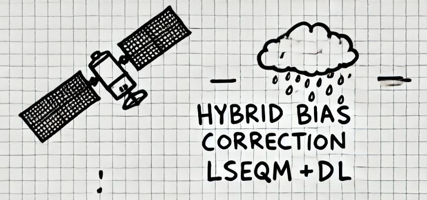

# Hybrid Bias Correction

**Values, Distributions, Extremes - with Neural Refinement.**

*Adjusting values, aligning distributions, preserving extremes - with neural refinement where station density allows.*

A reproducible Python framework for daily satellite precipitation bias correction. Combines **Linear Scaling** (mean adjustment), **Empirical Quantile Mapping with a Generalized Pareto tail** (distribution and extreme alignment), and a lightweight **CNN refinement** (spatial polish gated by station-density confidence). Operationally tested over Indonesia (2001-2025) on the 0.1 deg IMERG grid.



## Documentation

Full documentation site: [https://bennyistanto.github.io/hybrid-bias-correction](https://bennyistanto.github.io/hybrid-bias-correction)

| Section | What's there |
|---------|--------------|
| [Methodology](https://bennyistanto.github.io/hybrid-bias-correction/methodology/) | Theory behind each correction stage |
| [Implementation](https://bennyistanto.github.io/hybrid-bias-correction/implementation/) | Algorithm view: which `src/` function does what |
| [Tutorials](https://bennyistanto.github.io/hybrid-bias-correction/tutorials/) | Full pipeline walkthroughs against the Bali example |
| [Bali Results](https://bennyistanto.github.io/hybrid-bias-correction/tutorials/bali-results.html) | Actual outputs the framework produces |
| [FAQ](https://bennyistanto.github.io/hybrid-bias-correction/faq.html) | Basics + honest answers to reviewer-style questions |
| [API Reference](https://bennyistanto.github.io/hybrid-bias-correction/technical/api-reference/) | Auto-generated module docs |

## What ships in this repo

- `src/` - The framework as a Python package.
- `notebooks/` - Five-step end-to-end pipeline (`02_lseqmdl_bias_correction` through `06_visualisation_hub`) plus the optional data-acquisition and paper-results notebooks.
- `data/example_bali/` - 11 MB Bali example bundle (IMERG-L, IMERG-F, CPC-UNI at 0.1 deg and native 0.5 deg, BMKG stations, land/sea mask). Runs end to end in ~15 minutes on a free Colab CPU.
- `data/mask/aoi/bali_subset.nc` - The Bali AOI definition.
- `docs/` - Quarto site source.
- `config.yml` (Indonesia) and `config_bali.yml` (Bali example) - the two driver configs.

## Full Indonesia data on Zenodo

Indonesia operational input (IMERG + CPC + BMKG, 2001-2025, ~1.7 GB) and outputs (corrected NetCDFs, metrics, QA, station validation, figures, ~40 GB) are not stored in the repo. They are deposited on Zenodo with a citable DOI:

[https://doi.org/10.5281/zenodo.20287847](https://doi.org/10.5281/zenodo.20287847)

To reproduce the Indonesia results: clone this repo, download the Zenodo bundle, point `config.yml` at the extracted directories, and run the notebooks.

## Quickstart

**Google Colab is the recommended way to run this framework.** TensorFlow is pre-installed there, the GPU is provisioned, and the CNN refinement step works out of the box. Skip the install headaches.

Click the Colab badge on any tutorial page in the [docs site](https://bennyistanto.github.io/hybrid-bias-correction/tutorials/), or open the main notebook directly:

[](https://colab.research.google.com/github/bennyistanto/hybrid-bias-correction/blob/main/notebooks/02_lseqmdl_bias_correction.ipynb)

The notebooks open with `CONFIG_FILE = 'config_bali.yml'` at the top of Step 1. Run cells top to bottom and the Bali example pipeline produces three corrected NetCDFs (LS, LSEQM, LSEQM+DL) for each of 36 dekads.

To run the full Indonesia pipeline: flip `CONFIG_FILE = 'config.yml'` in each of nb02-nb06 and point `config.yml` at the Zenodo data extracted on your machine.

### Local install (if you really need it)

```bash
git clone https://github.com/bennyistanto/hybrid-bias-correction.git
cd hybrid-bias-correction
mamba env create -f environment.yml
mamba activate climate

# Verify TensorFlow before running anything that uses the CNN step:
python -c "import tensorflow as tf; print(tf.__version__); print(tf.config.list_physical_devices())"

jupyter lab notebooks/02_lseqmdl_bias_correction.ipynb
```

If the TensorFlow check fails, the LS and LSEQM stages will still run but the LSEQM+DL refinement will not. Either fix the TF install (see [Troubleshooting](https://bennyistanto.github.io/hybrid-bias-correction/user-guide/troubleshooting.html)) or switch to Colab.

## Prerequisites

- Python 3.10 or newer (3.11 recommended).
- Familiarity with Jupyter notebooks and `xarray` / NetCDF.
- Basic understanding of precipitation statistics (quantile mapping, extreme value theory) helps but is not required.

## Publication

Companion manuscript: under review at *Remote Sensing* (MDPI). DOI and citation will be added on acceptance.

JOSS paper covering the code and reproducible-research workflow: in preparation.

## Contributing

Contributions and suggestions are welcome. Please open an issue or pull request. 

## License

Mozilla Public License 2.0. See [LICENSE](LICENSE) or [https://www.mozilla.org/en-US/MPL/2.0/](https://www.mozilla.org/en-US/MPL/2.0/).

[](https://www.mozilla.org/en-US/MPL/2.0/)

## Authors

**Benny Istanto** - [https://benny.istan.to/about](https://benny.istan.to/about)

  Applied Climatology Study Program, Department of Geophysics and Meteorology</br>
  Bogor Agricultural University, Indonesia</br>
  [bennyistanto@apps.ipb.ac.id](mailto:bennyistanto@apps.ipb.ac.id)</br>

With supervision from [Prof. Rizaldi Boer](https://scholar.google.com/citations?user=jTPXEp8AAAAJ&hl=en) and [Dr. I Putu Santikayasa](https://scholar.google.com/citations?user=DcQ58z8AAAAJ&hl=en) as part of the MSc thesis.
