This is the case the framework was built for: daily satellite precipitation over a sparse-gauge tropical archipelago. The figures below are from the full Indonesia run (IMERG-L corrected against CPC-UNI, validated against independent BMKG stations whose gauge record runs 2001-2021). The inputs and outputs are deposited on Zenodo (<https://doi.org/10.5281/zenodo.20287847>); they are too large to ship in the repo, so this study is presented as curated figures and analysis rather than a runnable notebook.

::: {.callout-note}
The full LSEQM+DL run over Indonesia takes about four days of compute. This page documents that run; it is not regenerated when the docs build. To reproduce it, download the Zenodo bundle, point `config.yml` at it, and run nb02-nb06. For a runnable end-to-end example, use the [Bali case](../example-bali/index.qmd) instead.
:::

If you have not already, skim [Reading the Results](reading-the-results.qmd) first - it explains every metric used below.

## Study design

The reference is CPC-UNI (gauge-interpolated). The independent check is the BMKG station network, which is **not** part of the CPC pipeline, so it is a genuinely held-out validation set.

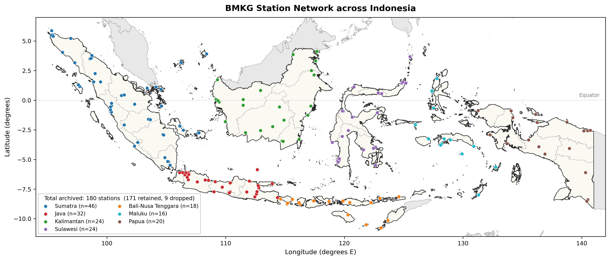{#fig-station-network fig-align="center"}

Not every archived station enters the validation. Two filters are applied before any metric is computed: a station must fall on the 0.1 deg land mask, and it must have at least 30 paired days per dekadal window. This takes the set from 180 archived stations to **171 validated** across all seven regions.

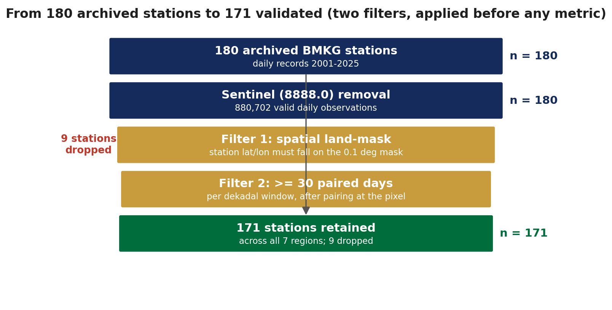{#fig-validation-funnel fig-align="center"}

## Overview: what improves

The headline result, evaluated at the 171 independent stations, is a clear win on the **mean, variability, and extremes**:

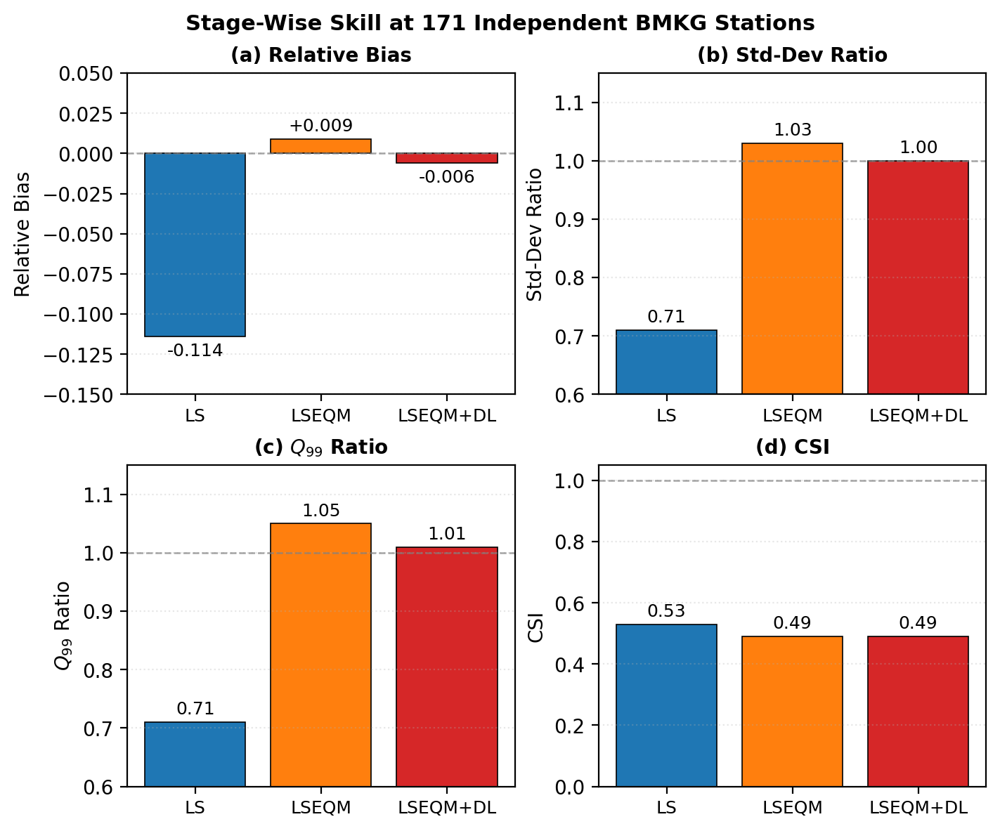{#fig-headline fig-align="center"}

Interactive version (same numbers; hover for values, dashed line marks the target):

```{ojs}
//| echo: false
headline = [
  {metric: "Relative bias", target: 0, LS: -0.114, LSEQM: 0.009, "LSEQM+DL": -0.006},
  {metric: "Std-dev ratio", target: 1, LS: 0.71, LSEQM: 1.03, "LSEQM+DL": 1.00},
  {metric: "Q99 ratio", target: 1, LS: 0.71, LSEQM: 1.05, "LSEQM+DL": 1.01},
  {metric: "CSI", target: 1, LS: 0.53, LSEQM: 0.49, "LSEQM+DL": 0.49}
].flatMap(r => ["LS", "LSEQM", "LSEQM+DL"].map(m => ({metric: r.metric, target: r.target, method: m, value: r[m]})))

Plot.plot({
  width: 880, height: 360, marginLeft: 50,
  facet: {data: headline, x: "metric"},
  x: {label: null, tickRotate: 0},
  y: {grid: true, label: "value"},
  color: {legend: true, domain: ["LS", "LSEQM", "LSEQM+DL"], range: ["#3b78b0", "#f39c12", "#27ae60"]},
  marks: [
    Plot.barY(headline, {x: "method", y: "value", fill: "method", fx: "metric"}),
    Plot.ruleY(headline, {fy: null, y: "target", fx: "metric", stroke: "#444", strokeDasharray: "4 3"}),
    Plot.ruleY([0]),
    Plot.tip(headline, Plot.pointer({x: "method", y: "value", fx: "metric",
      title: d => `${d.method}\n${d.metric} = ${d.value}`}))
  ]
})
```

- **Relative bias** moves from -0.114 (LS undercorrects the mean) to +0.009 (LSEQM) and -0.006 (LSEQM+DL): near-zero after distribution correction.
- **Standard-deviation ratio** moves from 0.71 (raw/LS is too smooth) to 1.03 (LSEQM) and 1.00 (LSEQM+DL): variability restored.
- **Q99 ratio** moves from 0.71 to 1.05 (LSEQM) and 1.01 (LSEQM+DL): the extreme tail is recovered.
- **CSI** stays around 0.49-0.53 across stages: categorical detection is set early and the later stages do not change it much.

Detection skill, broken out by intensity threshold, shows the same story: LS already does most of the categorical work at light thresholds, and skill degrades with intensity as expected for daily satellite precipitation.

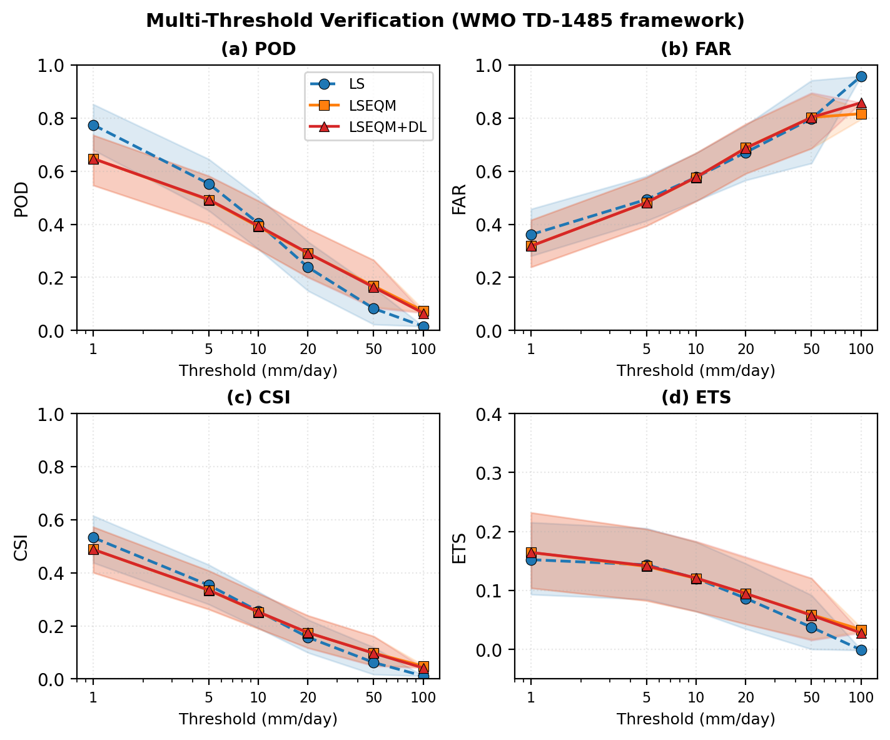{#fig-multi-threshold fig-align="center"}

The static figure above pools the climatology. The version below is interactive: pick a dekad and a score to see how the three methods compare across intensity thresholds for that specific 10-day window. Shaded bands are the inter-quartile range across stations; points drop out at high thresholds where too few stations record enough events to pass the WMO/TD-1485 minimum (see the [FAQ](../faq.qmd#why-does-the-bali-multi-threshold-curve-only-show-up-to-50-mm-where-are-the-100-and-150-mm-points)).

```{ojs}
//| echo: false
mt = FileAttachment("../data/case-studies/multithreshold.csv").csv({typed: true})
```

```{ojs}
//| echo: false
mtPeriods = new Map(
  Array.from(new Set(mt.map(d => d.month * 10 + d.dekad)))
    .sort((a, b) => a - b)
    .map(k => {
      const mo = Math.floor(k / 10), dk = k % 10;
      const name = ["Jan","Feb","Mar","Apr","May","Jun","Jul","Aug","Sep","Oct","Nov","Dec"][mo - 1];
      const span = dk === 1 ? "d1 (1-10)" : dk === 2 ? "d2 (11-20)" : "d3 (21-end)";
      return [`${name} ${span}`, {month: mo, dekad: dk}];
    })
)
viewof mtPeriod = Inputs.select(mtPeriods, {label: "Dekad", value: mtPeriods.get("Jan d2 (11-20)")})
```

```{ojs}
//| echo: false
mtMetrics = new Map([
  ["POD - probability of detection (higher better)", {key: "pod", dir: "higher"}],
  ["CSI - critical success index (higher better)", {key: "csi", dir: "higher"}],
  ["ETS - equitable threat score (higher better)", {key: "ets", dir: "higher"}],
  ["FAR - false-alarm ratio (lower better)", {key: "far", dir: "lower"}],
  ["HSS - Heidke skill score (higher better)", {key: "hss", dir: "higher"}],
  ["HK - Hanssen-Kuipers (higher better)", {key: "hk", dir: "higher"}]
])
viewof mtMetric = Inputs.select(mtMetrics, {label: "Score", value: mtMetrics.get("CSI - critical success index (higher better)")})
```

```{ojs}
//| echo: false
{
  const k = mtMetric.key;
  const sub = mt.filter(d => d.month === mtPeriod.month && d.dekad === mtPeriod.dekad && d[k] != null);
  if (!sub.length) return html`<em>No verified stations for this dekad/score.</em>`;
  return Plot.plot({
    width: 880,
    height: 420,
    marginLeft: 55,
    x: {type: "log", label: "Threshold (mm/day)", domain: [1, 160],
        ticks: [1, 5, 10, 20, 50, 100, 150], tickFormat: d => d},
    y: {label: mtMetric.key.toUpperCase() + " (median across stations)", grid: true, domain: [0, 1]},
    color: {legend: true, domain: ["LS", "LSEQM", "LSEQM+DL"], range: ["#3b78b0", "#f39c12", "#27ae60"]},
    marks: [
      Plot.areaY(sub.filter(d => d[k + "_lo"] != null), {x: "threshold", y1: k + "_lo", y2: k + "_hi",
        fill: "method", fillOpacity: 0.12, curve: "catmull-rom"}),
      Plot.line(sub, {x: "threshold", y: k, stroke: "method", strokeWidth: 2, curve: "catmull-rom"}),
      Plot.dot(sub, {x: "threshold", y: k, fill: "method", r: 3.2}),
      Plot.tip(sub, Plot.pointer({x: "threshold", y: k, stroke: "method",
        title: d => `${d.method}\n${d.threshold} mm (${d.label})\n${mtMetric.key.toUpperCase()} = ${d[k].toFixed(3)}`}))
    ]
  });
}
```

Reading it: at light thresholds (1-10 mm) all three methods sit close together - LS already captures most wet-day detection. The methods separate little even at heavier thresholds, because categorical detection depends on *when* it rains (timing the satellite sets), not on the distribution reshaping that LSEQM applies. This is the categorical face of the same [correlation ceiling](#the-correlation-ceiling).

The Taylor diagram summarises correlation, variability, and centred RMSE in one view, split by season. The bias-corrected products pull the variability ratio toward the reference, while correlation stays in the same band - the pattern explained in [the correlation ceiling](#the-correlation-ceiling) below.

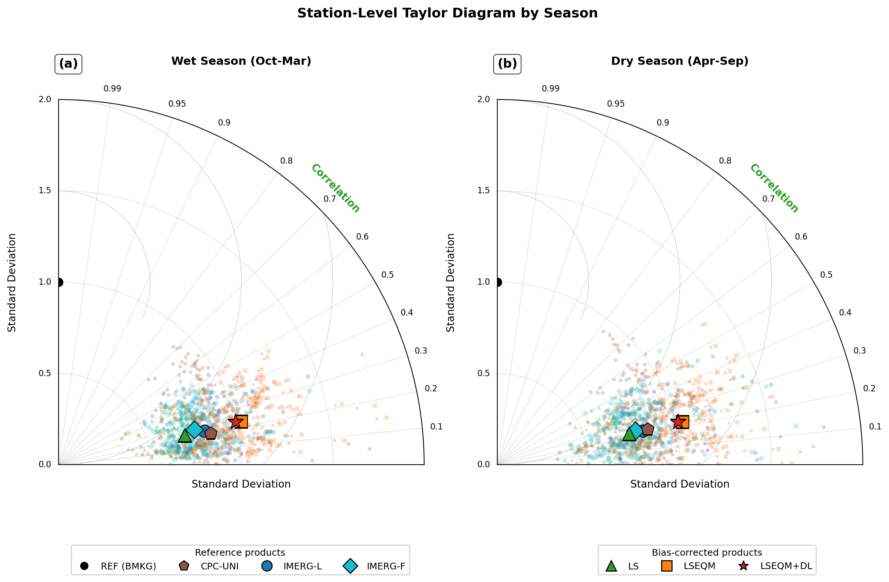{#fig-taylor fig-align="center"}

## Spatial skill

Mapped across the archipelago, the Continuous Quality Index (CQI) is high and spatially coherent for all three methods. The honest finding is that the **median CQI does not rise** from LS (0.541) to LSEQM (0.505) to LSEQM+DL (0.508):

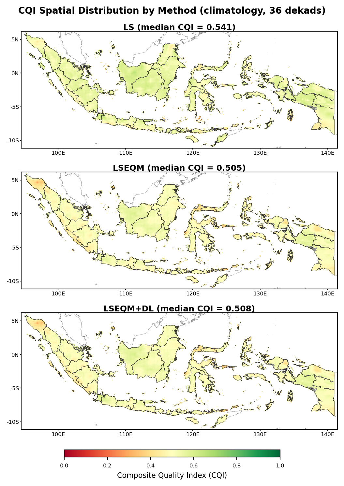{#fig-cqi-spatial fig-align="center"}

This is not a defect, and it is worth stating plainly. The CQI weights the basic-statistics component (which includes correlation and NSE) at 0.4. Because those timing-sensitive metrics do not improve under marginal bias correction - and RMSE slightly worsens when EQM restores variance against a mistimed series - the composite index does not reward the distribution and extreme gains that LSEQM delivers. The improvement map makes the trade explicit: relative to LS, LSEQM+DL lowers CQI at most pixels.

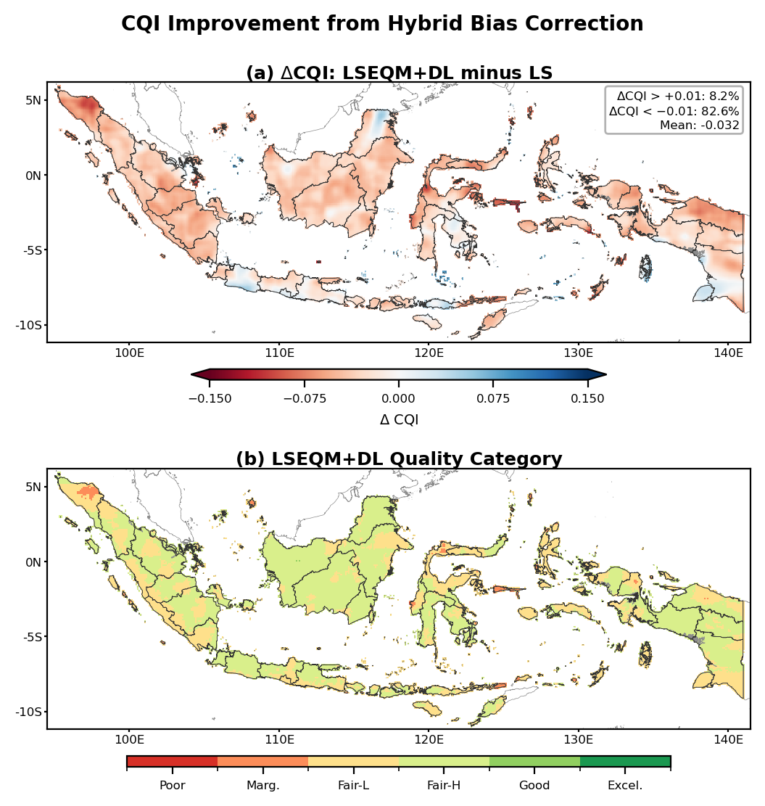{#fig-cqi-improvement fig-align="center"}

The takeaway: **choose the product by what you need.** If you need the right distribution and extremes (most hydrological and risk applications), LSEQM / LSEQM+DL is the right choice despite the flat composite index. If you only need the basic mean field and nothing else, LS is competitive.

Skill is stable across the seasonal cycle and does not collapse in any region:

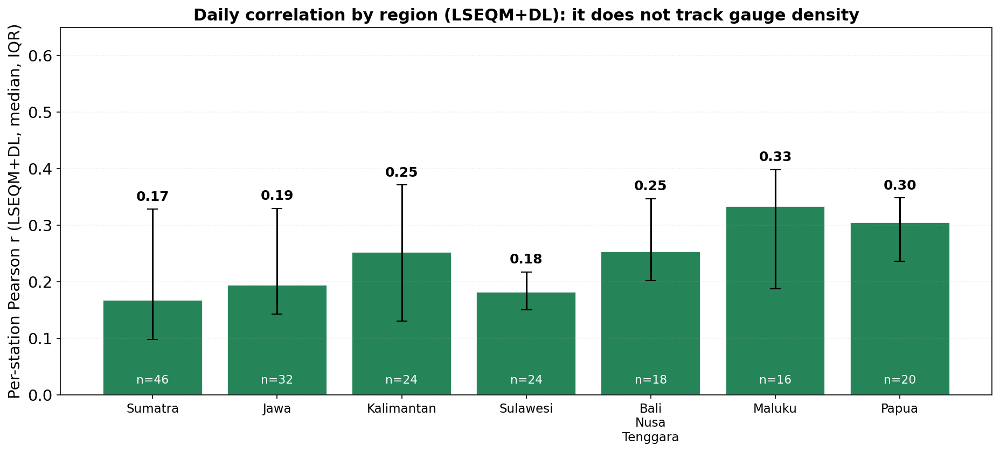{fig-align="center"}

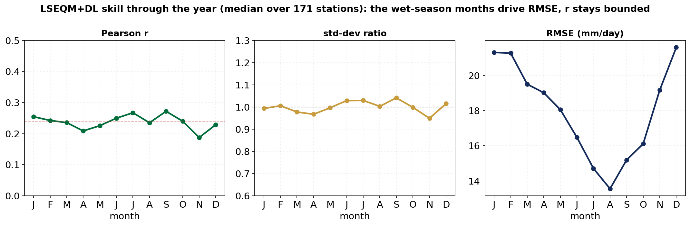{fig-align="center"}

The interactive version below is computed live from the 175-station metadata (2001-2021). Pick a metric and product; bars are the regional median, whiskers the inter-quartile range across stations in each region:

```{ojs}
//| echo: false
regOptions = new Map([
  ["Pearson r", {imergl: "imergl_r", lseqmdl: "lseqmdl_r"}],
  ["Relative bias", {imergl: "imergl_bias", lseqmdl: "lseqmdl_bias"}],
  ["RMSE (mm/day)", {imergl: "imergl_rmse", lseqmdl: "lseqmdl_rmse"}],
  ["NSE", {imergl: "imergl_nse", lseqmdl: "lseqmdl_nse"}],
  ["Correct-dry rate", {imergl: "correctdry_imergl", lseqmdl: "correctdry_lseqmdl"}],
  ["Wet-day frequency ratio", {imergl: "wetfreq_imergl", lseqmdl: "wetfreq_lseqmdl"}]
])
viewof regMetricName = Inputs.select([...regOptions.keys()], {label: "Metric", value: "Pearson r"})
```

```{ojs}
//| echo: false
viewof regProduct = Inputs.radio(new Map([["IMERG-L (raw)", "imergl"], ["LSEQM+DL", "lseqmdl"]]), {label: "Product", value: "lseqmdl"})
```

```{ojs}
//| echo: false
{
  const col = regOptions.get(regMetricName)[regProduct];
  const order = ["Sumatra", "Jawa", "Kalimantan", "Sulawesi", "Bali Nusa Tenggara", "Maluku", "Papua"];
  const byReg = d3.groups(meta.filter(d => d[col] != null && Number.isFinite(d[col])), d => d.region)
    .map(([region, rows]) => {
      const vals = rows.map(r => r[col]).sort(d3.ascending);
      return {region, n: rows.length, med: d3.median(vals), lo: d3.quantile(vals, 0.25), hi: d3.quantile(vals, 0.75)};
    })
    .sort((a, b) => order.indexOf(a.region) - order.indexOf(b.region));
  return Plot.plot({
    width: 880, height: 360, marginBottom: 80,
    x: {label: null, tickRotate: -25, domain: order},
    y: {grid: true, label: regMetricName},
    marks: [
      Plot.ruleY([0]),
      Plot.barY(byReg, {x: "region", y: "med", fill: "#27ae60", fillOpacity: 0.85}),
      Plot.ruleX(byReg, {x: "region", y1: "lo", y2: "hi", stroke: "#145a32", strokeWidth: 2}),
      Plot.text(byReg, {x: "region", y: "med", text: d => d.med?.toFixed(2), dy: -8, fontSize: 10}),
      Plot.text(byReg, {x: "region", y: 0, text: d => `n=${d.n}`, dy: 14, fontSize: 9, fill: "#666"})
    ]
  });
}
```

One point from the regional breakdown: daily correlation (0.17-0.33 across regions) does **not** track gauge density. Maluku and Papua, with far fewer stations than Java, are not systematically worse. This tells us the ceiling on daily correlation is set by something other than how many gauges are nearby - again, see below.

## Extreme values

The GPD tail graft is designed to recover heavy-rain behaviour. Across stations, the corrected-to-gauge ratio at heavy thresholds (20, 50, 100 mm/day) moves toward 1.0 where LS alone leaves a deficit:

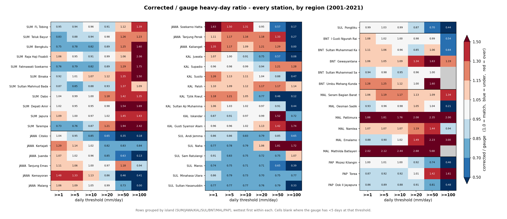{#fig-extremes-ratio fig-align="center"}

Interactive version below: pick a product and region. Each cell is the ratio of product to gauge heavy-day counts (counted on gauge-valid days only); **white is a perfect match (1.0)**, blue is under-detection, red is over-detection. Cells are blank where fewer than 5 gauge events make the ratio unreliable. Toggle IMERG-L vs LSEQM+DL to watch the heavy-rain deficit (blue) close toward white after correction.

```{ojs}
//| echo: false
extremes = FileAttachment("../data/case-studies/extremes_ratio.csv").csv({typed: true})
```

```{ojs}
//| echo: false
viewof exProduct = Inputs.radio(["IMERG-L", "LSEQM+DL"], {label: "Product", value: "LSEQM+DL"})
```

```{ojs}
//| echo: false
viewof exRegion = Inputs.select(
  ["All regions", "Sumatra", "Jawa", "Kalimantan", "Sulawesi", "Bali Nusa Tenggara", "Maluku", "Papua"],
  {label: "Region", value: "Jawa"}
)
```

```{ojs}
//| echo: false
{
  let sub = extremes.filter(d => d.product === exProduct);
  if (exRegion !== "All regions") sub = sub.filter(d => d.region === exRegion);
  sub = sub.map(d => ({...d, label: `${d.name} (${d.wmo})`}));
  const order = [...new Set(
    sub.slice().sort((a, b) => d3.ascending(a.region, b.region) || d3.descending(a.lat, b.lat)).map(d => d.label)
  )];
  const h = 70 + order.length * 13;
  return Plot.plot({
    width: 720, height: h, marginLeft: 175, marginBottom: 45,
    x: {type: "band", domain: [1, 5, 10, 20, 50, 100], label: "Threshold (mm/day)", tickFormat: d => d + " mm"},
    y: {domain: order, label: null},
    color: {type: "diverging", scheme: "RdBu", pivot: 1, reverse: true, domain: [0.5, 1.5],
            clamp: true, legend: true, label: `${exProduct} / gauge heavy-day ratio`},
    marks: [
      Plot.cell(sub, {x: "threshold", y: "label", fill: "ratio", inset: 0.5,
        tip: true, channels: {Region: "region", "n events": "n_gauge", ratio: "ratio"}})
    ]
  });
}
```

The same correction read as detection and intensity metrics for heavy days:

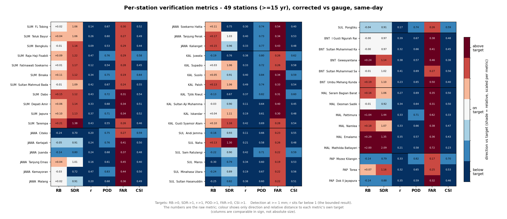{#fig-extremes-metrics fig-align="center"}

And as a calendar view of where and when the heaviest events land after LSEQM+DL correction:

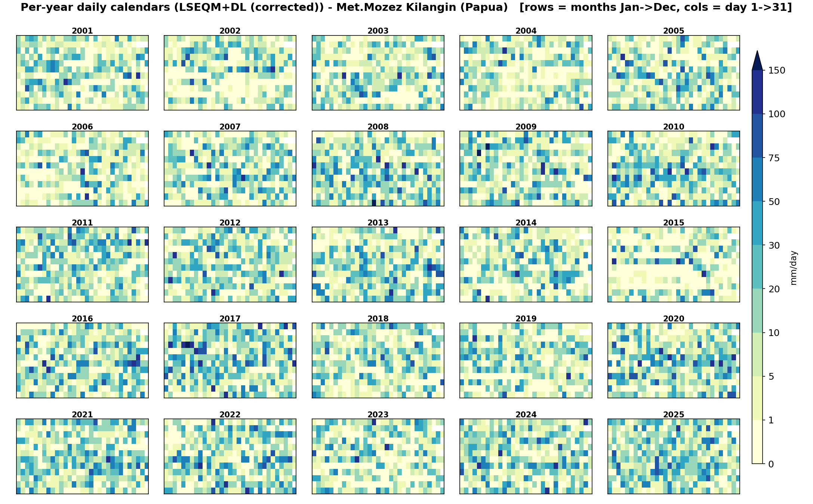{#fig-extremes-calendar fig-align="center"}

### Event-level view, by station

Zooming all the way in: the daily series around each station's heaviest rain days, comparing the gauge with the raw and corrected products. Pick a station to see how the correction handles its biggest events. These six span the archipelago, from Aceh to Papua.

```{ojs}
//| echo: false
exEventStations = new Map([
  ["FL Tobing - North Sumatra", "fltobing"],
  ["Malikussaleh - Aceh", "malikussaleh"],
  ["Bima - West Nusa Tenggara", "bima"],
  ["Betoambari - Southeast Sulawesi", "betoambari"],
  ["Sultan Aji (Balikpapan) - Kalimantan", "sultanaji"],
  ["Timika - Papua", "timika"]
])
viewof exEventStn = Inputs.select(exEventStations, {label: "Station", value: "timika"})
```

```{ojs}
//| echo: false
html``
```

## The correlation ceiling

This is the central diagnostic of the study, and the most important thing the framework reveals about daily satellite precipitation.

Under marginal bias correction, **Pearson correlation barely moves**: 0.343 (LS) to 0.345 (LSEQM) to 0.348 (LSEQM+DL), a shift of +0.005. RMSE and NSE do not improve either. Only the distribution-shape metrics (SDR, Q99) move to target.

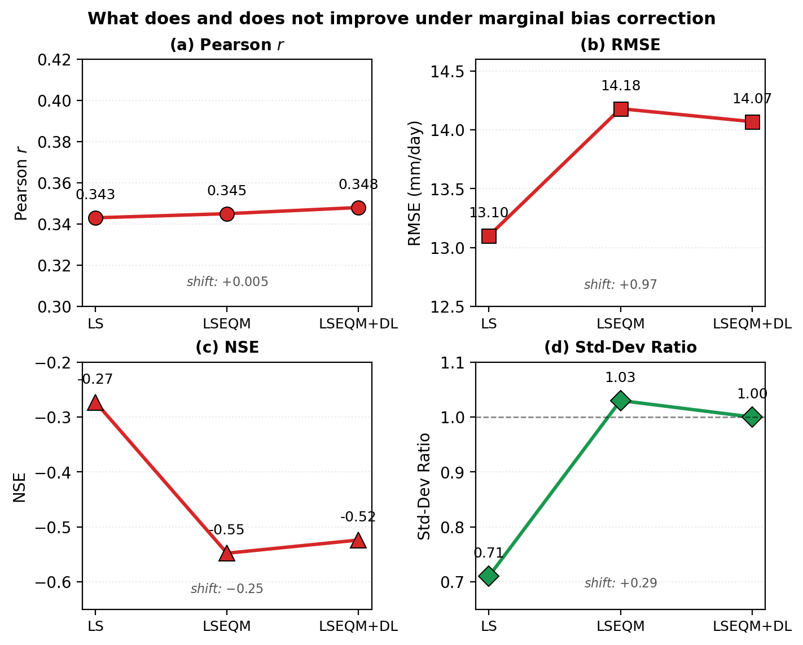{#fig-paradox fig-align="center"}

Interactive version - each panel has its own y-axis so the *shape* of the trajectory is what matters. Watch Pearson r stay almost flat while the std-dev ratio climbs to its target:

```{ojs}
//| echo: false
paradox = [
  {metric: "Pearson r", LS: 0.343, LSEQM: 0.345, "LSEQM+DL": 0.348},
  {metric: "RMSE (mm/day)", LS: 13.10, LSEQM: 14.18, "LSEQM+DL": 14.07},
  {metric: "NSE", LS: -0.27, LSEQM: -0.55, "LSEQM+DL": -0.52},
  {metric: "Std-dev ratio", LS: 0.71, LSEQM: 1.03, "LSEQM+DL": 1.00}
].flatMap(r => ["LS", "LSEQM", "LSEQM+DL"].map(m => ({metric: r.metric, method: m, value: r[m]})))

Plot.plot({
  width: 880, height: 320, marginLeft: 55,
  facet: {data: paradox, x: "metric"},
  fx: {label: null},
  x: {domain: ["LS", "LSEQM", "LSEQM+DL"], label: null},
  y: {grid: true, label: "value"},
  marks: [
    Plot.line(paradox, {fx: "metric", x: "method", y: "value", stroke: "#c0392b", strokeWidth: 2}),
    Plot.dot(paradox, {fx: "metric", x: "method", y: "value", fill: "#c0392b", r: 4}),
    Plot.tip(paradox, Plot.pointer({fx: "metric", x: "method", y: "value",
      title: d => `${d.metric}\n${d.method} = ${d.value}`}))
  ]
})
```

The reason is structural, not a failure of the method. Quantile mapping is a monotone, rank-preserving transform applied per pixel: it changes the *values* but not the day-to-day *ordering* inherited from the satellite. Correlation depends only on the ordering. So once LS has set the rank structure, no amount of distribution correction can move correlation - it is bounded by the satellite's day-to-day timing.

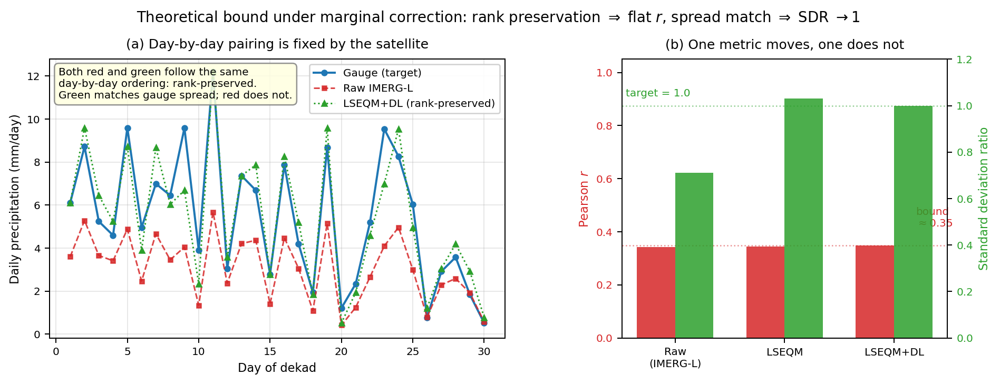{#fig-bound fig-align="center"}

### Where the ceiling comes from

A natural question is whether the ceiling is intrinsic to the satellite retrieval, or an artefact of how the data are aligned in time. IMERG accumulates on a UTC day; a BMKG gauge "day" is a local-morning-to-morning window. Indonesia spans three time zones, so the satellite day and the gauge day are offset by hours.

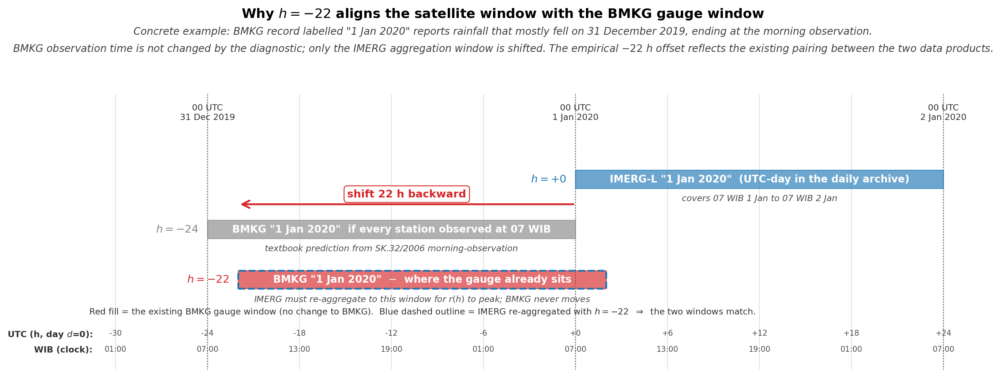{#fig-subdaily-timing fig-align="center"}

Shifting the satellite accumulation window and recomputing correlation reveals a clear peak well away from zero offset: correlation rises from about 0.19 at the UTC-day alignment that the archive uses to about 0.62 at roughly a 22-hour backward shift.

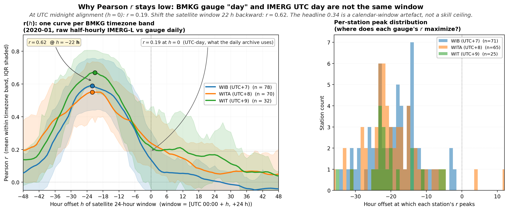{#fig-subdaily-lag fig-align="center"}

The optimal offset is spatially organised by time zone, confirming it is a real timing-window effect and not noise:

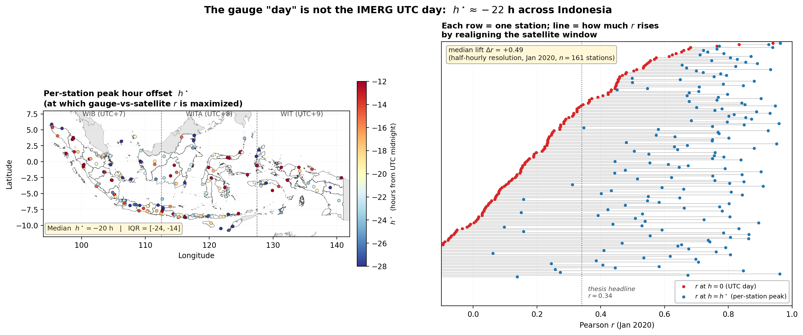{#fig-subdaily-map fig-align="center"}

The decomposition: of the headline daily correlation of about 0.34, roughly two-thirds of the achievable gain is a **calendar-window artefact** (fixable by aligning the accumulation window to the local day) and only the remainder is irreducible retrieval error. This is a methodological caveat that applies to any daily verification of UTC-accumulated satellite precipitation against locally-defined gauge days, not just this framework.

::: {.callout-important}
The practical implication: do not judge daily satellite precipitation - corrected or raw - on Pearson r alone. A low daily r is partly a timing-window artefact. Judge the correction on the distribution and extreme metrics, which is what the bias correction can actually move, and re-aggregate or re-window before computing correlation if timing fidelity matters for your application.
:::

## All-station summary

### Explore any station

The chart below is interactive. Pick a station and a year to see the daily series for the gauge, raw IMERG-L, and the corrected LSEQM+DL product, with skill metrics for the selected station updating alongside.

::: {.callout-note collapse="true"}
## About this data
This explorer covers **175 stations** over the **full 2001-2021 record** - every BMKG station with at least one full year of valid gauge data (close to the 171 validated in the headline pipeline; the small difference is a simpler completeness filter). Completeness varies by station and is shown in the dropdown and on the map - sparse stations have visible gaps in the daily series. Each station's daily record (~120 KB) is fetched only when you select it, so the page stays light. Per-station metrics are computed over 2001-2021, so they are close to but not identical to the headline figures above (which use the full pipeline's pairing rules).
:::

```{ojs}
//| echo: false
meta = FileAttachment("../data/case-studies/station_meta.csv").csv({typed: true})
```

```{ojs}
//| echo: false
stationOptions = new Map(
  meta
    .slice()
    .sort((a, b) => d3.ascending(a.region, b.region) || d3.ascending(a.name, b.name))
    .map(d => [`${d.region} - ${d.name} (${d.wmo}) - ${d.completeness}% complete`, String(d.wmo)])
)
viewof wmo = Inputs.select(stationOptions, {label: "Station", value: "96073"})
```

```{ojs}
//| echo: false
// Each station's full 2001-2021 daily record is fetched on demand (~150 KB).
stationRows = d3.csv(`station-data/${wmo}.csv`, d3.autoType)
```

```{ojs}
//| echo: false
yearsAvailable = Array.from(new Set(stationRows.map(d => d.date.getUTCFullYear()))).sort((a, b) => a - b)
viewof year = Inputs.select(yearsAvailable, {label: "Year", value: yearsAvailable[yearsAvailable.length - 1]})
```

```{ojs}
//| echo: false
plotRows = stationRows.filter(d => d.date.getUTCFullYear() === year)
```

```{ojs}
//| echo: false
series = ["gauge", "imergl", "lseqmdl"].flatMap(k =>
  plotRows.map(d => ({date: d.date, value: d[k], product: ({gauge: "Gauge (BMKG)", imergl: "IMERG-L (raw)", lseqmdl: "LSEQM+DL"})[k]}))
).filter(d => d.value != null && Number.isFinite(d.value))

Plot.plot({
  width: 920,
  height: 380,
  marginLeft: 55,
  x: {label: "Date", type: "utc"},
  y: {label: "Daily precipitation (mm/day)", grid: true, zero: true},
  color: {
    legend: true,
    domain: ["Gauge (BMKG)", "IMERG-L (raw)", "LSEQM+DL"],
    range: ["#222222", "#9aa0a6", "#27ae60"]
  },
  marks: [
    Plot.ruleY([0]),
    Plot.line(series, {x: "date", y: "value", stroke: "product", strokeWidth: 1.3, curve: "linear"}),
    Plot.tip(series, Plot.pointer({x: "date", y: "value", stroke: "product",
      title: d => `${d.product}\n${d.date.toISOString().slice(0,10)}\n${d.value.toFixed(1)} mm/day`}))
  ]
})
```

```{ojs}
//| echo: false
selMeta = meta.find(d => String(d.wmo) === String(wmo))
fmt = (x, d=2) => (x == null || Number.isNaN(x)) ? "n/a" : x.toFixed(d)
html`<table class="table table-sm" style="max-width:640px">
  <thead><tr><th>Metric (2001-2021)</th><th>IMERG-L (raw)</th><th>LSEQM+DL</th><th>Target</th></tr></thead>
  <tbody>
    <tr><td>Pearson r</td><td>${fmt(selMeta.imergl_r)}</td><td>${fmt(selMeta.lseqmdl_r)}</td><td>1.0</td></tr>
    <tr><td>RMSE (mm/day)</td><td>${fmt(selMeta.imergl_rmse,1)}</td><td>${fmt(selMeta.lseqmdl_rmse,1)}</td><td>0</td></tr>
    <tr><td>NSE</td><td>${fmt(selMeta.imergl_nse)}</td><td>${fmt(selMeta.lseqmdl_nse)}</td><td>1.0</td></tr>
    <tr><td>Relative bias</td><td>${fmt(selMeta.imergl_bias)}</td><td>${fmt(selMeta.lseqmdl_bias)}</td><td>0</td></tr>
    <tr><td>Paired days</td><td colspan="2">${selMeta.lseqmdl_n}</td><td></td></tr>
  </tbody>
</table>`
```

The same station as a scatter against the gauge (all paired days, 2001-2021), raw IMERG-L on the left and corrected LSEQM+DL on the right. Points on the dashed 1:1 line are perfect agreement. Hover any point for its date and values. The corrected cloud sits closer to the diagonal and recovers the heavy-rain points that raw IMERG-L compresses toward the axis:

```{ojs}
//| echo: false
scatterData = stationRows.flatMap(d => [
  {gauge: d.gauge, value: d.imergl, product: "IMERG-L (raw)", date: d.date},
  {gauge: d.gauge, value: d.lseqmdl, product: "LSEQM+DL", date: d.date}
]).filter(d => Number.isFinite(d.gauge) && Number.isFinite(d.value))

scatterMax = Math.max(10, d3.max(scatterData, d => Math.max(d.gauge, d.value)) ?? 10)

Plot.plot({
  width: 920,
  height: 440,
  marginLeft: 55,
  grid: true,
  aspectRatio: 1,
  facet: {data: scatterData, x: "product"},
  x: {label: "Gauge (mm/day)", domain: [0, scatterMax]},
  y: {label: "Product (mm/day)", domain: [0, scatterMax]},
  color: {domain: ["IMERG-L (raw)", "LSEQM+DL"], range: ["#9aa0a6", "#27ae60"]},
  marks: [
    Plot.line([[0, 0], [scatterMax, scatterMax]], {stroke: "#888", strokeDasharray: "4 3"}),
    Plot.dot(scatterData, {x: "gauge", y: "value", r: 1.6, fill: "product", fillOpacity: 0.25}),
    Plot.dot(scatterData, Plot.pointer({x: "gauge", y: "value", r: 4, fill: "product", stroke: "#111"})),
    Plot.tip(scatterData, Plot.pointer({x: "gauge", y: "value",
      title: d => `${d.date.toISOString().slice(0,10)}\ngauge ${d.gauge.toFixed(1)} mm\n${d.product} ${d.value.toFixed(1)} mm`})),
    Plot.frame()
  ]
})
```

The pattern to look for: LSEQM+DL pulls the **intensity and bias** toward the gauge (relative bias toward zero; in the time series the green line tracks the black gauge peaks better than grey raw IMERG; in the scatter the green cloud hugs the 1:1 line), while **Pearson r barely changes** between raw and corrected - the [correlation ceiling](#the-correlation-ceiling) at the single-station level, visible as the vertical scatter that neither product removes.

### Network skill map

Where does each metric sit geographically? Pick a metric to recolour the 49-station subset on the map below. Hover a marker for the station name, region, and value; the station selected in the dropdown above is ringed.

```{ojs}
//| echo: false
metricOptions = new Map([
  ["LSEQM+DL - Pearson r", {key: "lseqmdl_r", scheme: "viridis", domain: [0, 0.6], label: "Pearson r"}],
  ["IMERG-L (raw) - Pearson r", {key: "imergl_r", scheme: "viridis", domain: [0, 0.6], label: "Pearson r"}],
  ["LSEQM+DL - relative bias", {key: "lseqmdl_bias", scheme: "RdBu", domain: [-0.3, 0.3], label: "relative bias"}],
  ["LSEQM+DL - RMSE (mm/day)", {key: "lseqmdl_rmse", scheme: "YlOrRd", domain: [5, 25], label: "RMSE"}],
  ["LSEQM+DL - correct-dry rate", {key: "correctdry_lseqmdl", scheme: "BuGn", domain: [0.4, 0.9], label: "correct-dry"}],
  ["IMERG-L (raw) - correct-dry rate", {key: "correctdry_imergl", scheme: "BuGn", domain: [0.4, 0.9], label: "correct-dry"}],
  ["LSEQM+DL - wet-day freq ratio", {key: "wetfreq_lseqmdl", scheme: "RdBu", domain: [0.5, 1.5], label: "wet-freq ratio"}],
  ["IMERG-L (raw) - wet-day freq ratio", {key: "wetfreq_imergl", scheme: "RdBu", domain: [0.5, 1.5], label: "wet-freq ratio"}],
  ["Record completeness (%)", {key: "completeness", scheme: "BuGn", domain: [0, 100], label: "% complete"}]
])
viewof metricChoice = Inputs.select(metricOptions, {label: "Colour by", value: metricOptions.get("LSEQM+DL - Pearson r")})
```

```{ojs}
//| echo: false
{
  const m = metricChoice;
  const pts = meta.filter(d => Number.isFinite(d[m.key]));
  const sel = meta.find(d => String(d.wmo) === String(wmo));
  const diverging = m.scheme === "RdBu";
  return Plot.plot({
    width: 920,
    height: 360,
    marginLeft: 50,
    x: {label: "Longitude", domain: [94, 142]},
    y: {label: "Latitude", domain: [-11, 7]},
    aspectRatio: 1,
    grid: true,
    color: {
      legend: true,
      label: m.label,
      scheme: m.scheme,
      domain: m.domain,
      ...(diverging ? {pivot: 0} : {})
    },
    marks: [
      Plot.frame(),
      sel ? Plot.dot([sel], {x: "lon", y: "lat", r: 9, stroke: "#111", strokeWidth: 2, fill: "none"}) : null,
      Plot.dot(pts, {x: "lon", y: "lat", fill: d => d[m.key], r: 5, stroke: "#333", strokeWidth: 0.4,
        channels: {Station: "name", Region: "region", value: d => d[m.key]},
        tip: {format: {Station: true, Region: true, value: d => d3.format(".3f")(d), x: false, y: false, fill: false}}})
    ].filter(Boolean)
  });
}
```

A useful comparison: switch between **IMERG-L Pearson r** and **LSEQM+DL Pearson r** and note how little the colours change - correlation is set before correction. Then switch to **relative bias**: the same stations move clearly toward neutral (white) after correction. This is the spatial echo of the [correlation ceiling](#the-correlation-ceiling): bias correction moves what it can (the colour on the bias map), not the day-to-day timing (the colour on the r map).

### Dry-day skill

Dry days are about half the validated record, so getting the no-rain days right matters as much as getting the wet days right. The two charts below show **what the products actually do when the gauge says it is dry**.

The first chart is the before-vs-after scatter for two dry-day metrics: each point is one of the 175 stations, x-axis = raw IMERG-L, y-axis = corrected LSEQM+DL. **Points above the dashed 1:1 line** are stations where the correction improved that metric.

```{ojs}
//| echo: false
viewof dryMetric = Inputs.radio(
  new Map([
    ["Correct-dry rate (higher better, target 1.0)", "correctdry"],
    ["Wet-day frequency ratio (target 1.0)", "wetfreq"]
  ]),
  {label: "Metric", value: "correctdry"}
)
```

```{ojs}
//| echo: false
{
  const k = dryMetric;
  const pts = meta.filter(d => d[`${k}_imergl`] != null && d[`${k}_lseqmdl`] != null)
    .map(d => ({wmo: d.wmo, name: d.name, region: d.region,
                x: d[`${k}_imergl`], y: d[`${k}_lseqmdl`]}));
  const isRatio = k === "wetfreq";
  // For correct-dry the target is 1.0 (higher better); for wet-freq ratio target is 1.0 (either side worse).
  const lo = isRatio ? Math.min(0.4, d3.min(pts, d => Math.min(d.x, d.y))) : 0.3;
  const hi = isRatio ? Math.max(2.2, d3.max(pts, d => Math.max(d.x, d.y))) : 1.0;
  const axisLabel = isRatio ? "Wet-day frequency ratio" : "Correct-dry rate";
  return Plot.plot({
    width: 700, height: 480, marginLeft: 65, marginBottom: 55,
    aspectRatio: 1,
    x: {label: `IMERG-L (raw) - ${axisLabel}`, domain: [lo, hi], grid: true},
    y: {label: `LSEQM+DL - ${axisLabel}`, domain: [lo, hi], grid: true},
    color: {legend: true, label: "Region",
      domain: ["Sumatra","Jawa","Kalimantan","Sulawesi","Bali Nusa Tenggara","Maluku","Papua"],
      range: ["#1f77b4","#ff7f0e","#2ca02c","#d62728","#9467bd","#8c564b","#e377c2"]},
    marks: [
      // 1:1 line
      Plot.line([[lo, lo], [hi, hi]], {stroke: "#888", strokeDasharray: "4 3"}),
      // target line (correct-dry: y=1 is target; for ratio: cross at x=1, y=1)
      isRatio ? Plot.ruleX([1], {stroke: "#444", strokeWidth: 1}) : null,
      isRatio ? Plot.ruleY([1], {stroke: "#444", strokeWidth: 1}) : null,
      Plot.dot(pts, {x: "x", y: "y", fill: "region", r: 4, stroke: "white", strokeWidth: 0.6,
        channels: {Station: "name", Region: "region", WMO: "wmo"},
        tip: {format: {Station: true, Region: true, WMO: true,
          x: d => d.toFixed(3), y: d => d.toFixed(3)}}}),
      Plot.frame()
    ].filter(Boolean)
  });
}
```

For **correct-dry**, most stations sit above the 1:1 line: the median moves from **0.547** (raw) to **0.681** (corrected), matching the 171-station thesis headline (~56% → ~69%). For **wet-day frequency ratio**, the cloud moves from above 1.0 (raw over-detects, median 1.23) toward 1.0 (median 0.97) - the EQM stage doing its job. A handful of stations *cross under* 1.0 (LSEQM+DL slightly under-detects), an honest cost of matching the reference dry-day fraction.

The second chart breaks down **what the product reports on each gauge-dry day**, by intensity bin. Pick a station to see its composition (sum to 100%), or switch to the all-station median:

```{ojs}
//| echo: false
drymix = FileAttachment("../data/case-studies/drymix.csv").csv({typed: true})
```

```{ojs}
//| echo: false
mixStationOptions = new Map([
  ["All stations (median)", "__all__"],
  ...meta
    .slice()
    .sort((a, b) => d3.ascending(a.region, b.region) || d3.ascending(a.name, b.name))
    .map(d => [`${d.region} - ${d.name} (${d.wmo})`, String(d.wmo)])
])
viewof mixStation = Inputs.select(mixStationOptions, {label: "Station", value: "__all__"})
```

```{ojs}
//| echo: false
{
  const bins = ["dry", "drizzle", "light", "heavy"];
  const labels = {dry: "Dry (< 1 mm)", drizzle: "Drizzle (1-5 mm)", light: "Light (5-20 mm)", heavy: "Heavy (>= 20 mm)"};
  let sub;
  if (mixStation === "__all__") {
    sub = ["IMERG-L", "LSEQM+DL"].flatMap(p => {
      const rows = drymix.filter(d => d.product === p);
      return bins.map(b => ({product: p, bin: labels[b], value: d3.median(rows, d => d[b])}));
    });
  } else {
    sub = drymix.filter(d => String(d.wmo) === String(mixStation))
      .flatMap(d => bins.map(b => ({product: d.product, bin: labels[b], value: d[b]})));
  }
  // Pre-compute the midpoint x of each segment so the text mark gets a
  // direct x coordinate (no stack transform to read internal channels from).
  const labelOrder = Object.values(labels);
  const withMid = [];
  for (const product of ["IMERG-L", "LSEQM+DL"]) {
    let cum = 0;
    for (const lbl of labelOrder) {
      const row = sub.find(d => d.product === product && d.bin === lbl);
      if (!row) continue;
      withMid.push({...row, x0: cum, x1: cum + row.value, mid: cum + row.value / 2});
      cum += row.value;
    }
  }
  return Plot.plot({
    width: 720, height: 280, marginLeft: 90, marginRight: 40, marginBottom: 50,
    x: {label: "Share of gauge-dry days (%)", percent: true, grid: true, domain: [0, 1]},
    y: {label: null, domain: ["IMERG-L", "LSEQM+DL"]},
    color: {legend: true, domain: labelOrder,
      range: ["#27ae60", "#f1c40f", "#e67e22", "#c0392b"]},
    marks: [
      // Draw bars directly from the pre-computed (x0, x1) ranges; no stack transform.
      Plot.rectX(withMid, {y: "product", x1: "x0", x2: "x1", fill: "bin",
        tip: true, channels: {Product: "product", Bin: "bin", Share: d => (d.value * 100).toFixed(1) + "%"}}),
      Plot.text(withMid.filter(d => d.value > 0.05), {
        y: "product", x: "mid", text: d => (d.value * 100).toFixed(0) + "%",
        fill: "white", fontWeight: 600, fontSize: 11
      })
    ]
  });
}
```

Reading the all-stations median: on the days the gauge records as dry, **IMERG-L is dry only 55% of the time** and reports drizzle / light / heavy on the rest. **LSEQM+DL pushes the dry bin to 68%**, shrinking the drizzle and light slices. The heavy slice barely moves (5% before, 5% after) - those are the rare big-event mismatches that EQM does not try to suppress. Pick an individual station to see how the same pattern looks at single sites.

### Spatial pattern across all stations

Across the validated stations, the spatial pattern of heavy-day preservation is consistent across thresholds - the correction does not just work on average, it works at most individual stations:

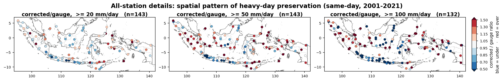{#fig-allstation-spatial fig-align="center"}

Heavy-event detection and the underlying mechanism, across the full station set:

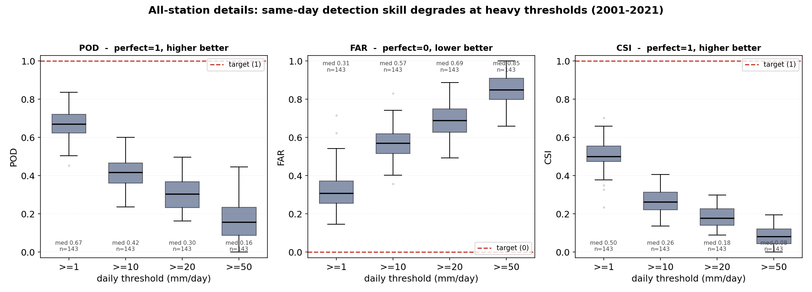{fig-align="center"}

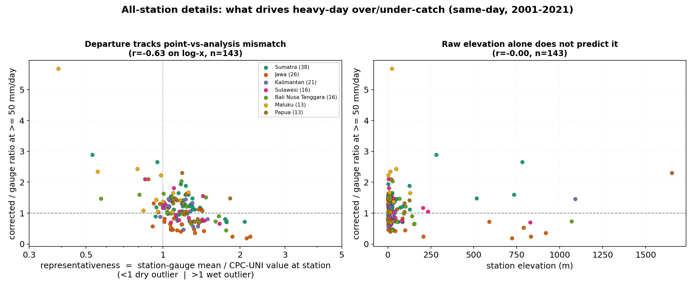{fig-align="center"}

## Per-product comparison

A close look at what each stage does, day by day, at a single pixel. All products track the gauge's wet-dry rhythm; the corrected products differ mainly in how they handle intensity and the tail:

{#fig-hero-zoom fig-align="center"}

A full year at one pixel, all six products overlaid:

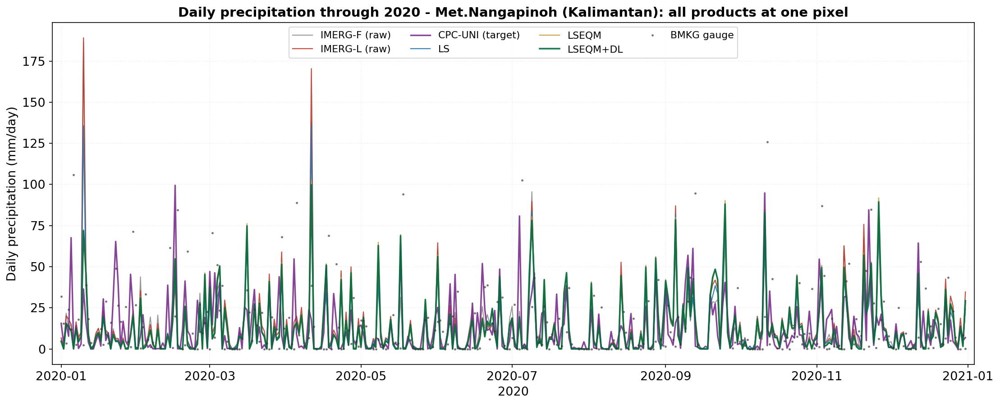{#fig-year-daily fig-align="center"}

Aggregated to monthly totals by region, and as a single-day spatial field, the corrected product is spatially coherent and seasonally consistent:

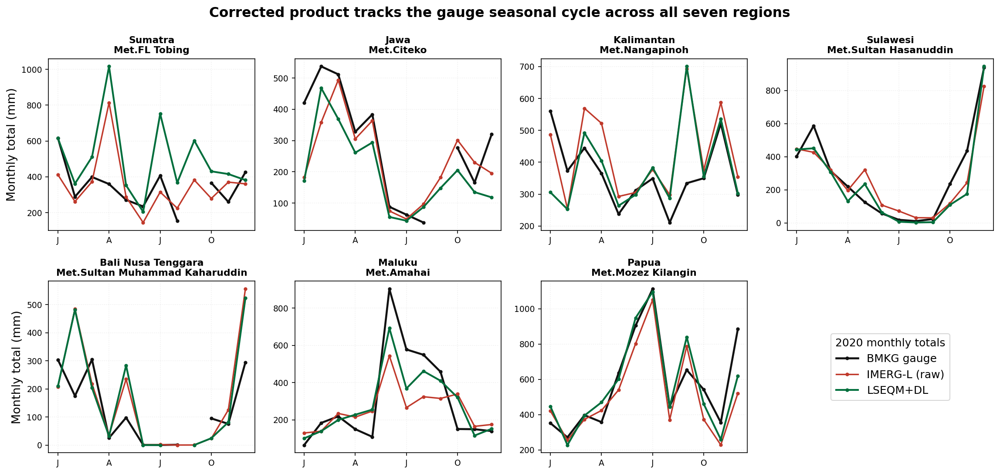{fig-align="center"}

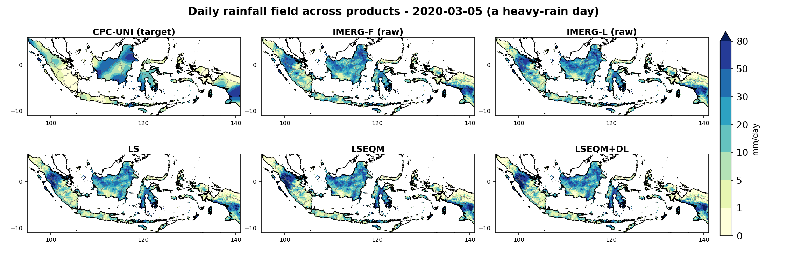{fig-align="center"}

## Summary

| Question | Answer from the Indonesia run |
|----------|-------------------------------|
| Does the mean improve? | Yes - relative bias near zero after LSEQM. |
| Does the distribution improve? | Yes - SDR 0.71 to 1.00, KS gap shrinks. |
| Do extremes improve? | Yes - Q99 ratio 0.71 to 1.01; heavy-day ratios move to 1.0. |
| Does daily correlation improve? | No - it is bounded near 0.34 by timing, mostly a calendar-window artefact. |
| Does the composite CQI rise? | No - it is dominated by timing-sensitive components that cannot move. |
| Does the CNN help? | Marginally and only where gauges are dense; it is a refinement, gated by station density. |

The framework's contribution is therefore twofold: a working, transferable correction that fixes what marginal bias correction *can* fix (values, distributions, extremes), and an honest diagnostic of the ceiling on what it *cannot* (daily timing), with evidence that most of that ceiling is a fixable windowing artefact rather than irreducible error.

For the data and code behind these figures, see the [Zenodo deposit](https://doi.org/10.5281/zenodo.20287847) and the [GitHub repository](https://github.com/bennyistanto/hybrid-bias-correction).
