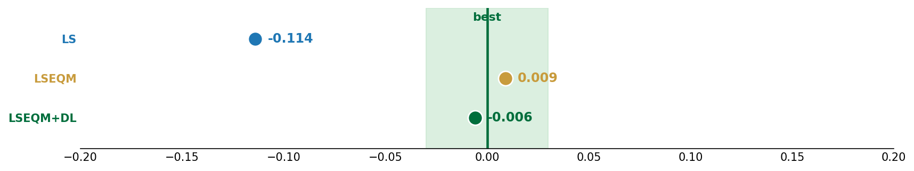
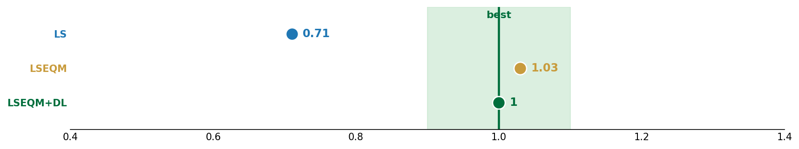
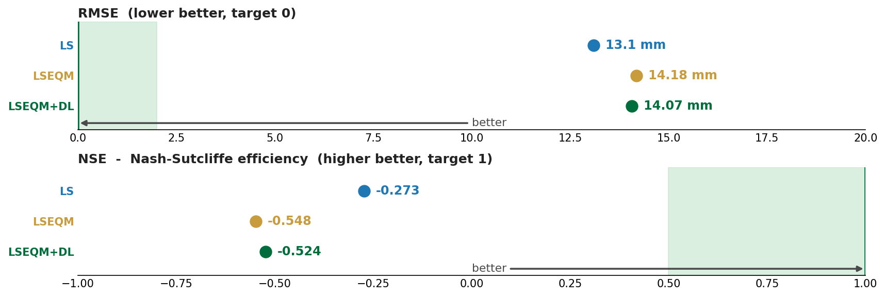
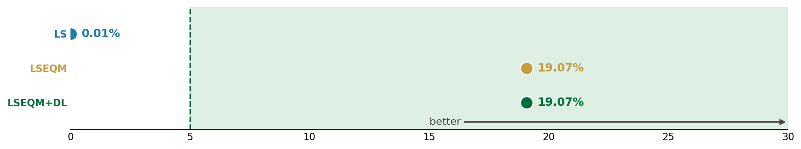
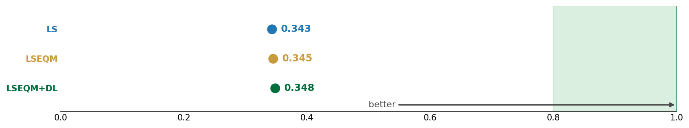
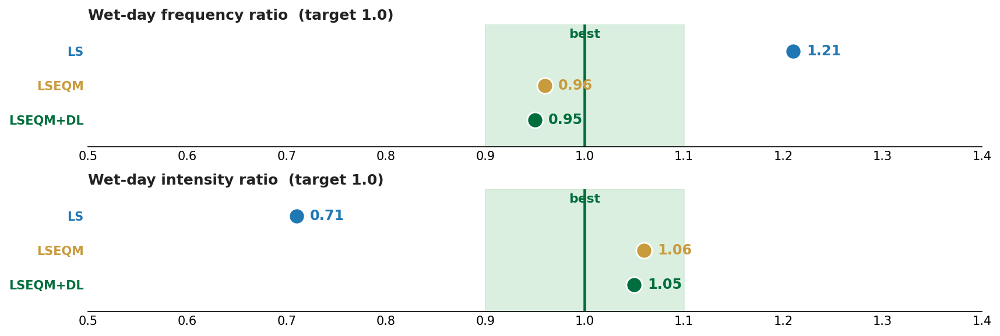
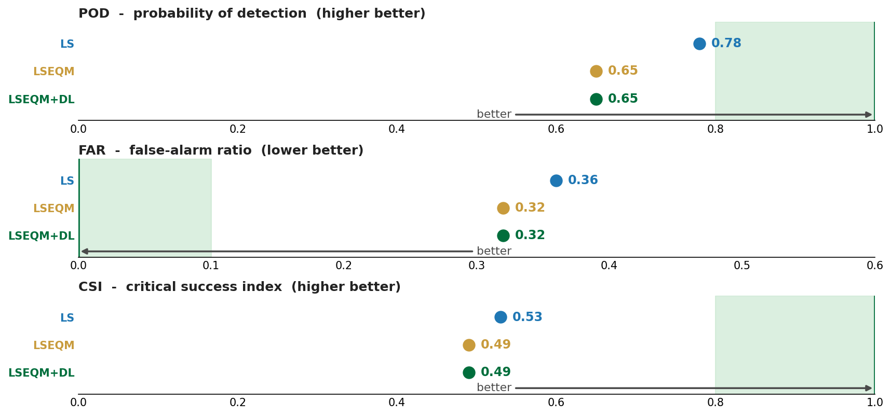
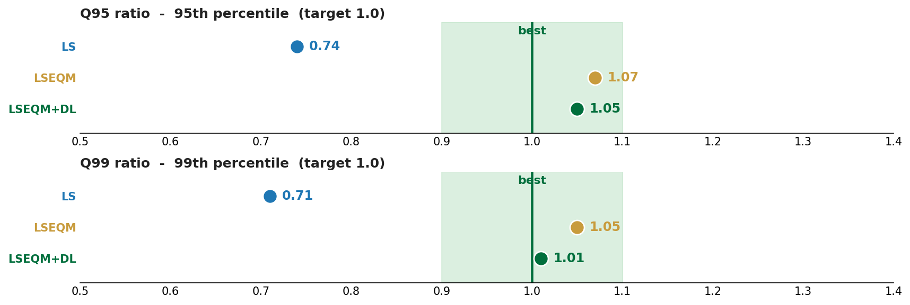

Before looking at the Bali or Indonesia results, it helps to know how to read the numbers. The framework reports metrics in several families, following WMO verification guidance (WMO/TD-1485, WMO-No. 1317). Each card below places the three correction stages (LS, LSEQM, LSEQM+DL) on a number line, with the **target** value and the **"better" direction** marked.

The values shown on the cards are from the full Indonesia run (171 validated stations). They are illustrative of the *shape* of each metric, not the headline result - for that, see the [Indonesia study](indonesia.qmd).

## Mean and bias

How close the long-term average is to the gauge. Relative bias is the headline mean-error metric; the target is zero.

{fig-align="center"}

## Variability

Whether the corrected field has the right amount of day-to-day spread. The standard-deviation ratio (SDR) compares the corrected variance to the gauge; the target is 1.0. Raw and LS-corrected satellite is usually too smooth (SDR < 1); EQM restores the spread.

{fig-align="center"}

## Error and efficiency

Root-mean-square error (lower is better, target 0) and Nash-Sutcliffe efficiency (higher is better, target 1). These are the metrics most sensitive to day-to-day timing, and they are where daily satellite precipitation struggles most - see [the correlation ceiling](indonesia.qmd#the-correlation-ceiling) for why.

{fig-align="center"}

## Distribution shape

The Kolmogorov-Smirnov statistic measures the largest gap between the corrected and gauge cumulative distributions; the target is 0 (distributions identical). This is where EQM does its work.

{fig-align="center"}

## Correlation

Pearson correlation of daily values against the gauge. Higher is better, but for daily satellite precipitation this metric is **bounded well below 1** by factors the correction cannot touch - see [the correlation ceiling](indonesia.qmd#the-correlation-ceiling).

{fig-align="center"}

## Wet-day frequency

Whether the corrected field rains on about the right number of days. The wet-day frequency ratio compares corrected wet-day count to the gauge at the 1 mm/day threshold; the target is 1.0.

{fig-align="center"}

## Categorical detection

Did the product rain on the days the gauge says it rained? Probability of detection (POD), false-alarm ratio (FAR), and critical success index (CSI) summarise hit/miss/false-alarm behaviour at a chosen threshold. These are computed at multiple thresholds (1 to 150 mm/day) to show how detection skill degrades with intensity.

{fig-align="center"}

## Extremes

How well the upper tail is reproduced: the 99th-percentile ratio (Q99, target 1.0) and heavy-day detection. This is what the GPD tail graft targets.

{fig-align="center"}

## The Continuous Quality Index

Most of the metrics above are folded into a single 0-1 **Continuous Quality Index (CQI)** per pixel, a weighted blend of basic-statistics, distribution, and temporal components. The [QA Framework tutorial](../tutorials/qa-framework.qmd) explains the CQI in detail, and the [Indonesia study](indonesia.qmd#spatial-skill) shows it mapped across the archipelago.

::: {.callout-tip}
A recurring pattern in the results: **distribution and extreme metrics improve markedly under LSEQM, while correlation and NSE barely move.** This is expected, not a defect. Reading the cards above with that in mind makes the case-study results much easier to interpret.
:::
