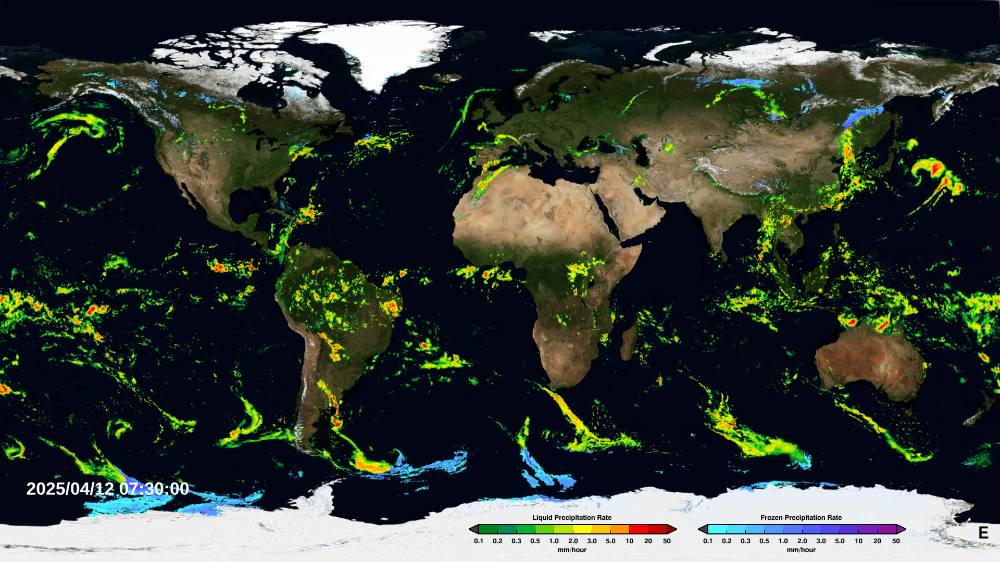
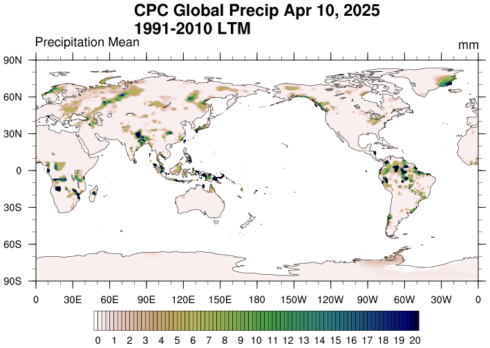

# Data

This research only use publicly available data on the internet and utilize free and open source software, mainly [Python](https://www.python.org/) and the libraries.

There are two data will be used in this analysis.

1. **IMERG:**
   The Global Precipitation Measurement (GPM) Integrated Multi-satellite Retrievals for GPM ([IMERG](https://gpm.nasa.gov/data/imerg)) dataset is a high-resolution satellite product that estimates global precipitation. IMERG combines data from multiple satellites to offer near real-time precipitation measurements, with a spatial resolution of 0.1-degrees and a temporal resolution of 30-minutes, daily and monthly.

   This dataset is particularly valuable for monitoring and analyzing precipitation patterns, especially in regions with sparse ground-based observations. IMERG data are accessible via the NASA Goddard Earth Sciences Data and Information Services Center ([GES DISC](https://disc.gsfc.nasa.gov/#!)) and available in GEE Data Catalog for large-scale analyses. **IMERG Late Run** (IMERG-L), which has a latency of around 12-18 hours, will be used for the analysis.

   

2. **CPC-UNI:**
   The Climate Prediction Center Unified Gauge-Based Analysis of Daily Precipitation (CPC-UNI) dataset is a reliable source of gauge-based precipitation measurements, providing daily precipitation data with a global coverage at a 0.5-degree spatial resolution. This dataset is derived from thousands of rain gauges worldwide and is used to validate and correct satellite precipitation estimates.

   The CPC-UNI dataset is available from the [NOAA Physical Science Laboratory](https://psl.noaa.gov/data/gridded/data.cpc.globalprecip.html) and serves as an essential reference for bias correction, ensuring the accuracy and reliability of precipitation data in hydrological and climate studies.

   
