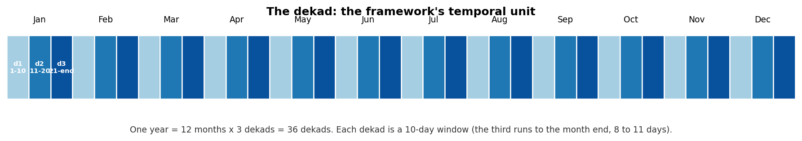

## Purpose

This page is the practical bridge between:

- **Quick Start / Tutorials** (how to run),
- **User Guide** (how to interpret), and
- **Methodology / Implementation** (why each design choice was made).

If you are unsure whether your data is "ready" for the LSEQM+DL pipeline, what `config.yml` expects to find, or what each output NetCDF contains, start here.

---

## Input Data Contract

### Supported containers

- Gridded inputs: **`xarray.Dataset`** (preferred) or **`xarray.DataArray`**, served from CF-compliant NetCDF.
- Station inputs: **`pandas.DataFrame`** loaded from semicolon-separated CSV (location) and comma-separated CSV (daily observations).

### Required coordinates and dimensions

Your gridded inputs must include:

- `time` (datetime64)
- `lat` (decimal degrees, ascending preferred)
- `lon` (decimal degrees)

Preferred dimension order: `(time, lat, lon)`. The loader checks lat orientation and flips descending grids automatically.

### Temporal resolution

- **Daily** timestep across all gridded inputs.
- Continuous time axis: gaps are tolerated but flagged.
- Recommended minimum: **20 years** for stable GPD tail estimation.

### Spatial conventions

- Resolution: **0.1 deg** for IMERG and the regridded CPC. CPC native is **0.5 deg**.
- Coordinate names: `lat`, `lon` (not `y`, `x`).
- Mask alignment uses `reindex(method='nearest')`, not `interp`, so float32 / float64 dtype mismatches at AOI boundaries do not silently drop edge cells.

### Required input files

| File | Grid | Variable | Units | Role |
|------|------|----------|-------|------|
| `imergl_file` | 0.1 deg | `precipitation` | mm/day | The satellite field being corrected (IMERG Late Run V07) |
| `imergf_file` | 0.1 deg | `precipitation` | mm/day | Gauge-adjusted satellite baseline (IMERG Final Run V07) - comparison only |
| `cpc_file` | 0.1 deg | `precip` | mm/day | CPC-UNI regridded - per-pixel EQM target |
| `cpc_native_file` | 0.5 deg | `precip` | mm/day | CPC-UNI native - BCSD parameter fitting source |
| `mask_file` | 0.1 deg | `land` (1 = land, 0 / NaN = sea) | -- | Applied at load time; ocean cells become NaN |
| `station_file` | CSV (`;` separator) | `ID, ID_WMO, Station, Lon, Lat, Elevation, region, a1name, a2name` | -- | Station metadata for confidence mask + validation |
| `station_data_file` | CSV (`,` separator, wide format) | one column per WMO ID, indexed by `ID, Date, JD` | mm/day | Daily station observations for validation |

Paths are declared in `config.yml` and support `{main_dir}` / `{input_dir}` placeholders. See [Configuration](configuration.qmd).

### Variable name conventions

Configurable through `config.yml`:

```yaml
variable_names:
  imerg_precip_var: "precipitation"   # IMERG-L and IMERG-F
  cpc_precip_var:   "precip"          # CPC-UNI (both 0.1 deg and native 0.5 deg)
  mask_var:         "land"            # 1 = land, 0 / NaN = sea
```

Verify with `ncdump -h <file>` or `xarray.open_dataset(<file>).data_vars` before running.

### Missing values

- **IMERG / CPC**: `NaN` for missing.
- **Mask**: ocean is `NaN`; land is `1.0`. Applied via `xr.where(mask == 1)` so ocean pixels become NaN, not zero - this prevents ocean contamination of mean calculations.
- **BMKG station observations**: sentinel value `8888.0` for missing (configurable via `station_validation.missing_sentinel`).

::: {.callout-tip}
## Quick sanity checks (recommended)

```python
import xarray as xr
from src.config import initialize_config

config = initialize_config('config_bali.yml')

for label, path in [
    ('IMERG-L', config.imergl_file),
    ('IMERG-F', config.imergf_file),
    ('CPC 0.1', config.cpc_file),
    ('CPC 0.5', config.cpc_native_file),
    ('Mask',    config.mask_file),
]:
    ds = xr.open_dataset(path)
    has_time = 'time' in ds.coords
    print(
        f"{label:8s}: dims={dict(ds.sizes)}, "
        f"time={str(ds.time.values[0])[:10] if has_time else 'n/a'}.."
        f"{str(ds.time.values[-1])[:10] if has_time else 'n/a'}"
    )
    ds.close()
```

If the time ranges line up across IMERG and CPC, and the mask grid matches the IMERG grid, you are ready to run [Full Pipeline](../tutorials/full-pipeline.qmd) starting from nb02.
:::

### Data quality thresholds (per dekad per pixel)

The pipeline enforces these minimums during fitting. If a pixel fails any check, the output for that pixel becomes NaN (or zero) for the dekad.

| Check | Threshold | What happens if violated |
|-------|-----------|--------------------------|
| Non-NaN IMERG time series | any non-NaN day | Pixel skipped (NaN output) |
| Wet days in IMERG | >= 5 (above `wet_day_threshold = 1.0 mm/day`) | Output forced to zero (preserves dry climatology) |
| GPD exceedances | >= `n_splits_gpd_crossvalidate` (default 5) | Below that, `cross_validate_gpd` silently falls back to a single GPD fit on the whole sample - no error, just no K-Fold averaging |
| Gamma fit shape / scale | > 0 | Pixel returns NaN |

::: {.callout-warning}
## Very dry dekads

In peak dry season in highly seasonal regions, some pixels may have fewer than 5 wet days across the dekad. The pipeline outputs zero for those, which preserves the dry climatology but means the LSEQM step is effectively a no-op there. Distribution metrics will still be computed; they just reflect a degenerate distribution.
:::

---

## Dekad temporal convention

The pipeline correction parameters are fit **per dekad** (10-day window). Each calendar month has three dekads:

- Dekad 1: days 1-10
- Dekad 2: days 11-20
- Dekad 3: days 21-end (28, 29, 30, or 31)

That gives **36 dekads per year**. Fitting independently per dekad lets the framework follow the wet-dry seasonal cycle without smearing the monsoon onset / retreat.

{#fig-dekad fig-align="center"}

### Calibration period

- The full overlap between IMERG and CPC time axes is used (typically 2001-onward).
- Calibration is applied **per pixel, per dekad** (each cell fitted independently for each of the 36 windows).
- For Indonesia (2001-2025) this means ~25 samples per (pixel, day-in-dekad) - enough to fit gamma + GPD with K-Fold cross-validation.

### Parameter reuse (recommended for repeated runs)

Trained CNN models are written to disk so subsequent runs can skip the training step:

```
output/trained_models/bias_correction_model_month{MM}_dekad{DD}.keras
```

When a model file already exists, `runtime.existing_model_action` decides whether to reuse it (`use_existing`, default), overwrite, or abort. There is no normalisation sidecar: normalisation is per-sample (each daily field is divided by its own maximum and the prediction is multiplied back by it), so the `.keras` file is all you need.

---

## Output Contract (What You Get Back)

The pipeline writes each correction stage to its own directory so any stage can be evaluated or replaced independently.

```
data/output/
  corrected_ls/         per-dekad NetCDF (Linear Scaling)
  corrected_lseqm/      per-dekad NetCDF (LS + EQM + GPD)
  corrected_lseqmdl/    per-dekad NetCDF (LSEQM + CNN refinement)
  trained_models/       one .keras per dekad
  station_density/      confidence_mask_station_density.nc4
  metrics_{method}/     per-dekad metrics NetCDF
  quality_{method}/     per-dekad QA NetCDF
  station_validation/   per-method CSVs
  figures/              QA / Taylor / station validation PNGs
```

### Corrected precipitation

**Return type:** one NetCDF per dekad per method.

**Filename pattern:** `{prefix}_{method_abbr}_corrected_imergl_month{MM}_dekad{D}.nc4`
(e.g. `bali_cli_lseqmdl_corrected_imergl_month01_dekad01.nc4`).

| Variable | Type | Units | Description |
|----------|------|-------|-------------|
| `precipitation` | float32 | mm/day | Corrected daily precipitation |
| `lat`, `lon` | float64 | deg | Cell-centre coordinates on the 0.1 deg grid |
| `time` | datetime64 | UTC | Daily timestamps for the dekad x all years |

Global attributes record the correction method (`ls` / `lseqm` / `lseqmdl`), source files, framework version, and run timestamp.

### Trained CNN models

```
trained_models/
  bias_correction_model_month{MM}_dekad{DD}.keras   # Keras model
```

Load with `tf.keras.models.load_model(path)`. The model name carries no filename prefix and needs no companion file.

### Confidence mask

`station_density/confidence_mask_station_density.nc4` - a single 2-D field on the 0.1 deg grid with values in `[0, 1]`. Built once per AOI from the station network; cached for the rest of the session.

### Metrics

One per-dekad NetCDF per method:

```
metrics_{method}/{prefix}_metricssd_{ref}_imergl_{method}_month{MM}_dekad{DD}.nc4
```

`{ref}` is `cpc`, `imergl`, or `imergf`; `sd` marks single-dekad mode (timeseries mode writes `metricsts`).

Contains a 31-variable set drawn from WMO/TD-1485 + WMO-1317: relative bias, Pearson r, RMSE, MAE, reference and test standard deviation plus their ratio, POD, FAR, CSI, wet-day frequency and mean wet-day precipitation (reference and test), NSE, maximum dry-spell length (reference and test), KS statistic and KS p-value, and the 25th / 50th / 75th / 90th / 95th / 99th percentile **values** for reference and test.

### QA framework (CQI)

One per-dekad NetCDF per method:

```
quality_{method}/{prefix}_qualitysd_{ref}_imergl_{method}_month{MM}_dekad{DD}.nc4
```

| Variable | Range | Meaning |
|----------|-------|---------|
| `basic_statistical_quality` | 0-1 | Relative bias / RMSE / NSE component (no correlation term) |
| `distribution_quality` | 0-1 | Distribution-shape component |
| `temporal_quality` | 0-1 | Event-timing component |
| `continuous_quality` (CQI) | 0-1 | Weighted sum of the three components |
| `categorical_quality` | 1-4 | Poor / Fair / Good / Excellent classification |
| `confidence_level` | 0-1 | Confidence in the assessment itself: metric consistency, KS p-value, and sample size. Unrelated to gauge density |

### Station validation

Written by `05_station_validation.ipynb`; these filenames carry no prefix.

```
station_validation/
  station_validation_{method}_month{MM}_dekad{DD}.csv        # 31 metrics x stations
  station_validation_summary_month{MM}_dekad{DD}.csv         # all methods, one dekad
  station_multi_threshold_{method}_month{MM}_dekad{DD}.csv   # WMO threshold scores per station
  multi_threshold_summary_{method}_month{MM}_dekad{DD}.csv   # threshold scores aggregated
```

Taylor diagram PNGs are written to `figures/taylor/`, not here.

### Figures

```
figures/
  qa/                  QA spatial maps (8 plot types x 36 dekads x 2 quality modes)
  taylor/              Pooled + per-dekad Taylor diagrams
  station_validation/  Per-station scatter, threshold curves, regional boxplots
```

---

## Configuration tokens

`config.yml` uses three placeholder tokens that `initialize_config()` resolves at load time:

| Token | Resolves to |
|-------|-------------|
| `{main_dir}` | Repo root (`directories.main_dir` from config) |
| `{input_dir}` | `{main_dir}/data/input` (or override via `directories.input_dir`) |
| `{output_dir}` | `{main_dir}/data/output` (or override) |
| `{method}` | Expanded per call: `ls` / `lseqm` / `lseqmdl` |

So the YAML key `output_dirs.metrics: "{output_dir}/metrics_{method}"` is read by `initialize_config()` into the `src.config.metrics_path_template` attribute, which becomes `data/output/metrics_lseqm/` when the pipeline runs for `method='lseqm'`.

---

## NetCDF encoding (CF-1.8)

All output NetCDFs follow [CF Conventions 1.8](https://cfconventions.org/Data/cf-conventions/cf-conventions-1.8/cf-conventions-1.8.html):

| Property | Value |
|----------|-------|
| Data type | `float32` |
| Compression | zlib level 4 |
| `_FillValue` | `NaN` |
| `Conventions` | `CF-1.8` |
| `lat.standard_name` | `latitude`, units `degrees_north` |
| `lon.standard_name` | `longitude`, units `degrees_east` |
| `time.units` | `days since 2001-01-01` |
| `precipitation.standard_name` | `lwe_precipitation_rate`, units `mm day-1` |

Reproducibility metadata on each output: `framework_version`, `git_commit`, `config_file`, `run_timestamp`, `blend_alpha`, `gpd_threshold_percentile`, `saturation_count`.

See [Technical > CF Compliance](../technical/cf-compliance.qmd) for the full attribute table.

---

## Where to go next

- Want **"how-to"**? -> [Quick Start](quick-start.qmd) and [Tutorials](../tutorials/data-preparation.qmd)
- Want **meaning / interpretation**? -> [User Guide](../user-guide/index.qmd)
- Want **scientific detail**? -> [Methodology](../methodology/index.qmd)
- Want **algorithm detail**? -> [Implementation](../implementation/index.qmd)
- Want **API reference**? -> [Technical > API Reference](../technical/api-reference/index.qmd)

---

## See Also

- [Installation](installation.qmd) - Setup and dependencies
- [Quick Start](quick-start.qmd) - First Bali run
- [Configuration](configuration.qmd) - Driver YAML reference
- [Data Preparation](../tutorials/data-preparation.qmd) - Define AOI + download data for a new region
- [Troubleshooting](../user-guide/troubleshooting.qmd) - Common errors and fixes
