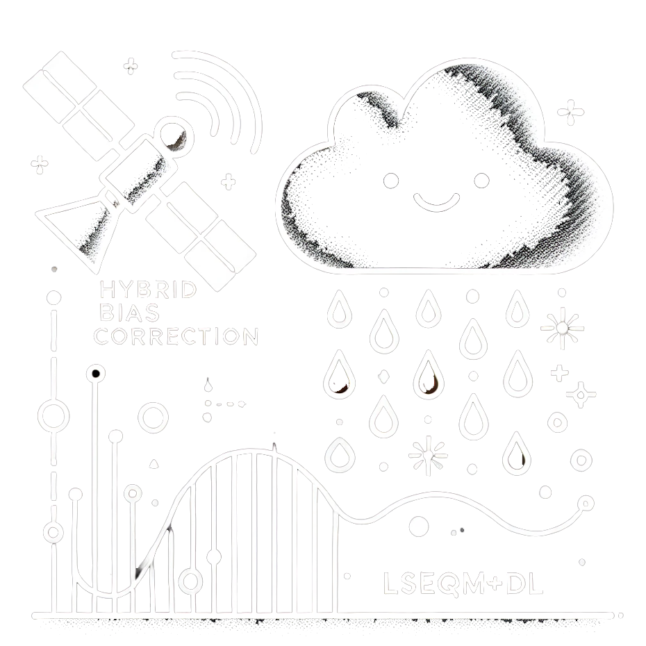

::: {.hero-banner}
::: {.hero-logo}

:::

::: {.hero-content}
# Values, Distributions, Extremes - with Neural Refinement

A reproducible Python framework that combines **Linear Scaling**, **Empirical Quantile Mapping with a GPD tail**, and a lightweight **CNN refinement** to correct biases in daily satellite precipitation estimates. Built for tropical regions with sparse gauge networks - tested operationally over Indonesia.

*Adjusting values, aligning distributions, preserving extremes - with neural refinement where station density allows.*

Python 3.10+
MPL-2.0
v2026.05

[Quickstart](get-started/quick-start.qmd){.btn .btn-primary .btn-lg role="button"}
[View on GitHub](https://github.com/bennyistanto/hybrid-bias-correction){.btn .btn-outline-light .btn-lg role="button"}
:::
:::

---

## What data does it work with?

The framework is **designed for** three products on a common 0.1 deg daily grid:

| Role | Product | Source | Used for |
|------|---------|--------|----------|
| **Satellite (corrected)** | IMERG Late Run V07 | NASA GPM | The field being bias-corrected |
| **Reference** | CPC-UNI (0.5 deg native + regridded to 0.1 deg) | NOAA PSL | Distribution / quantile target for the correction |
| **Independent check** | BMKG station observations (Indonesia) | National service | Validation only, held out from training |

Other products work too, as long as they follow the same structure: CF-compliant NetCDF, daily timestep, lat/lon grid, mm/day units, with variable names declared in `config.yml`. See [Data Model](get-started/data-model.qmd) for the exact conventions and [Data Preparation](tutorials/data-preparation.qmd) for the workflow of swapping in a different source or region.

## What it does

The framework takes the satellite product and a gauge-based reference, and produces a bias-corrected daily field that better matches the reference distribution while preserving the satellite's spatial detail. Three correction stages are applied in sequence:

1. **LS** - Linear Scaling matches the long-term mean per dekad.
2. **LSEQM** - Empirical Quantile Mapping reshapes the full daily distribution, with a Generalized Pareto Distribution fit to the upper tail to handle extremes.
3. **LSEQM+DL** - A CNN learns the residual spatial pattern and refines the extremes, blended back into LSEQM with a station-density confidence mask so the deep learning correction only takes effect where gauge support justifies it.

Each stage can be evaluated independently against the reference and against an independent set of BMKG weather stations.

## Why it exists

Satellite precipitation underestimates light rain, mis-shapes the upper tail, and varies in skill across the seasonal cycle. Pure statistical correction handles the marginal distribution well but ignores spatial structure. Pure deep learning needs training data that does not exist in sparsely gauged regions. This framework keeps the statistical core as a physical floor and adds DL only where it earns its keep.

## Key Features

::: {.grid-container}
::: {.feature-card}
### Dekad-Aware Correction

- Parameters fit per 10-day window (36 per year)
- Captures the wet-dry seasonal cycle
- No global parameters that wash out tropical variability
:::

::: {.feature-card}
### Distribution-Aware

- Gamma fit to the body of the distribution
- Generalized Pareto Distribution for the tail
- 80th-percentile threshold by default (sensitivity caveat documented)
:::

::: {.feature-card}
### Station-Density Aware

- Gauge-count-driven confidence mask at CPC 0.5 deg resolution
- Gaussian-smoothed, saturating with station count
- DL influence scales with local gauge support
:::

::: {.feature-card}
### Reproducible

- Single `config.yml` drives every path and parameter
- Notebooks call `src/` modules (no inline algorithms)
- Bali example data ships with the repo for end-to-end testing
:::

::: {.feature-card}
### Validated

- Continuous Quality Index combining basic, distribution, and temporal scores
- Independent BMKG station validation (held out from training)
- WMO-compliant metrics
:::

::: {.feature-card}
### Colab-Ready

- Run the full Bali pipeline in a free Colab session
- No CUDA or TensorFlow install pain on the user side
- The same code that ran the Indonesia evaluation runs the tutorial
:::
:::

---

## At a Glance

| | |
|--|--|
| **Domain** | Tropical (operationally tested over Indonesia) |
| **Resolution** | 0.1 deg, daily |
| **Period** | 2001 onward (IMERG V07 availability) |
| **Reference** | CPC-UNI (gauge-based) |
| **Satellite** | IMERG Late Run V07 |
| **Independent check** | BMKG weather stations |
| **License** | MPL-2.0 |

## Next steps

- [Install the package](get-started/installation.qmd) and reproduce the Bali quickstart
- Open the [QA Framework](tutorials/qa-framework.qmd) and [Station Validation](tutorials/station-validation.qmd) tutorials to see what the framework actually produces
- Explore the [Case Studies](case-studies/index.qmd): the runnable Bali example and the full Indonesia evaluation, including [the correlation ceiling](case-studies/indonesia.qmd#the-correlation-ceiling) diagnostic
- Open the [interactive dashboard](https://bennyistanto.github.io/hybrid-bias-correction/viz/) to explore the Indonesia results directly: staged skill, the correlation ceiling, and the calendar-window recovery
- Read the [methodology overview](methodology/index.qmd) to understand the LSEQM+DL design
- See the [Changelog](changelog.qmd) for what's in v2026.05
- Browse the [API reference](technical/api-reference/index.qmd) for module-level documentation

---

## Publication

Companion manuscript: under review at *Remote Sensing* (MDPI). DOI and citation will be added on acceptance.

## How to cite

If you use this framework, please cite the archived software release:

> Istanto, B., Boer, R., & Santikayasa, I. P. (2026). *Hybrid Bias Correction: Values, Distributions, Extremes - with Neural Refinement* (v2026.05). Zenodo. [https://doi.org/10.5281/zenodo.20473508](https://doi.org/10.5281/zenodo.20473508)

If you use the bundled full-Indonesia data archive, please cite it separately:

> Istanto, B., Boer, R., & Santikayasa, I. P. (2026). *Hybrid Bias Correction of IMERG Late Run V07 over Indonesia (2001-2025): Input Data, Land-Sea Masks, and Corrected Products* (Version 1) [Data set]. Zenodo. [https://doi.org/10.5281/zenodo.20287847](https://doi.org/10.5281/zenodo.20287847)

Machine-readable metadata is in [`CITATION.cff`](https://github.com/bennyistanto/hybrid-bias-correction/blob/main/CITATION.cff); GitHub renders it as a "Cite this repository" button on the repo landing page.

## Author

**Benny Istanto** - [https://benny.istan.to/about](https://benny.istan.to/about)

Department of Geophysics and Meteorology 
[Bogor Agricultural University](https://www.ipb.ac.id/), Indonesia 
Email: [bennyistanto@apps.ipb.ac.id](mailto:bennyistanto@apps.ipb.ac.id)

With supervision from [Prof. Dr. Ir. Rizaldi Boer, M.S.](https://scholar.google.com/citations?user=jTPXEp8AAAAJ&hl=en) and [Dr. I Putu Santikayasa, S.Si., M.Sc.](https://scholar.google.com/citations?user=DcQ58z8AAAAJ&hl=en) as part of the MSc thesis.

::: {.text-muted .small}
v2026.05 - First public release of the documentation site. Indonesia bundle on Zenodo: [10.5281/zenodo.20287847](https://zenodo.org/records/20287847).
:::
