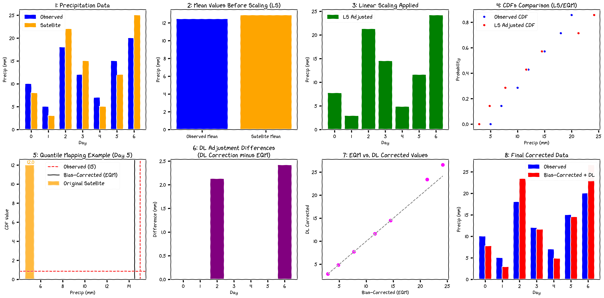

# Methodology

Bias correction of satellite-based precipitation estimates is crucial in climate studies to enhance their accuracy and reliability. This exercise explores a hybrid method that integrates statistical and machine learning techniques to address both systematic biases and the full distributional discrepancies between satellite-derived data and ground-based observations.

## 1 Conceptual Framework

The proposed bias correction framework sequentially improves satellite precipitation estimates through multiple processing steps. First, Linear Scaling (LS) adjusts the overall magnitude to match ground observations. Then, Empirical Quantile Mapping (EQM) with tail adjustment via a Generalized Pareto Distribution (GPD) is applied to align the entire distribution of the satellite data with the observed data. Finally, a Deep Learning (DL) model is incorporated to further refine the EQM-corrected output—specifically targeting extreme events and local spatial variability. This multi-step approach ensures both typical and exceptional rainfall behaviors are accurately represented.

Figure 1. LSEQM+DL conceptual framework

## 2 Main Components of the Workflow

The overall workflow consists of the following components, each addressing a specific aspect of bias correction:

### 2.1 Adjusting Values with Linear Scaling (LS)

This initial step ensures that the overall magnitude of satellite-derived precipitation matches the observed data, providing a baseline correction that is crucial for subsequent adjustments.

#### Linear Scaling (LS) Approach

The Linear Scaling (LS) method is applied first to correct the mean bias in the IMERG precipitation data relative to the CPC precipitation data. The LS approach involves calculating a scale factor as the ratio of the observed mean to the modeled mean:

$$
\text{Scale Factor} = \frac{\mu_{\text{obs}}}{\mu_{\text{mod}}}
$$

where $\mu_{\text{obs}}$ is the mean precipitation from the CPC observations, and $\mu_{\text{mod}}$ is the mean precipitation from the IMERG satellite data. This scale factor is then used to adjust the IMERG data:

$$
P_{\text{corrected}} = P_{\text{IMERG}} \times \text{Scale Factor}
$$

The strength of this approach lies in its simplicity and effectiveness in correcting systematic biases. However, it does not address distributional differences, particularly in the tails of the distribution where extreme values occur.

### 2.2 Aligning Distributions with Empirical Quantile Mapping (EQM)

Aligning the distributions ensures that the corrected precipitation data not only matches the overall magnitude but also the variability and distribution patterns observed in the ground-based data.

#### Basic Empirical Quantile Mapping (EQM)

Empirical Quantile Mapping (EQM) is a comprehensive method used to align the distributions of satellite-based precipitation estimates with ground-based observations. By matching the empirical cumulative distribution functions (CDFs) of the two datasets, EQM corrects distributional biases across the entire range of precipitation values.

$$
Q_{\text{corrected}} = F_{\text{obs}}^{-1}\Bigl(F_{\text{mod}}\bigl(P_{\text{IMERG}}\bigr)\Bigr)
$$

where $F_{\text{obs}}$ and $F_{\text{mod}}$ are the CDFs of the observed and modeled precipitation, respectively, and $Q_{\text{corrected}}$ represents the bias-corrected quantiles. The strength of EQM lies in its ability to correct distributional biases across the entire range of precipitation values. However, it might miss extreme values if they are not well represented in the observational data.

#### Gamma Distribution-Based Quantile Mapping

To further refine the bias correction, gamma distribution-based quantile mapping is applied. This involves fitting gamma distributions to both IMERG and CPC data using the method of moments, ensuring accurate representation of the distribution shapes. The gamma distribution is defined by its shape $(k)$, location $(\theta)$, and scale $( \beta)$ parameters:

$$
f(x; k, \theta, \beta) = \frac{(x-\theta)^{k-1} e^{-(x-\theta)/\beta}}{\beta^k \, \Gamma(k)}
$$

Fitting these parameters involves solving moment equations that relate the moments of the data to the parameters of the gamma distribution. The strength of this method is its mathematical rigor in fitting the entire distribution. However, it requires careful handling of parameter bounds to avoid infeasibility issues during optimization.

### 2.3 Preserving Extremes with Tail Adjustment (GPD)

Preserving extremes is essential for accurately representing and predicting rare but significant precipitation events, which are critical for flood risk management and other climate-related applications.

#### Tail Adjustment with Generalized Pareto Distribution (GPD)

To accurately capture extreme values, the method incorporates tail adjustment using the Generalized Pareto Distribution (GPD). This involves fitting a GPD to the excesses above a high threshold, defined as the 95th percentile in this study. The GPD is defined by its shape $(\xi)$, location $(\mu)$, and scale $(\sigma)$ parameters:

$$
f(x; \xi, \mu, \sigma) = \frac{1}{\sigma} \left(1 + \xi \frac{x-\mu}{\sigma}\right)^{-\left(\frac{1}{\xi} + 1\right)}
$$

This step is crucial for accurately capturing extreme precipitation events, which are often underrepresented in observational datasets. The main strength of this approach is its focus on tail behavior, improving the representation of extremes. However, the requirement for sufficient data points above the threshold can be a limitation in sparse datasets.

### 2.4 Incorporating Deep Learning (DL) Enhancement

While LS, EQM, and GPD adjustments provide a robust framework for correcting mean biases and distributional discrepancies, they may still struggle to optimally capture pixel-level variability—especially in regions exhibiting complex micro-scale precipitation features. To address this, a Deep Learning (DL) model is integrated into the bias correction pipeline.

#### Deep Learning (DL) Model for Refinement

The DL component is designed to fine-tune the EQM-corrected output by targeting pixels with extreme values or complex local patterns that are not well addressed by the traditional statistical approaches. The DL model is trained on spatially distributed datasets (e.g., daily precipitation fields) and learns a mapping from the EQM-corrected satellite estimates to the ground-based observations. Mathematically, this process can be represented as:

$$
P_{\text{final}} = \text{DL}\left(Q_{\text{corrected}}\right)
$$

where $\text{DL}(\cdot)$ denotes the deep neural network applied to the EQM output $Q_{\text{corrected}}$. The model focuses on:

- **Further refining extreme values:** Enhancing prediction accuracy for high-intensity precipitation events.
- **Spatial consistency:** Capturing spatial dependencies that statistical approaches might miss.
- **Adaptive correction:** Providing a dynamic adjustment based on local precipitation patterns.

The integration of the DL model serves as a final “polishing” step, ensuring that the corrected precipitation fields accurately reproduce both the central tendency and the tail behavior observed in ground measurements.

## 3 Measuring Performances

Bias correction in precipitation data aims to adjust systematic errors between satellite-based estimates and ground-based observations. The evaluation of bias correction performance relies on several complementary metrics that assess different aspects of the correction quality:

### 3.1 Basic Statistical Metrics

1. **Relative Bias (RB)**  
   Measures the proportional difference between test and reference datasets
   $$ RB = \frac{P_{test} - P_{ref}}{P_{ref}} $$

2. **Pearson Correlation Coefficient (CORR)**  
   Assesses the linear relationship between the two datasets
   $$ r = \frac{\sum_{i=1}^{n} (P_{test,i} - \overline{P_{test}})(P_{ref,i} - \overline{P_{ref}})}{\sqrt{\sum_{i=1}^{n} (P_{test,i} - \overline{P_{test}})^2}\sqrt{\sum_{i=1}^{n} (P_{ref,i} - \overline{P_{ref}})^2}} $$

3. **Root Mean Squared Error (RMSE)**  
   Quantifies the magnitude of errors with emphasis on larger differences
   $$ RMSE = \sqrt{\frac{1}{n}\sum_{i=1}^{n} (P_{test,i} - P_{ref,i})^2} $$

4. **Mean Absolute Error (MAE)**  
   Measures the average magnitude of errors
   $$ MAE = \frac{1}{n}\sum_{i=1}^{n} |P_{test,i} - P_{ref,i}| $$

5. **Nash-Sutcliffe Efficiency (NSE)**  
   Indicates how well the bias-corrected values match reference data, ranging from -∞ to 1
   $$ NSE = 1 - \frac{\sum_{i=1}^{n}(P_{ref,i} - P_{test,i})^2}{\sum_{i=1}^{n}(P_{ref,i} - \overline{P_{ref}})^2} $$

6. **Standard Deviation (STDEV)**  
   Measures the variability in each dataset
   $$ STDEV = \sqrt{\frac{1}{n-1}\sum_{i=1}^{n} (P_i - \overline{P})^2} $$

7. **Kolmogorov-Smirnov Test (KS)**  
   Evaluates if two samples come from the same distribution by measuring maximum distance between their cumulative distribution functions
   $$ D = \max_x |F_{test}(x) - F_{ref}(x)| $$

### 3.2 Categorical Statistics (using threshold)

1. **Probability of Detection (POD)**  
   Measures the fraction of observed events that were correctly detected
   $$ POD = \frac{hits}{hits + misses} $$

2. **False Alarm Ratio (FAR)**  
   Indicates the fraction of predicted events that did not occur
   $$ FAR = \frac{false\_alarms}{hits + false\_alarms} $$

3. **Critical Success Index (CSI)**  
   Provides a balanced measure of detection accuracy
   $$ CSI = \frac{hits}{hits + misses + false\_alarms} $$

4. **Frequency of Precipitation Days (FPD)**  
   Calculates the percentage of days with precipitation above threshold
   $$ FPD = \frac{days \geq threshold}{total\ days} \times 100 $$

5. **Mean Wet-Day Precipitation (MDWP)**  
   Average precipitation on wet days
   $$ MDWP = \frac{\sum_{P_i \geq threshold} P_i}{n_{wet}} $$

6. **Dry Spell Length (DSL)**  
   Maximum number of consecutive days with precipitation below threshold
   $$ DSL = \max(consecutive\ days < threshold) $$

### 3.3 Distribution Percentiles

Computed for both reference and test datasets to assess distribution matching:

- General distribution: 25th (Q1), 50th (median), 75th (Q3)
- Extreme precipitation: 90th, 95th, 99th percentiles

where:

- hits = number of events correctly detected
- misses = number of events observed but not detected
- false_alarms = number of events detected but not observed
- $P_{test}$ = test dataset precipitation
- $P_{ref}$ = reference dataset precipitation
- $\overline{P_{test}}$ = mean of test dataset precipitation
- $\overline{P_{ref}}$ = mean of reference dataset precipitation
- $F_{test}$, $F_{ref}$ = cumulative distribution functions
- $n$ = number of samples
- $n_{wet}$ = number of wet days
- threshold = precipitation threshold (default 1.0 mm/day)

## 4 Quality Assessment Framework

The quality assessment framework evaluates the effectiveness of bias correction by consolidating multiple performance metrics into three core components. This comprehensive evaluation is implemented through Python functions utilizing **xarray** and **numpy**, with outputs saved as CF-1.8 compliant NetCDF files.

### 4.1 Core Quality Components

#### Basic Statistical Quality

This component assesses fundamental bias correction performance using traditional verification metrics:
$$ BasicScore = w_{rb} \cdot RB_{norm} + w_{corr} \cdot CORR + w_{rmse} \cdot RMSE_{norm} + w_{nse} \cdot NSE $$

- $w_{rb}=0.25$: Weights normalized relative bias.
- $w_{corr}=0.25$: Weights correlation coefficient.
- $w_{rmse}=0.25$: Weights normalized RMSE, which is scaled using exponential normalization.
- $w_{nse}=0.25$: Weights Nash-Sutcliffe Efficiency.

Each metric is normalized to a scale of [0,1], ensuring comparability.

#### Distribution Quality Score

Evaluates how well precipitation distributions are preserved:
$$ DQS = w_g \cdot General_{percentiles} + w_e \cdot Extreme_{percentiles} + w_v \cdot Variability $$

- $w_g=0.4$: General percentile matching (25th, 50th, 75th percentiles).
- $w_e=0.4$: Extreme percentile matching (90th, 95th, 99th percentiles).
- $w_v=0.2$: Variability preservation, measured as the standard deviation ratio.

Scores are derived using relative errors, adjusted with tolerance factors for each percentile range.

#### Temporal Quality Score

Assesses the preservation of temporal patterns:
$$ TQS = w_c \cdot CORR + w_e \cdot EventTiming + w_s \cdot SpellMatch $$

- $w_c=0.4$: Weights correlation coefficient.
- $w_e=0.3$: Event timing, combining POD and FAR.
- $w_s=0.3$: Dry spell preservation, comparing the longest dry spell length in the reference and test datasets.

### 4.2 Quality Classification System

#### Categorical Quality

The **categorical_quality** variable provides a classification of quality into four levels:

- **1 (Poor):** Below "Fair" thresholds.
- **2 (Fair):** Meets minimum acceptable performance.
- **3 (Good):** Meets most quality criteria.
- **4 (Excellent):** Achieves the highest performance, with:
  - Relative Bias (RB) within ±10%.
  - Correlation (CORR) > 0.9.
  - RMSE < 2.0 mm/day.
  - NSE > 0.8.
  - Probability of Detection (POD) > 0.8.
  - False Alarm Ratio (FAR) < 0.2.

#### Continuous Quality Index

The **continuous_quality** variable is a normalized score ranging from [0,1], combining the three core components:
$$ QI = 0.4 \cdot BasicScore + 0.3 \cdot DistributionScore + 0.3 \cdot TemporalScore $$

### 4.3 Confidence Assessment

The **confidence_level** variable indicates the reliability of the quality assessment, ranging from [0,1]. It combines:

- **SampleSize:** Proportion of valid data points used.
- **StatSignificance:** Statistical significance derived from the KS-test p-value.
- **MetricConsistency:** Agreement between different quality indicators.

### 4.4 Implementation Notes

The framework is implemented with attention to:

- **CF-1.8 Compliant NetCDF Outputs**: Ensuring compatibility with scientific conventions.
- **Robust Error Handling**: Addressing missing data and masks effectively.
- **Efficient Processing**: Leveraging xarray operations for performance.

### 4.5 NetCDF Output Variables

The framework generates the following output variables, with detailed metadata and attributes:

| Variable Name | Description | Value Range / Classification |
|---------------|-------------|------------------------------|
| **basic_statistical_quality**  | Aggregated score for statistical quality.          | [0, 1]: Higher is better.    |
| **distribution_quality**       | Evaluates the preservation of precipitation distributions. | [0, 1]: Higher is better.    |
| **temporal_quality**           | Measures temporal pattern preservation.            | [0, 1]: Higher is better.    |
| **continuous_quality**         | Combined overall quality score.                    | [0, 1]: Higher is better.    |
| **categorical_quality**        | Categorical classification of quality.             | 1: Poor, 2: Fair, 3: Good, 4: Excellent. |
| **confidence_level**           | Confidence level for the quality assessment.       | [0, 1]: Higher is better.    |

Results are stored in NetCDF files with:

- Core component scores.
- Overall quality indices (both continuous and categorical).
- Confidence levels.
- Comprehensive metadata and attributes for transparency.

---

This methodology thus provides a comprehensive framework for enhancing daily satellite precipitation estimates. By sequentially applying LS, EQM with Gamma distribution fitting, tail adjustment with GPD, and refining corrections with a DL model, the approach ensures that both systematic biases and complex distributional discrepancies—including extreme events—are effectively addressed. This integrated strategy improves the reliability of precipitation data for climate analyses and remote sensing applications.
