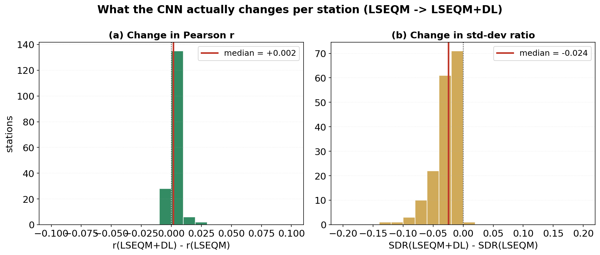
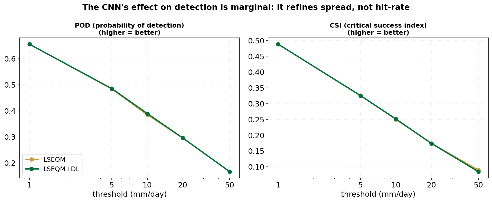

After LSEQM, the marginal distribution matches CPC at each pixel. What remains is the spatial residual: where does LSEQM systematically over- or underestimate compared to the reference field, in patterns a per-pixel correction cannot see?

## Architecture

{#fig-cnn-arch fig-align="center"}

A small 2-layer convolutional network:

- **Conv2D #1:** 32 filters, 3 x 3 kernel, ReLU, followed by 2 x 2 max-pooling, dropout 0.2
- **Conv2D #2:** 64 filters, 3 x 3 kernel, ReLU, followed by 2 x 2 max-pooling, dropout 0.3
- **Flatten + Dense:** 128 units, ReLU, dropout 0.4
- **Output:** linear, one value per pixel

Trained per dekad. Input is the LSEQM-corrected field for that dekad across all years; target is the CPC field for the same days. Optimizer: Adam. Early stopping with patience 5 on a 20% validation split.

This is intentionally small. On a 0.1 deg Indonesia grid (171 x 461) the Flatten -> Dense layer already dominates the parameter count, and it grows with AOI size; going deeper would inflate it further without meaningfully improving skill for this task.

## Why not a U-Net

A U-Net would skip the Flatten -> Dense bottleneck and preserve spatial dimensions throughout. It would also produce a tighter parameter budget. The current architecture predates that design choice and has been evaluated against the held-out BMKG stations; switching to U-Net is a planned improvement, tracked in the [Changelog](../changelog.qmd).

## What the CNN actually learns

In practice the CNN learns three things:

1. **Coastal and orographic bias.** LSEQM tends to over-smooth gradients near coasts and steep terrain; the CNN sharpens them.
2. **Convective extreme refinement.** Heavy-rain pixels can be nudged by several percent to better match CPC's spatial coherence on convection days.
3. **Diffuse-precipitation suppression.** Pixels with very light precipitation that LSEQM nudges upward sometimes get pulled back down.

The amount of correction is modest by design - see [Blending](blending.qmd).

## How much the CNN moves, per station

The per-station change from LSEQM to LSEQM+DL is small and centred near zero: across the validated BMKG stations the median change in daily correlation is about +0.002 and the median change in standard-deviation ratio about -0.024. The CNN tightens the variance slightly and does not degrade correlation; it is a refinement, not a second correction stage.

{#fig-cnn-effect fig-align="center"}

Plotting the two changes jointly, coloured by region, shows the same point from a different angle: the cloud sits tight around the origin, and the stations that move furthest are the Jawa sites - exactly where the gauge network is densest and the confidence mask opens the CNN up. Everywhere else the move is barely distinguishable from zero.

{#fig-cnn-scatter fig-align="center"}

The same restraint shows up in categorical detection. Plotting POD and CSI against intensity threshold, the LSEQM and LSEQM+DL curves sit on top of each other: the CNN refines spread and tail shape, but it does not change *when* the product says it rains. Detection skill is set earlier in the chain and the CNN leaves it untouched.

{#fig-cnn-threshold fig-align="center"}

This modest footprint is the intended behaviour. The deep-learning stage is gated by station density (see [Confidence Mask](confidence-mask.qmd)), so it only acts where gauge support justifies it, and the statistical core (LSEQM) remains the physical floor everywhere else.

## Implementation

`src/deep_learning.py` - `train_bias_correction_model()` (which builds and fits the network) and `apply_deeplearning_model()`. Trained models land in `output/trained_models/`.
