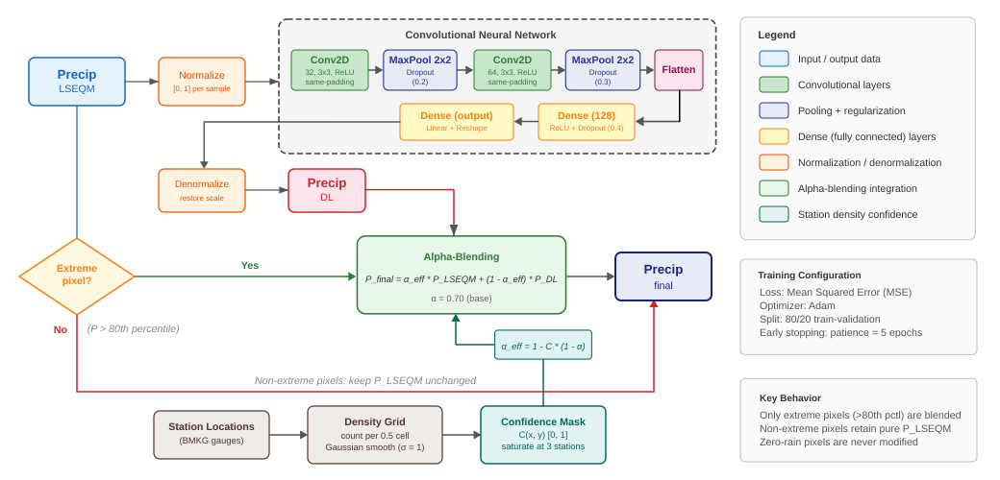

After LSEQM, the marginal distribution matches CPC at each pixel. What remains is the spatial residual: where does LSEQM systematically over- or underestimate compared to the reference field, in patterns a per-pixel correction cannot see?

## Architecture

{#fig-cnn-arch fig-align="center"}

A small 2-layer convolutional network:

- **Conv2D #1:** 32 filters, 3 x 3 kernel, ReLU, dropout 0.2
- **Conv2D #2:** 64 filters, 3 x 3 kernel, ReLU, dropout 0.3
- **Flatten + Dense:** 128 units, ReLU, dropout 0.4
- **Output:** linear, one value per pixel

Trained per dekad. Input is the LSEQM-corrected field for that dekad across all years; target is the CPC field for the same days. Optimizer: Adam. Early stopping with patience 5 on a 20% validation split.

This is intentionally small. On a 0.1 deg Indonesia grid (171 x 461) the Flatten -> Dense layer already produces a ~10 M parameter weight matrix; going deeper would balloon the parameter count without meaningfully improving skill for this task.

## Why not a U-Net

A U-Net would skip the Flatten -> Dense bottleneck and preserve spatial dimensions throughout. It would also produce a tighter parameter budget. The current architecture predates that design choice and has been validated against the held-out BMKG stations; switching to U-Net is a planned improvement, tracked in the [Changelog](../changelog.qmd).

## What the CNN actually learns

In practice the CNN learns three things:

1. **Coastal and orographic bias.** LSEQM tends to over-smooth gradients near coasts and steep terrain; the CNN sharpens them.
2. **Convective extreme refinement.** Heavy-rain pixels often get pushed by 5-15% to better match CPC's spatial coherence on convection days.
3. **Diffuse-precipitation suppression.** Pixels with very light precipitation that LSEQM nudges upward sometimes get pulled back down.

The amount of correction is modest by design - see [Blending](blending.qmd).

## Implementation

`src/deep_learning.py` - `build_cnn()`, `train_cnn_for_dekad()`, `apply_cnn()`. Trained models land in `output/trained_models/`.
