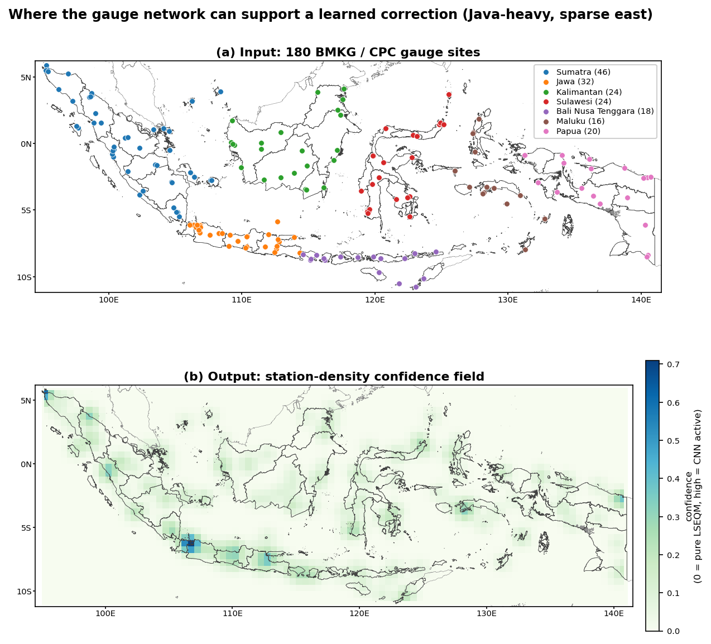
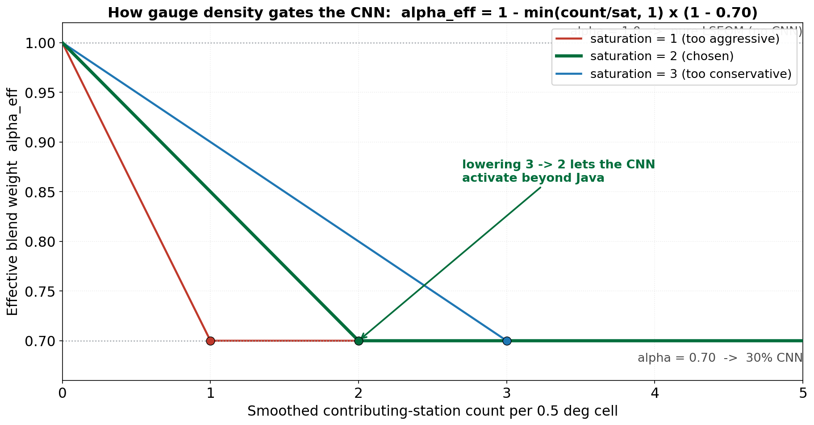
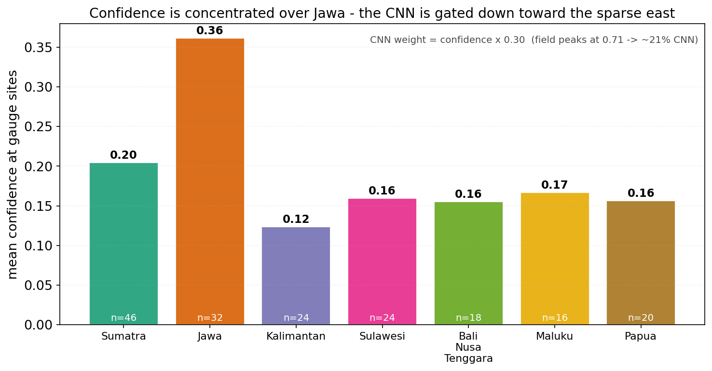

CPC-UNI is built from a global gauge network. In Indonesia, that network is concentrated in Java; many islands have one or zero contributing stations. When the CNN is trained against CPC, it learns whatever CPC happens to say in those data-poor cells - which may be a regional climatology rather than a true local field.

The confidence mask is a per-pixel weight in $[0, 1]$ that scales the CNN's influence by local gauge density. Where gauges are dense, the CNN gets full weight. Where gauges are absent, the CNN gets zero weight and the output reverts to pure LSEQM.

The input is the gauge network (top); the output is a smooth confidence field that is high over Java and the denser clusters and near-zero over the sparsely gauged east:

{#fig-density-maps fig-align="center"}

## Construction

1. **Count:** Stations are assigned to CPC 0.5 deg cells. Each cell gets a raw count.
2. **Smooth:** A Gaussian kernel with $\sigma = 1.0$ cell ($\approx$ 55 km at 0.5 deg) blurs the counts to avoid hard cell boundaries.
3. **Saturate:** The smoothed count is divided by a saturation parameter (default 2) and clipped to 1.0. This is the confidence value.
4. **Regrid:** Nearest-neighbour interpolation from 0.5 deg to the 0.1 deg working grid, with edge NaN filled as zero confidence.

## The saturation parameter

::: {.callout-warning}
`saturation_count` defines how many smoothed stations per 0.5 deg cell are needed for full confidence.

- `saturation_count = 1`: any station presence gives full confidence. This can be too aggressive when a single station's record is noisy.
- `saturation_count = 2` (recommended for Indonesia's ~180-station network): a balanced middle ground. The Bali example config uses this value.
- `saturation_count = 3`: conservative. Outside Java, the CNN barely contributes.
- `saturation_count = 5+`: very conservative; effectively disables the CNN outside the densest clusters.

The shipped Indonesia config sets this to 2, acknowledged as a sensitivity parameter that was not formally optimized.
:::

The choice directly controls how far the CNN reaches. The curve below shows the effective blend weight as a function of smoothed station count for three saturation values: lowering it from 3 to 2 lets the CNN activate beyond Java without forcing full weight on single-station cells.

{#fig-density-alpha fig-align="center"}

## How it interacts with the blend

The CNN does not get a constant weight - it gets `confidence * (1 - blend_alpha)`. With `blend_alpha = 0.70`:

| Local confidence | LSEQM share | CNN share |
|:----------------:|:-----------:|:---------:|
| 0.0 (no stations nearby) | 1.00 | 0.00 |
| 0.5 (some support) | 0.85 | 0.15 |
| 1.0 (dense network) | 0.70 | 0.30 |

See [Blending](blending.qmd) for the exact formula.

In the Indonesia run this plays out exactly as the construction predicts: mean confidence at gauge sites is highest over Jawa (0.36) and drops to roughly 0.12 to 0.20 elsewhere. Even at the peak the CNN share is modest - confidence of 0.36 means the CNN contributes about 11% of the field there, and far less in the sparse east.

{#fig-confidence-region fig-align="center"}

## Implementation

`src/station_density.py` - `build_confidence_mask()`. The mask is computed once and cached as `output/station_density/confidence_mask_station_density.nc4`.
