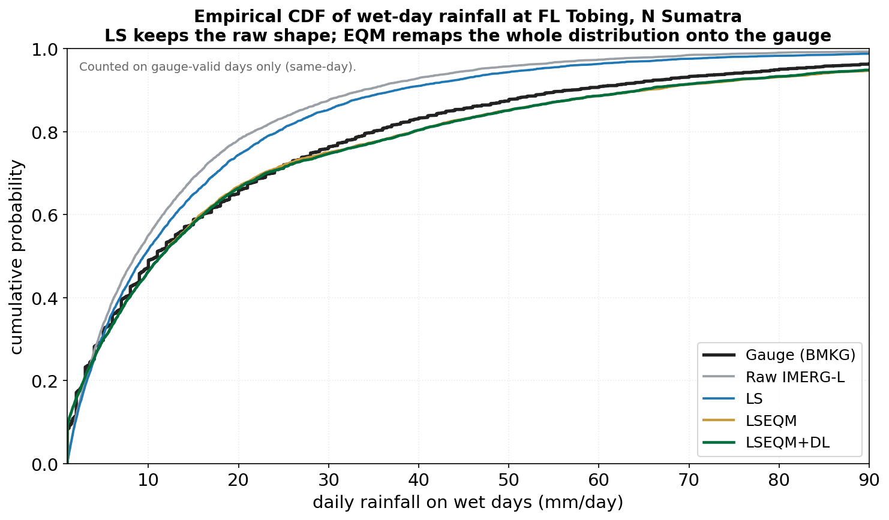

EQM maps each quantile of the LS-corrected IMERG distribution to the same quantile of CPC. The result is a field whose marginal distribution at each pixel matches the reference, while the temporal sequence (which day was wet, which was dry) is inherited from the satellite.

## The transformation

For a daily value $P^{LS}$ at quantile $q$:

$$
P^{EQM} = F^{-1}_{CPC, d}\left( F^{LS, d}(P^{LS}) \right)
$$

where $F^{LS, d}$ is the empirical CDF of the LS-corrected IMERG field for dekad $d$, and $F^{-1}_{CPC, d}$ is the inverse empirical CDF of CPC for the same dekad.

The effect is visible in the wet-day CDF below: Linear Scaling shifts the mean but keeps the *shape* of the raw IMERG distribution (the blue curve still bends like the grey one). EQM remaps the whole distribution onto the gauge, so the LSEQM and LSEQM+DL curves sit almost on top of the BMKG reference.

{#fig-eqm-cdf fig-align="center"}

## Why a Gamma body, GPD tail

The empirical CDF is well behaved in the body of the distribution (frequent values, well sampled). It becomes unreliable above ~80th percentile, where you may only have a handful of exceedances per dekad. Two failure modes are common:

- **Saturation at the highest observed quantile.** An empirical CDF cannot map a value larger than the largest CPC observation; large IMERG events get clipped.
- **Discrete jumps in the tail.** With few exceedances, the empirical inverse CDF is a step function with visible discontinuities.

To prevent both, the body is fit with a parametric Gamma distribution (which provides a smooth interpolation) and the tail is replaced by a GPD fit above the 80th percentile. See [GPD Tail](gpd-tail.qmd).

## Matching a 0.5 deg reference to a 0.1 deg product (BCSD)

CPC-UNI is gauge-interpolated at **0.5 deg**, but IMERG is corrected at **0.1 deg** - one CPC cell spans a 5 x 5 block of IMERG pixels. The framework does not regrid the rainfall *data*; instead it follows the BCSD principle (Wood et al. 2004): fit the correction *parameters* on the native CPC grid, then disaggregate the parameters to the fine grid.

{#fig-bcsd fig-align="center"}

The key idea: **the correction is disaggregated, not the rainfall.** IMERG keeps its native 0.1 deg spatial detail; only the climatological target (the Gamma shape and scale, the GPD threshold, the dry-day fraction) is interpolated down from the coarser reference. This is what `fit_cpc_parameters_on_native_grid` followed by `interpolate_cpc_params_to_imerg_grid` does in the code - see [Implementation > EQM](../implementation/eqm.qmd#where-cpc-parameters-come-from).

## Wet / dry handling

Days below the 1.0 mm wet-day threshold are treated as dry. The threshold is the value used in WMO categorical metrics and the default `wet_day_threshold` in `config.yml`. EQM handles dry days in two ways:

- **A dry input stays dry.** Quantile mapping is applied only to above-threshold IMERG days; the output array is zero-initialised, so a day the satellite already reports as dry comes out as exactly zero.
- **Over-detected drizzle is suppressed to dry.** Raw IMERG rains on too many days. EQM matches the corrected product's dry-day fraction to the reference (Cannon 2015, §3.2): the smallest over-detected wet values, whose position in the unconditional distribution falls below the reference dry-day fraction, are set to zero.

This is a first-order property, not a corner case: **dry days are about half the validated record.** The effect is a clear gain in dry-day agreement. On a day the gauge records as dry, the corrected product is also dry about **69%** of the time, up from **~56%** before the distribution step, and the wet-day-frequency ratio moves from **1.21** (over-detecting) toward **0.95**.

::: {.callout-note}
The same mechanism that removes false drizzle also costs a little hit rate: probability of detection drops from about 0.78 to 0.65 as the over-detected light-rain days are reclassified as dry. Fewer false alarms at the cost of some light-rain hits - not a free win. The CNN refinement stage leaves dry days untouched; this is purely the EQM stage. (Numbers from the 172-station Indonesia validation.)
:::

## Implementation

`src/bias_correction.py` - the `lseqm()` function, which calls `src/distribution_fitting.py` for the Gamma and GPD fits.

::: {.callout-tip}
The full LSEQM correction (LS + EQM + GPD) is what the framework labels `lseqm`. The chain runs as one function call per dekad.
:::

## References

- Wood, A. W., Leung, L. R., Sridhar, V., & Lettenmaier, D. P. (2004). Hydrologic implications of dynamical and statistical approaches to downscaling climate model outputs. *Climatic Change*, 62(1-3), 189-216. (BCSD parameter disaggregation.)
- Cannon, A. J., Sobie, S. R., & Murdock, T. Q. (2015). Bias correction of GCM precipitation by quantile mapping: how well do methods preserve changes in quantiles and extremes? *Journal of Climate*, 28(17), 6938-6959. (Dry-day frequency matching, §3.2.)
