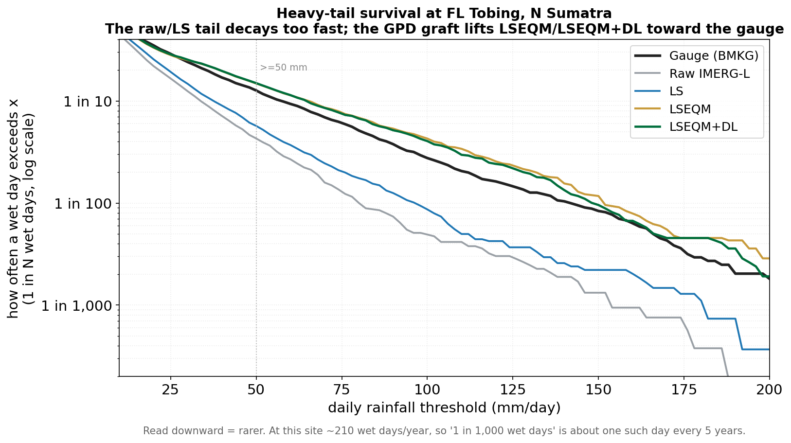

Above the 80th percentile, the EQM correction is replaced by a Generalized Pareto Distribution (GPD) fit. This handles the extreme part of the distribution where empirical sampling is too sparse to be reliable.

## The GPD

For exceedances $X$ above threshold $u$:

$$
P(X - u > x \mid X > u) = \left( 1 + \frac{\xi x}{\sigma} \right)^{-1/\xi}
$$

with shape $\xi$ and scale $\sigma$. The shape parameter governs the heaviness of the tail: $\xi > 0$ means a heavier-than-exponential tail (typical for tropical convection), $\xi = 0$ is exponential, $\xi < 0$ is bounded.

## What the tail graft fixes

Raw IMERG and LS decay too fast in the tail: heavy days that the gauge records once every few years are systematically under-represented. The survival curve below (how often a wet day exceeds a given threshold, log scale) shows the raw and LS curves dropping away from the gauge, while the GPD graft lifts LSEQM / LSEQM+DL back toward the BMKG reference at the high-intensity end.

{#fig-gpd-survival fig-align="center"}

## Fitting protocol

- **Threshold:** 80th percentile of the CPC **wet-day** values for the dekad (days above `wet_day_threshold`), configurable via `gpd_threshold_percentile`.
- **Stability:** Fit is K-Fold cross-validated (default K=5) and the mean shape and scale are used. This reduces the variance of the estimate when exceedances are few.
- **Upper cap:** After mapping, values are capped at the 99.9th percentile of the CPC reference (configurable via `upper_cap_threshold_percentile`) to avoid physically unrealistic extrapolation.

## Sensitivity caveats

::: {.callout-warning}
The 80th percentile threshold is a convention from precipitation extreme-value literature, not the result of a formal optimization on this dataset. A lower threshold (e.g., 75th) yields more data for the GPD fit but blurs the boundary between the gamma body and the GPD tail. A higher threshold (e.g., 90th-95th) targets only the most extreme events but leaves fewer exceedances per dekad, sometimes fewer than the K-Fold split can absorb.

Sensitivity to this choice should be acknowledged when reporting results.
:::

## Implementation

`src/distribution_fitting.py` - `fit_generalized_pareto_distribution()` and `cross_validate_gpd()`, called from `fit_cpc_parameters_on_native_grid()`. The mapping is applied inside `gamma_quantile_mapping_precomputed()`, which runs in the EQM loop of `lseqm()` in `src/bias_correction.py`.

## References

- Coles, S. (2001). *An Introduction to Statistical Modeling of Extreme Values.* Springer.
- Hosking, J. R. M., & Wallis, J. R. (1997). *Regional Frequency Analysis: An Approach Based on L-Moments.* Cambridge University Press.
