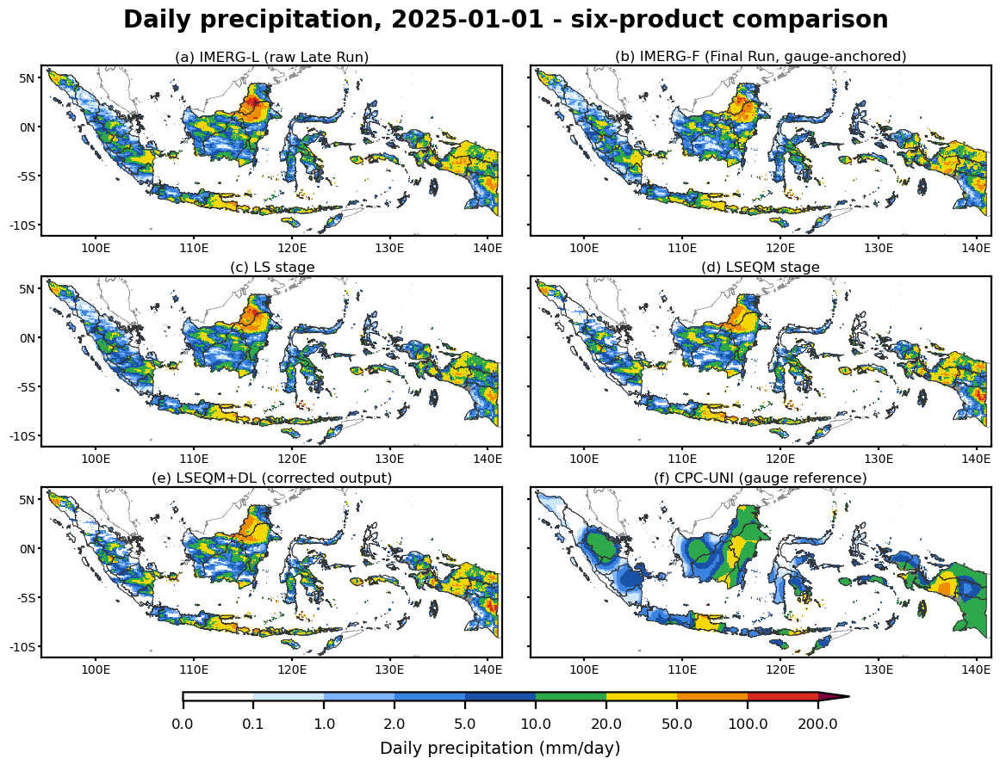

*Adjusting values, aligning distributions, preserving extremes - with neural refinement where station density allows.*

The framework is built around a simple idea: a statistical core (LSEQM) handles the marginal distribution honestly, and a CNN adds spatial refinement only where gauge density supports it. The result is a correction that is conservative where data is sparse and confident where it is not.

The tagline maps directly to the three correction stages:

| Stage | Action | What it touches |
|-------|--------|-----------------|
| **Linear Scaling (LS)** | Adjusting *values* | The long-term mean - first moment |
| **Empirical Quantile Mapping (EQM)** | Aligning *distributions* | The full daily distribution shape - the body |
| **GPD tail correction** | Preserving *extremes* | The right tail above the 80th percentile |

Each stage operates on a distinct aspect of the distribution; together they bring IMERG's marginal distribution into line with the reference. The CNN refinement (LSEQM+DL) then adds a spatial pattern on top, gated by the station-density confidence mask.

For the *theory* of each stage - what it does and why - read the pages below. For the *algorithm* - which functions in `src/`, complexity, gotchas - see the parallel [Implementation](../implementation/index.qmd) section.

{#fig-framework fig-align="center"}

## The chain

::: {.feature-card}
1. **Linear Scaling (LS)** matches the long-term mean per dekad. Cheap, transparent, and a sensible first pass even when nothing else is fit. See [Linear Scaling](linear-scaling.qmd).

2. **Empirical Quantile Mapping (EQM)** reshapes the full daily distribution. A Gamma fit is used for the body of the distribution. See [EQM](eqm.qmd).

3. **GPD tail** replaces the right tail of the EQM-corrected field with a Generalized Pareto fit above an 80th-percentile threshold. This prevents EQM from saturating at the highest observed quantile. See [GPD Tail](gpd-tail.qmd).

4. **CNN refinement** trains a small 2-layer convolutional network to learn the residual spatial bias of LSEQM versus CPC. The CNN sees the LSEQM field and produces a refined extreme field. See [CNN Refinement](cnn-refinement.qmd).

5. **Station-density confidence mask** scales the CNN's influence by local gauge density. See [Confidence Mask](confidence-mask.qmd).

6. **Blending** combines LSEQM and the CNN output using the confidence mask. See [Blending](blending.qmd).
:::

The chain is easier to see on a map than to read as a list. The panels below show one day (1 January 2025) over Indonesia: raw IMERG-L and gauge-anchored IMERG-F at the top, the LS and EQM intermediates in the middle, and the final LSEQM+DL output next to the CPC-UNI reference. The correction tightens spatial structure stage by stage toward the reference field on the right.

{#fig-six-product fig-align="center"}

## Each stage, on a 60-day sample

The map view shows the chain in space; the panel below shows it in time, at a single pixel over a 60-day window. It walks through every stage in order: LS matches the wet-day mean, EQM aligns the distribution body via quantile mapping, the GPD graft recovers the extreme tail, and the CNN nudges the extreme pixels. The bottom-right bar summarises how each stage moves the headline targets (relative bias toward 0, SDR and Q99 ratio toward 1).

{#fig-stage-demo fig-align="center"}

## Why this layering, in one paragraph

A pure statistical method works distribution-by-distribution and ignores neighbouring pixels - that is fine for the body but produces visible block boundaries at the CPC native resolution and underestimates the spatial coherence of heavy rain events. A pure CNN captures spatial structure but can introduce rainfall in cells where no gauge ever constrained it. Keeping LSEQM as the floor and adding the CNN only where stations are dense gives a correction that falls back to LSEQM in poorly observed areas rather than to a CNN's unconstrained estimate.

## Where the parameters come from

Three parameters control the trade-off between aggressiveness and conservatism:

| Parameter | Default | Tunes |
|-----------|---------|-------|
| `blend_alpha` | 0.70 | LSEQM share at full confidence (0.70 = 70% LSEQM, 30% CNN) |
| `gpd_threshold_percentile` | 80 | Where the GPD tail takes over from the gamma body |
| `saturation_count` | 2 | Station count at which the confidence mask saturates |

These were chosen by inspection rather than formal optimization. Sensitivity to each is documented in the corresponding methodology page and acknowledged as a limitation in the companion paper (*Remote Sens.* 2026, 18, 2298; https://doi.org/10.3390/rs18142298).

## Temporal unit

All parameters are fit per **dekad** (10-day window, 36 per year). See [Data Model](../get-started/data-model.qmd#dekad-temporal-convention) for why.
