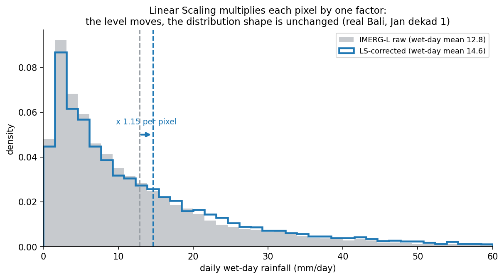

Linear Scaling is the simplest correction in the chain: multiply IMERG by a per-dekad, per-pixel factor that brings the long-term mean in line with CPC.

## What it does

For each dekad $d$ and each grid cell $(i, j)$, the LS factor is:

$$
k_{i,j,d} = \frac{\overline{P}^{CPC}_{i,j,d}}{\overline{P}^{IMERG}_{i,j,d}}
$$

where $\overline{P}$ is the long-term mean of all matching days in dekad $d$. The corrected field is then $P^{LS} = k \cdot P^{IMERG}$.

Because every value in a pixel is multiplied by the same factor, LS slides the whole distribution along the rainfall axis without changing its shape:

{#fig-ls fig-align="center"}

## What it does not do

LS preserves the shape of the IMERG distribution. If IMERG mis-shapes the upper tail or underestimates light rain, LS will not fix that - it just scales whatever IMERG produced (the two histograms above have the same shape, only rescaled). The EQM stage is what reshapes the distribution to match the gauge - see [EQM](eqm.qmd#the-transformation).

## When LS is enough

For long-term climatologies and monthly aggregates over data-sparse regions, LS alone often performs comparably to more elaborate methods. Use it as a sanity check before adding complexity: if LS already produces acceptable seasonal cycles, the marginal value of EQM and DL may not justify the extra fit.

## Implementation

`src/bias_correction.py` - the `linear_scaling()` function. Driven by the per-dekad call from `notebooks/02_lseqmdl_bias_correction.ipynb`.

::: {.callout-note}
LS is computed on land cells only; the land/sea mask zeroes out ocean before the mean is taken.
:::
