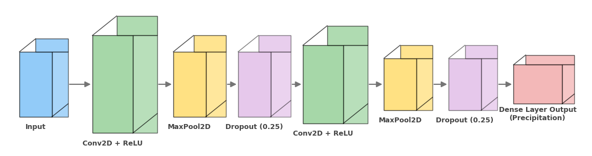

# A Scalable Framework for Enhancing Satellite-Derived Daily Precipitation: Adjusting Values, Aligning Distributions, And Preserving Extremes

## 1. Introduction

Accurate and timely precipitation estimates are critical for a wide range of scientific and societal applications, including flood forecasting, drought monitoring, hydrological modeling, and climate risk assessments. Satellite-derived precipitation products, such as those from the Global Precipitation Measurement (GPM) mission, have greatly expanded the global coverage of precipitation observations, especially over regions with sparse ground station networks. However, despite their transformative role, satellite-based estimates often suffer from systematic biases, spatial inconsistencies, and challenges in capturing the full spectrum of precipitation variability, particularly for extreme rainfall events. These limitations reduce the reliability of satellite data for operational and scientific applications that depend on accurate depiction of both mean conditions and high-impact extremes.

A wide range of bias correction techniques has been developed to address these challenges. Traditional statistical methods such as Linear Scaling (LS) effectively correct mean biases by adjusting the overall magnitude of satellite estimates to align with ground-based observations. Empirical Quantile Mapping (EQM) extends this correction by aligning the entire distribution of satellite precipitation with the reference distribution, adjusting not only the mean but also higher-order statistical moments. More recently, methods such as Generalized Pareto Distribution (GPD) fitting have been introduced to specifically address biases in the tails of precipitation distributions, aiming to better preserve extreme events. In parallel, advances in machine learning (ML) and deep learning (DL) have opened new possibilities for bias correction, enabling more flexible, nonlinear mappings between satellite and reference data. Convolutional Neural Networks (CNNs), in particular, offer powerful capabilities to model complex spatial patterns that traditional statistical methods may overlook.

Despite these advances, several critical gaps remain. Traditional bias correction techniques, while effective in adjusting mean and moderate rainfall distributions, often underperform in preserving the frequency and magnitude of extreme precipitation events—precisely the events most relevant for disaster risk management and climate adaptation. Furthermore, many machine learning approaches lack integration with physically interpretable statistical corrections, leading to potential issues with overfitting, instability, or lack of transparency. There remains a need for a hybrid approach that simultaneously addresses mean biases, distributional alignment, and extreme event preservation in a scalable and reproducible manner.

In this study, we propose a novel hybrid bias correction framework that sequentially integrates Linear Scaling, Empirical Quantile Mapping with gamma-based distribution fitting and GPD tail adjustment, and a Deep Learning refinement step using Convolutional Neural Networks. The framework is designed to enhance daily satellite precipitation estimates by systematically adjusting values, aligning distributions, and preserving extremes. Leveraging globally available datasets—IMERG Late Run satellite precipitation and CPC-UNI gridded station observations—this methodology emphasizes scalability and reproducibility across diverse regions. Special attention is given to the Indonesian archipelago as a case study, due to its vulnerability to extreme rainfall and complex topographic and climatic conditions. The anticipated outcome is an improved satellite-based precipitation product suitable for operational hydrological forecasting, climate risk analysis, and early warning systems, with methodological generalizability to other regions worldwide.

## 2. Conceptual Framework and Theoretical Background

Improving satellite-derived precipitation estimates requires addressing biases across multiple statistical dimensions: the mean, the distributional structure, and the representation of extremes. Recognizing the multifaceted nature of bias, this study adopts a hybrid framework that sequentially integrates physical-statistical correction methods with machine learning refinement, ensuring comprehensive improvements across the precipitation spectrum.

### 2.1 Rationale for a Hybrid Approach

Single-method bias correction strategies often target specific aspects of the precipitation distribution but fail to holistically address all sources of error. Linear Scaling (LS) methods are effective at correcting systematic mean biases but do not modify variance or higher-order moments, leaving distributional mismatches largely unresolved. Empirical Quantile Mapping (EQM) extends corrections to the full distribution, aligning the shape of cumulative distribution functions (CDFs) between satellite and reference datasets. However, EQM, especially when applied without tailored adjustments, may underestimate or misrepresent the upper extremes, where observational data sparsity and fitting uncertainty are most pronounced.

Extreme events, which are often underrepresented in station-based datasets and distorted in satellite retrievals, require special treatment. Generalized Pareto Distribution (GPD) fitting provides a statistical mechanism to model the behavior of extreme precipitation beyond high thresholds, complementing EQM by refining the upper tail of the distribution. Nevertheless, statistical methods alone may struggle to capture complex spatial structures and local-scale anomalies that influence extreme precipitation, particularly over heterogeneous landscapes.

Recent advances in machine learning, particularly the application of Convolutional Neural Networks (CNNs) within broader Deep Learning (DL) frameworks, offer a powerful complementary tool for bias correction. CNNs can learn nonlinear relationships between satellite estimates and reference data, exploiting spatial correlations and subtle patterns not easily addressed by traditional techniques. Integrating deep learning refinement after statistical corrections allows the framework to adaptively correct localized errors without undermining physical plausibility.

Thus, a sequential hybrid approach—starting with mean correction (LS), moving to distributional correction (EQM with GPD adjustment), and culminating in deep learning refinement—is proposed to systematically address all facets of satellite precipitation bias, with a particular emphasis on preserving extreme event realism.

To summarize the sequential structure of the proposed bias correction methodology, Figure 1 illustrates the conceptual framework of the LSEQM+DL approach. The framework highlights the stepwise integration of Linear Scaling for mean correction, Empirical Quantile Mapping with tail adjustments for distributional alignment, and a Deep Learning refinement to enhance spatial and extreme event representations.

Figure 1. Conceptual workflow of the LSEQM+DL hybrid bias correction framework.

The framework integrates sequential adjustments of satellite precipitation through Linear Scaling (LS), Empirical Quantile Mapping (EQM) with tail adjustment via Generalized Pareto Distribution (GPD), and Deep Learning (DL) refinement to improve both central tendencies and extremes.

### 2.2 Theoretical Basis for Bias Correction Components

Building on the sequential structure summarized in Figure 1, the following subsections provide a detailed theoretical basis for each major component of the proposed hybrid bias correction framework. Each step—Linear Scaling, Empirical Quantile Mapping with gamma distribution fitting, Generalized Pareto tail adjustment, and Deep Learning refinement—is essential for systematically addressing different aspects of bias in satellite precipitation estimates. Together, these components form a comprehensive correction pipeline designed to improve both the accuracy and robustness of daily precipitation products.

#### 2.2.1 Linear Scaling (LS)

Linear Scaling adjusts satellite precipitation by applying a multiplicative factor derived from the ratio of mean observed precipitation to mean modeled precipitation. Mathematically, the LS correction factor $ SF $ is given by:

$$
SF = \frac{\mu_{\text{obs}}}{\mu_{\text{sat}}}
$$

where $ \mu_{\text{obs}} $ and $ \mu_{\text{sat}} $ are the mean daily precipitation of the reference and satellite datasets, respectively. The corrected precipitation $ P_{\text{corr}} $ is then obtained as:

$$
P_{\text{corr}} = P_{\text{sat}} \times SF
$$

This step ensures that the first moment (mean) of the precipitation distribution is correctly aligned, providing a foundational adjustment before more complex distributional corrections.

#### 2.2.2 Empirical Quantile Mapping (EQM) and Gamma-Based Distribution Fitting

EQM aligns the entire cumulative distribution function (CDF) of satellite-derived precipitation to that of the observed data. For each satellite precipitation value $ P_{\text{sat}} $, the corresponding corrected value $ Q_{\text{corr}} $ is given by:

$$
Q_{\text{corr}} = F_{\text{obs}}^{-1}\left( F_{\text{sat}}(P_{\text{sat}}) \right)
$$

where $ F_{\text{sat}} $ and $ F_{\text{obs}} $ denote the CDFs of the satellite and reference datasets, respectively.

To improve the stability and smoothness of the CDFs, particularly in sparse observational environments, gamma distributions are fitted to the precipitation data prior to mapping. This fitting enhances the robustness of EQM, especially in representing moderate to heavy precipitation events.

#### 2.2.3 Tail Adjustment Using Generalized Pareto Distribution (GPD)

Extreme precipitation values, exceeding high thresholds (e.g., 95th percentile), are modeled separately using the Generalized Pareto Distribution (GPD). The probability density function of the GPD is defined as:

$$
f(x; \xi, \mu, \sigma) = \frac{1}{\sigma} \left(1 + \xi \frac{x-\mu}{\sigma}\right)^{-\left(1/\xi + 1\right)}
$$

where $ \xi $ is the shape parameter, $ \mu $ is the location parameter, and $ \sigma $ is the scale parameter. Tail fitting corrects satellite precipitation biases in the extreme upper quantiles, ensuring that the corrected data preserves not only the frequency but also the magnitude of extreme events critical for hydrological and climate impact studies.

#### 2.2.4 Deep Learning Refinement (CNN)

Following statistical corrections, a Convolutional Neural Network (CNN) model is employed to further refine the bias-corrected satellite data. The CNN is trained to minimize the residual differences between EQM-GPD corrected satellite data and the reference dataset, learning spatially coherent patterns of bias. This final refinement step specifically targets:

- Pixel-level inaccuracies in complex terrains,
- Subtle spatial biases across climatological gradients,
- Enhancement of localized extreme event representations.

The CNN refinement step thus acts as a dynamic, spatially-aware corrective layer, complementing the preceding physically-based corrections without undermining statistical coherence.

## 3. Methods

Bias correction of satellite-derived precipitation products requires not only robust methodological design but also careful data preparation and study site selection. This chapter details the geographical focus of the study, the datasets utilized, and the preprocessing steps undertaken to ensure consistency and comparability between satellite and reference observations. Each step is tailored to support the development of a globally scalable bias correction framework that enhances precipitation estimates across varying climatic and topographical conditions.

### 3.1 Study Region

Indonesia, the world's largest archipelagic country, presents a complex and challenging environment for precipitation estimation. Located between the Indian and Pacific Oceans and straddling the equator, Indonesia experiences a tropical climate characterized by high spatial and temporal rainfall variability. Topographical diversity, ranging from lowland plains to mountainous regions exceeding 4,000 meters in elevation, further complicates precipitation patterns. The country is highly vulnerable to extreme rainfall events that frequently trigger flooding, landslides, and other hydrometeorological disasters.

This study adopts Indonesia as the area of interest (AOI) due to its critical need for improved precipitation monitoring and its representative challenges for satellite-based hydrometeorological applications. While the BMKG station data used for validation are specific to Indonesia, the primary datasets utilized for bias correction—IMERG Late Run and CPC-UNI—are globally available. Moreover, the hybrid bias correction methodology developed here is designed to be scalable and replicable across other regions worldwide, supporting broader applications in climate research, disaster risk reduction, and hydrological modeling beyond Indonesia.

### 3.2 Data and Preprocessing

Developing a reliable bias correction framework demands the careful selection of datasets that represent both satellite-based estimates and ground-based observations. This section describes the data sources utilized and outlines the preprocessing steps undertaken to harmonize their spatial and temporal characteristics.

#### 3.2.1 IMERG Satellite Precipitation Data

The Integrated Multi-satellitE Retrievals for GPM (IMERG) Late Run product is selected as the satellite-derived precipitation dataset for this study. IMERG Late Run offers an optimal balance between latency and data quality, providing near-real-time precipitation estimates with a delay of approximately 14 hours. Unlike the IMERG Final Run, which incorporates station data into its post-processing, the Late Run product relies purely on satellite observations, making it ideal for evaluating bias correction methods without the influence of gauge data assimilation. IMERG data are available at a high spatial resolution of 0.1 degrees (~10 km) and are directly accessed from the official NASA Goddard Earth Sciences Data and Information Services Center (GES DISC).

#### 3.2.2 IMERG Final Run for Complementary Evaluation

In addition to the IMERG Late Run data used for bias correction, this study also utilizes the IMERG Final Run product as a complementary evaluation dataset. IMERG Final Run incorporates gauge-based observations during its post-processing, aiming to further improve precipitation accuracy relative to purely satellite-derived estimates. Although it benefits from station assimilation, the Final Run is not used in the bias correction procedure itself to maintain independence between correction inputs and validation references. Instead, the IMERG Final Run is employed for comparative analysis, providing an additional benchmark to assess the effectiveness of the bias correction applied to the IMERG Late Run data. IMERG Final Run data are also available at a 0.1-degree spatial resolution and were obtained directly from the NASA GES DISC.

#### 3.2.3 CPC-UNI Gridded Observational Data

The Climate Prediction Center Unified Gauge-Based Analysis of Global Daily Precipitation (CPC-UNI) dataset is employed as the reference observation for bias correction. CPC-UNI offers the highest-resolution global daily gridded precipitation product derived from station measurements, available at a 0.5-degree spatial resolution (~50 km). Its broad spatial coverage and gauge-based foundation make it suitable for large-scale satellite precipitation correction efforts. However, the gridded values in CPC-UNI are derived through interpolation, and the density of contributing stations varies geographically. In regions with sparse station networks, including parts of Indonesia, the interpolated values may fail to capture local extremes accurately, particularly in complex terrain. This limitation underscores the necessity of integrating CPC-UNI with satellite-derived data and applying additional distributional and extreme-event corrections. The CPC-UNI data used in this study were obtained directly from the NOAA Physical Sciences Laboratory.

#### 3.2.4 Independent Validation Data (BMKG)

Independent validation is conducted using ground-based observations from Indonesia's Meteorological, Climatological, and Geophysical Agency (BMKG). BMKG operates an extensive network of weather stations providing daily precipitation measurements across the Indonesian archipelago. These independent station data are not used in the bias correction process itself but serve to evaluate the performance of the corrected IMERG precipitation estimates. Validation focuses on key criteria, including the correct detection of rainfall events, the ability to represent observed extremes, and the assessment of spatial consistency between corrected satellite estimates and ground truth. The use of independent validation data ensures an objective assessment of correction effectiveness, particularly for extreme rainfall conditions critical to disaster risk management. BMKG data were accessed directly from the agency’s publicly available online repository.

#### 3.2.5 Preprocessing and Harmonization

To ensure comparability between the satellite-derived and ground-based datasets, several preprocessing steps were undertaken. First, the CPC-UNI dataset, originally available at a coarser 0.5-degree spatial resolution, was regridded to match the 0.1-degree resolution of the IMERG dataset using nearest-neighbor interpolation. Temporal alignment was performed by synchronizing daily time steps across the datasets and ensuring a strictly monotonic, duplicate-free time axis. A land-sea mask, based on official land boundary datasets, was applied to both IMERG and CPC-UNI to retain only land-based precipitation estimates. These preprocessing steps ensure that both datasets are spatially and temporally consistent, enabling robust application of bias correction techniques and minimizing errors due to resolution or coverage discrepancies.

### 3.3 Hybrid Bias Correction Methodology

Building upon the conceptual framework introduced in Chapter 2, the operational implementation of the hybrid bias correction methodology follows a sequential structure. Each processing stage targets a specific source of bias in satellite-derived daily precipitation estimates, ensuring comprehensive improvements across the mean, distribution, extreme events, and spatial patterns. All bias correction steps are performed separately for each dekadal period (i.e., three subdivisions per month) to preserve seasonal rainfall characteristics, while leveraging multi-year pooled samples to enhance statistical robustness.

The overall hybrid bias correction workflow is illustrated in Figure 2, highlighting the progression from initial mean correction to final deep learning-based spatial refinement.

Figure 2. Overview of the hybrid bias correction workflow integrating Linear Scaling (LS), Empirical Quantile Mapping (EQM) with Gamma fitting, Generalized Pareto Distribution (GPD) tail adjustment, and Convolutional Neural Network (CNN) refinement.

The process begins with Linear Scaling (LS) to correct systematic mean biases. For each dekad, daily precipitation values from IMERG Late Run and CPC-UNI are aggregated across all years to compute dekadal means. The scaling factor $ SF $ is defined as:

$$
SF = \frac{\mu_{\text{obs}}}{\mu_{\text{sat}}}
\quad , \quad
P_{\text{LS}}(t) = P_{\text{IMERG}}(t) \times SF
$$

where $ \mu_{\text{obs}} $ and $ \mu_{\text{sat}} $ are the mean precipitation for CPC-UNI and IMERG datasets, respectively, over the same dekadal period. The LS adjustment ensures that the first moment (mean) of IMERG precipitation is aligned with the reference before moving to distributional corrections.

Next, Empirical Quantile Mapping (EQM) is applied to correct the entire distribution. To enhance CDF stability, gamma distributions are fitted independently to the LS-corrected IMERG and CPC-UNI precipitation samples, using L-moment estimation. The first two L-moments are calculated as:

$$
L_1 = \frac{1}{n} \sum_{i=1}^{n} x_i
\quad , \quad
L_2 = \frac{1}{2n(n-1)} \sum_{i=1}^{n} \sum_{j=1}^{n} |x_i - x_j|
$$

where $ x_i $ denotes daily precipitation values. These L-moments are used to derive the gamma distribution's shape $ k $ and scale $ \theta $ parameters. The quantile correction is performed by matching the cumulative probability of each IMERG value to the CPC-UNI fitted distribution.

After distributional correction, a Generalized Pareto Distribution (GPD) is fitted to precipitation exceedances above a high threshold $ u $, typically the 80th or 95th percentile of CPC-UNI samples. The threshold exceedances $ y $ are defined as:

$$
y = x - u, \quad \text{for} \quad x > u
$$

where $ x $ represents the EQM-corrected precipitation values. GPD parameters—shape $ \xi $ and scale $ \sigma $—are estimated using a cross-validation approach to improve parameter robustness against data sparsity. The final bias-corrected precipitation after statistical adjustment $ P_{\text{stat}}(t) $ is defined as:

$$
P_{\text{stat}}(t) =
\begin{cases}
P_{\text{EQM}}(t), & \text{if } P_{\text{LS}}(t) \leq u \\
P_{\text{GPD}}(t), & \text{if } P_{\text{LS}}(t) > u
\end{cases}
$$

This hybrid statistical correction ensures both distributional consistency and realistic modeling of extreme rainfall events.

Although the statistical corrections significantly reduce biases, residual spatial inconsistencies often persist due to complex local topographic and atmospheric processes. To address these remaining biases, a Convolutional Neural Network (CNN) is employed to further refine the corrected precipitation fields. The CNN is trained for each dekadal period, using the bias-corrected IMERG fields $ P_{\text{stat}}(t) $ as input and CPC-UNI observations as target output.

A schematic of the CNN refinement architecture is provided in Figure 3.

Figure 3. CNN architecture for spatial bias refinement. The architecture consists of two convolutional layers (Conv2D) with ReLU activations, max pooling layers (MaxPool2D), dropout layers for regularization, and a final dense layer for prediction.

The CNN model architecture includes:

- Input: 2D precipitation fields normalized between 0 and 1 using the maximum value for each dekad:
    $$
    P_{\text{norm}}(t) = \frac{P_{\text{stat}}(t)}{\max(P_{\text{stat}})}
    $$
- Two convolutional layers (3x3 filters) with 32 and 64 filters respectively,
- Max pooling layers after each convolution,
- Dropout layers (rates: 0.2–0.3) to prevent overfitting,
- Dense output layer reconstructing the corrected precipitation field,
- Loss function: Mean Squared Error (MSE),
- Optimizer: Adam with learning rate scheduling,
- Training setup: 80/20 train-validation split, early stopping based on validation loss stabilization, batch size of 64, up to 50 epochs.

The CNN refinement dynamically captures local and nonlinear biases, particularly in areas of complex topography or coastal transition zones, further enhancing the realism and applicability of the final corrected precipitation product.

### 3.4 Model Evaluation and Quality Assessment

The evaluation of bias correction effectiveness is conducted through a comprehensive, multi-metric quality assessment framework that captures statistical accuracy, distributional consistency, temporal pattern preservation, and extreme event representation. Both standard performance metrics and integrated quality indices are used to ensure a holistic assessment of the corrected precipitation products.

#### 3.4.1 Evaluation Metrics

The evaluation of the bias-corrected precipitation products relies on a comprehensive set of performance metrics, assessing not only general statistical agreement but also the ability to capture categorical events, temporal precipitation patterns, and distributional characteristics. Metrics are grouped into four major categories: basic statistical accuracy, categorical event detection, temporal behavior, and distributional consistency.

##### Basic Statistical Metrics

The basic statistical metrics evaluate the general correspondence between the corrected satellite estimates and the reference observations across all daily values.

1. **Relative Bias (RB)**  
   Measures the proportional difference between test and reference datasets:
   $$
   RB = \frac{P_{\text{test}} - P_{\text{ref}}}{P_{\text{ref}}}
   $$

2. **Pearson Correlation Coefficient (CORR)**  
   Assesses the linear relationship between the two datasets:
   $$
   r = \frac{\sum_{i=1}^{n} (P_{\text{test},i} - \overline{P_{\text{test}}})(P_{\text{ref},i} - \overline{P_{\text{ref}}})}{\sqrt{\sum_{i=1}^{n} (P_{\text{test},i} - \overline{P_{\text{test}}})^2}\sqrt{\sum_{i=1}^{n} (P_{\text{ref},i} - \overline{P_{\text{ref}}})^2}}
   $$

3. **Root Mean Squared Error (RMSE)**  
   Quantifies the magnitude of errors with emphasis on larger differences:
   $$
   RMSE = \sqrt{\frac{1}{n}\sum_{i=1}^{n} (P_{\text{test},i} - P_{\text{ref},i})^2}
   $$

4. **Mean Absolute Error (MAE)**  
   Measures the average magnitude of errors without giving disproportionate weight to large outliers:
   $$
   MAE = \frac{1}{n}\sum_{i=1}^{n} |P_{\text{test},i} - P_{\text{ref},i}|
   $$

5. **Nash-Sutcliffe Efficiency (NSE)**  
   Indicates how well the bias-corrected values match the reference data, ranging from $-\infty$ to 1, where 1 represents perfect agreement:
   $$
   NSE = 1 - \frac{\sum_{i=1}^{n}(P_{\text{ref},i} - P_{\text{test},i})^2}{\sum_{i=1}^{n}(P_{\text{ref},i} - \overline{P_{\text{ref}}})^2}
   $$

6. **Standard Deviation (STDEV)**  
   Measures the variability (spread) of precipitation values within each dataset:
   $$
   STDEV = \sqrt{\frac{1}{n-1}\sum_{i=1}^{n} (P_i - \overline{P})^2}
   $$

7. **Kolmogorov-Smirnov Test (KS)**  
   Evaluates whether two samples originate from the same distribution by measuring the maximum distance between their cumulative distribution functions:
   $$
   D = \max_x |F_{\text{test}}(x) - F_{\text{ref}}(x)|
   $$

##### Categorical Event Metrics

Categorical metrics evaluate the ability of the corrected satellite data to capture discrete precipitation events above a predefined threshold (typically 1 mm/day), focusing on detection skills rather than continuous value matching.

1. **Probability of Detection (POD)**  
   Measures the fraction of observed events that were correctly detected:
   $$
   POD = \frac{hits}{hits + misses}
   $$

2. **False Alarm Ratio (FAR)**  
   Indicates the fraction of predicted events that did not actually occur:
   $$
   FAR = \frac{false\_alarms}{hits + false\_alarms}
   $$

3. **Critical Success Index (CSI)**  
   Provides a balanced metric considering hits, misses, and false alarms simultaneously:
   $$
   CSI = \frac{hits}{hits + misses + false\_alarms}
   $$

##### Temporal Pattern Metrics

Temporal pattern metrics assess the corrected data’s ability to reproduce important aspects of daily precipitation time series, such as frequency of rain days and duration of dry periods.

1. **Frequency of Precipitation Days (FPD)**  
   Calculates the percentage of days exceeding the precipitation threshold:
   $$
   FPD = \frac{days \geq threshold}{total\ days} \times 100
   $$

2. **Mean Wet-Day Precipitation (MDWP)**  
   Computes the average precipitation amount on days when rainfall exceeds the threshold:
   $$
   MDWP = \frac{\sum_{P_i \geq threshold} P_i}{n_{wet}}
   $$

3. **Dry Spell Length (DSL)**  
   Determines the maximum number of consecutive dry days (days below threshold):
   $$
   DSL = \max(consecutive\ days < threshold)
   $$

##### Distributional Metrics

Distributional metrics ensure that the overall precipitation distributions between corrected and reference datasets are consistent, particularly for both moderate and extreme rainfall regimes.

1. **General distribution percentiles**:  
  25th percentile (Q1), 50th percentile (median), and 75th percentile (Q3) are compared between test and reference datasets.

2. **Extreme distribution percentiles**:  
  90th, 95th, and 99th percentiles are evaluated to assess extreme event correction performance.

**Notes:**

- $ P_{\text{test}} $ = test (bias-corrected) precipitation dataset  
- $ P_{\text{ref}} $ = reference (CPC-UNI) precipitation dataset  
- $ \overline{P_{\text{test}}} $, $ \overline{P_{\text{ref}}} $ = respective dataset means  
- $ hits $ = number of events correctly detected  
- $ misses $ = number of observed events not detected  
- $ false\_alarms $ = number of false detected events  
- $ F_{\text{test}}(x) $, $ F_{\text{ref}}(x) $ = cumulative distribution functions of test and reference datasets  
- $ n $ = number of valid daily samples  
- $ n_{wet} $ = number of wet days (above threshold)

#### 3.4.2 Composite Quality Assessment Framework

While individual performance metrics provide important insights into specific aspects of model accuracy, a composite framework is necessary to holistically evaluate the overall quality of bias-corrected precipitation products. The composite quality assessment aggregates multiple metrics into three principal dimensions: basic statistical quality, distributional quality, and temporal pattern quality. This integrated approach ensures a balanced evaluation of both general performance and the ability to reproduce important precipitation features across different intensity and temporal scales.

##### Basic Statistical Quality

The basic statistical quality score aggregates four key continuous performance metrics: normalized Relative Bias (RB), Pearson Correlation Coefficient (CORR), normalized Root Mean Squared Error (RMSE), and Nash-Sutcliffe Efficiency (NSE).

Each metric is normalized onto a [0,1] scale to ensure comparability. For metrics where lower values represent better performance (e.g., RB, RMSE), inverse normalization is applied. The Basic Statistical Quality Score (BSQS) is computed as a weighted average:

$$
\text{BSQS} = w_{\text{RB}} \times RB_{\text{norm}} + w_{\text{CORR}} \times CORR + w_{\text{RMSE}} \times RMSE_{\text{norm}} + w_{\text{NSE}} \times NSE
$$

where the default weighting is equal across all components:

$$
w_{\text{RB}} = w_{\text{CORR}} = w_{\text{RMSE}} = w_{\text{NSE}} = 0.25
$$

This score captures general statistical agreement between the corrected and reference datasets.

##### Distribution Quality

The distribution quality score focuses on the ability of the bias correction method to preserve the precipitation distribution, particularly both moderate and extreme precipitation regimes.

It aggregates three sub-components:

- Percentile differences for general distribution (25th, 50th, 75th percentiles),
- Percentile differences for extreme events (90th, 95th, 99th percentiles),
- Standard deviation ratio as a measure of variability consistency.

The Distribution Quality Score (DQS) is calculated as:

$$
\text{DQS} = w_{\text{general}} \times Q_{\text{general}} + w_{\text{extreme}} \times Q_{\text{extreme}} + w_{\text{variability}} \times Q_{\text{std}}
$$

where:

- $ Q_{\text{general}} $ = averaged relative error across general percentiles,
- $ Q_{\text{extreme}} $ = averaged relative error across extreme percentiles,
- $ Q_{\text{std}} $ = relative error in standard deviation,
- Default weighting:
    $$
    w_{\text{general}} = 0.4, \quad w_{\text{extreme}} = 0.4, \quad w_{\text{variability}} = 0.2
    $$

This dimension ensures that distributional biases are systematically assessed, not only average biases.

##### Temporal Pattern Quality

Temporal pattern quality measures the corrected dataset's ability to maintain realistic temporal structures, especially event detection timing and dry spell patterns.

It includes:

- **Event Timing**: Derived from Probability of Detection (POD) and False Alarm Ratio (FAR).
- **Dry Spell Preservation**: Derived from the difference between observed and corrected maximum Dry Spell Length (DSL).
- **Temporal Correlation**: Derived from the correlation of precipitation occurrence between datasets.

The Temporal Quality Score (TQS) is computed as:

$$
\text{TQS} = w_{\text{event}} \times Q_{\text{event}} + w_{\text{dryspell}} \times Q_{\text{dryspell}} + w_{\text{correlation}} \times CORR
$$

where:

- $ Q_{\text{event}} $ = joint evaluation of POD and FAR,
- $ Q_{\text{dryspell}} $ = normalized dry spell length error,
- Default weighting:
    $$
    w_{\text{event}} = 0.4, \quad w_{\text{dryspell}} = 0.3, \quad w_{\text{correlation}} = 0.3
    $$

This dimension ensures that daily-to-seasonal scale precipitation patterns are realistically preserved.

##### Overall Continuous Quality Index

Finally, a Continuous Quality Index (CQI) synthesizes the three component scores into a single normalized indicator ranging from 0 (poor quality) to 1 (excellent quality):

$$
\text{CQI} = 0.4 \times \text{BSQS} + 0.3 \times \text{DQS} + 0.3 \times \text{TQS}
$$

The weights reflect a slight emphasis on basic statistical agreement, while still valuing distributional and temporal behavior.

##### Categorical Quality Classification

To enhance interpretability, the Continuous Quality Index (CQI) scores are further categorized into discrete quality classes based on established thresholds. This categorical classification provides an intuitive and accessible means to evaluate the practical reliability of the corrected precipitation datasets.

The classification thresholds are defined as follows:

| Categorical Class | CQI Range | Description |
|:------------------|:----------|:------------|
| 4 (Excellent) | $ \text{CQI} \geq 0.8 $ | Correction meets or exceeds high-performance standards across all metrics. |
| 3 (Good) | $ 0.6 \leq \text{CQI} < 0.8 $ | Correction performs well but shows minor deficiencies in some areas. |
| 2 (Fair) | $ 0.4 \leq \text{CQI} < 0.6 $ | Correction achieves basic improvements but still has moderate performance gaps. |
| 1 (Poor) | $ \text{CQI} < 0.4 $ | Correction shows substantial deficiencies and limited reliability. |

This classification enables a spatial and temporal visualization of bias correction quality, allowing users to quickly identify areas of high or low correction success. It also facilitates communication of results to broader audiences, including operational agencies, stakeholders, and non-technical users.

#### 3.4.3 Confidence Assessment

In addition to evaluating the corrected precipitation fields through multiple quality metrics, it is important to assess the reliability and robustness of these evaluations themselves. Confidence assessment provides an additional layer of information, indicating how much trust can be placed in the computed quality scores across different spatial and temporal domains.

The confidence score for each grid cell is calculated by integrating three key factors:

- **Sample Size Adequacy**:  
  The proportion of valid precipitation observations available for evaluation within a given dekadal period. A higher sample size generally yields more statistically stable and reliable quality metric estimates.

- **Statistical Consistency Across Metrics**:  
  Consistency is assessed by evaluating the variance and agreement among multiple basic metrics (e.g., RB, CORR, POD, FAR). High variability among metrics suggests instability or contradictions in correction performance, lowering confidence.

- **Distributional Agreement Significance**:  
  The statistical similarity between corrected and reference precipitation distributions is tested using the Kolmogorov-Smirnov (KS) test. Higher KS p-values indicate that corrected and reference samples are statistically indistinguishable, enhancing confidence.

The overall confidence score $ C $ is computed as a weighted combination of these three components:

$$
C = w_{\text{sample}} \times C_{\text{sample}} + w_{\text{consistency}} \times C_{\text{consistency}} + w_{\text{KS}} \times (1 - p_{\text{KS}})
$$

where:

- $ C_{\text{sample}} $ = normalized score based on sample size (e.g., ratio of valid days to total days),
- $ C_{\text{consistency}} $ = normalized score based on metric consistency (lower spread among basic metrics implies higher consistency),
- $ p_{\text{KS}} $ = KS test p-value (lower p-values imply greater distributional difference),
- Default weighting:
    $$
    w_{\text{sample}} = 0.4, \quad w_{\text{consistency}} = 0.4, \quad w_{\text{KS}} = 0.2
    $$

The resulting confidence score $ C $ ranges between 0 (low confidence) and 1 (high confidence).

Grid cells or time periods with low confidence scores are flagged, highlighting regions where the bias correction evaluation may be less reliable due to data limitations, inconsistent correction behavior, or significant distributional discrepancies. This dual reporting of quality and confidence supports more nuanced and cautious interpretation of correction performance, particularly in operational or decision-support contexts.

Together, the comprehensive multi-metric evaluation, composite quality indices, categorical classifications, and confidence assessments provide a robust framework for assessing the performance of the hybrid bias correction methodology. This approach ensures that improvements in mean, variability, extremes, and temporal structure are objectively measured, while also acknowledging the underlying reliability of these evaluations. The following chapter presents the results of applying this evaluation framework, highlighting the performance of the bias correction across different spatial domains, dekadal periods, and precipitation intensities.

## 4 Results and Discussion

### 4.1 Basic Statistical Performance

### 4.2 Distributional Behavior

### 4.3 Extreme Event Representation

### 4.4 Spatial Patterns

### 4.5 Confidence Maps

### 4.6 Discussion of Implications
