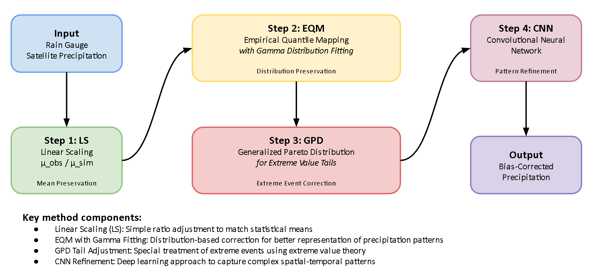

The framework is intentionally flat: one config, a handful of focused `src/` modules, and notebooks that orchestrate but never inline algorithms.

{#fig-workflow fig-align="center"}

## The contract

| Layer | Owns | Does not |
|-------|------|----------|
| `config.yml` | All paths, all numeric parameters, all toggles | Hold logic |
| `src/` | Algorithms, data loading, IO, fitting, training | Hold paths or parameters |
| `notebooks/` | Orchestration, narrative, plots | Define functions |

Notebooks import from `src/`. `src/` modules read from `src.config` (populated by `initialize_config`). Nothing in `src/` reads `config.yml` directly.

## Module map

```
src/
  config.py                # Loads YAML, resolves placeholders, exposes attrs
  io.py                    # NetCDF loading, grid alignment, mask application
  utility.py               # Small helpers (mask apply, dekad helpers, decorators)
  bias_correction.py       # linear_scaling(), lseqm(), run_correction_pipeline()
  distribution_fitting.py  # Gamma + GPD fits, K-Fold cross-validation
  deep_learning.py         # build_cnn(), train_cnn_for_dekad(), apply_cnn()
  station_density.py       # build_confidence_mask()
  metrics.py               # 31 WMO metrics + run_metrics_pipeline()
  qa_framework.py          # CQI components + run_qa_pipeline()
  station_validation.py    # Per-station and regional validation
```

## Data flow (one dekad)

```
config.yml
   |
   v
initialize_config('config.yml')
   |
   v
load_imerg / load_cpc / align_grids (src/io.py)
   |
   v
linear_scaling (src/bias_correction.py)
   |
   v
lseqm (src/bias_correction.py)
   ^   uses fit_gamma + fit_gpd from src/distribution_fitting.py
   |
   v
train_cnn_for_dekad (src/deep_learning.py)
   |
   v
apply_cnn + blend (src/bias_correction.py)
   ^   uses confidence_mask from src/station_density.py
   |
   v
write outputs to output_dirs (see Output Structure)
```

The `run_correction_pipeline(imerg, cpc, month, dekad)` wrapper in `src/bias_correction.py` is the single entry point that runs LS -> LSEQM -> CNN train -> blend for one dekad. Notebooks call this in a loop.

## Notebooks

| Notebook | Calls into |
|----------|------------|
| `00_define_aoi.ipynb` | n/a - utility for building AOI masks |
| `01_data_acquisition.ipynb` | NASA Earthdata / NOAA download helpers |
| `02_lseqmdl_bias_correction.ipynb` | `src.bias_correction.run_correction_pipeline` |
| `03_measuring_performances.ipynb` | `src.metrics.run_metrics_pipeline` |
| `04_qa_framework.ipynb` | `src.qa_framework.run_qa_pipeline` |
| `05_station_validation.ipynb` | `src.station_validation.*` |
| `06_visualisation_hub.ipynb` | self-contained plotting |
| `07_paper_results.ipynb` | aggregates outputs for the paper figures |

## Colab mirror

All notebooks under `notebooks/` import directly from `src/`. On Colab the first cell clones the repository and adds it to `sys.path`, so `from src.xxx import ...` resolves transparently.
