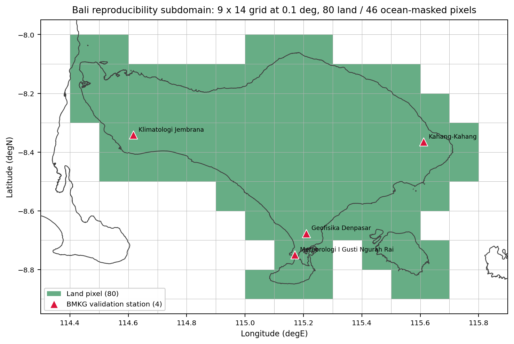

[](https://colab.research.google.com/github/bennyistanto/hybrid-bias-correction/blob/main/notebooks/02_lseqmdl_bias_correction.ipynb)

The same five notebooks drive both the Bali example and the full Indonesia run. The only difference is one line at the top of each notebook's Step 1 cell:

```python
CONFIG_FILE = 'config_bali.yml'   # or 'config.yml' for full Indonesia
```

Keep all five notebooks (nb02 through nb06) on the same value when you switch.

## The Bali subdomain

The shipped example runs on a small, fully reproducible slice of the grid: a 9 x 14 cell window at 0.1 deg over Bali, of which 80 cells are land and 46 are ocean-masked. Four BMKG stations fall inside it and serve as the independent validation set. This is what keeps the example light enough to run end-to-end in a Colab session while exercising every stage of the pipeline.

{#fig-bali-coverage fig-align="center"}

## Notebooks involved

| Notebook | What it does |
|----------|--------------|
| `00_define_aoi.ipynb`, `01_data_acquisition.ipynb` | Region adaptation: define AOI + download IMERG / CPC. Skip for Bali (data ships with repo). Full walkthrough in [Data Preparation](data-preparation.qmd). |
| `02_lseqmdl_bias_correction.ipynb` | LS → LSEQM → CNN train → DL blend, for all 36 dekads. |
| `03_measuring_performances.ipynb` | Computes metrics against CPC for each correction stage. |
| `04_qa_framework.ipynb` | Computes the Continuous Quality Index and writes per-period QA NetCDFs. |
| `05_station_validation.ipynb` | Independent validation against BMKG stations. |
| `06_visualisation_hub.ipynb` | Generates spatial figures + Taylor diagrams from the metrics / QA outputs. |

## Step-by-step

1. **Step 1** of every notebook is the setup cell. It reads `CONFIG_FILE` and calls `initialize_config(...)`. Edit this line to switch the AOI.
2. **Step 2-5 (nb02)** load IMERG / CPC / CPC-native / mask and pre-flight check the grids.
3. **Step 11 (nb02)** is the batch loop. It calls `run_correction_pipeline(imerg_ds, cpc_ds, month, dekad, cpc_native_ds=...)` from `src/bias_correction.py` for each of the 36 dekads.
4. **Step 7 (nb03)** loops over `run_metrics_pipeline(month, dekad, mode)` for each method - `ls`, `lseqm`, `lseqmdl`.
5. **Step 6 (nb04)** loops over `run_qa_pipeline(month, dekad, mode)` to score each method.
6. **Step 12 (nb05)** runs the per-period station validation batch. If you skip Step 2 (data loading) and jump straight to the batch, the batch cell **auto-loads** `station_df` and `obs_df` so it stays self-contained.
7. **nb06** has individual visualisation cells *plus* a **unified batch cell (Step 24)** that runs all 4 visualisation batches (QA, QA regional, Taylor, station validation) in one go.

Each batch cell wraps every period in `try/except` so a single bad dekad does not block the rest.

## Expected runtime

| Stage | Bali (Colab CPU) | Indonesia (local GPU, for reference) |
|-------|------------------|--------------------------------------|
| nb02 batch (36 dekads, including CNN train) | ~30-40 min | ~3-4 h |
| nb03 metrics | ~5 min | ~30 min |
| nb04 QA | ~5 min | ~30 min |
| nb05 station validation | <2 min | ~5 min |
| nb06 unified batch (all visualisations + Taylor) | ~10-15 min | ~30-60 min |

## What you get out

After all notebooks finish, `data/example_bali/output/` looks like this:

```
output/
  corrected_ls/         36 NetCDFs
  corrected_lseqm/      36 NetCDFs
  corrected_lseqmdl/    36 NetCDFs
  trained_models/       36 .keras models + normalisation JSONs
  metrics_ls/           per-dekad metrics NetCDFs
  metrics_lseqm/        per-dekad metrics NetCDFs
  metrics_lseqmdl/      per-dekad metrics NetCDFs
  quality_ls/           per-dekad QA NetCDFs
  quality_lseqm/        per-dekad QA NetCDFs
  quality_lseqmdl/      per-dekad QA NetCDFs
  station_validation/   per-method CSVs (31 metrics + multi-threshold)
  station_density/      confidence_mask_station_density.nc4
  figures/
    qa/                 1296 PNGs (8 QA plot types x 36 periods x 2 modes
                                   + regional breakdowns)
    taylor/             152 PNGs (pooled + per-dekad Taylor diagrams)
    station_validation/ 288 PNGs (metric maps, threshold curves,
                                   regional box plots)
```

For a walkthrough of what the figures look like and how to read them, see the [QA Framework](qa-framework.qmd) and [Station Validation](station-validation.qmd) tutorials.

## Memory on Colab

The batch cells are memory-aware:

- `_load_corrected` (Taylor pipeline) opens NetCDFs with a `with` block so file handles are released immediately.
- Every batch loop ends each iteration with `plt.close('all')` and `gc.collect()` so the previous period's arrays and matplotlib state are freed before the next period loads.
- Admin boundary shapefiles are loaded once per session, clipped to the AOI, and cached as numpy line segments (about 3-4 MB for Bali).

If you still hit OOM on a larger AOI, the most likely cause is the CNN training step in nb02 (TensorFlow can pin memory across calls). Adding `tf.keras.backend.clear_session()` between dekads usually resolves it.
