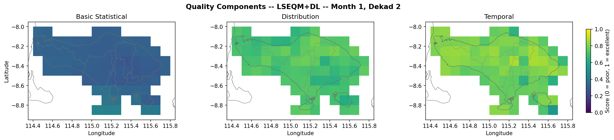
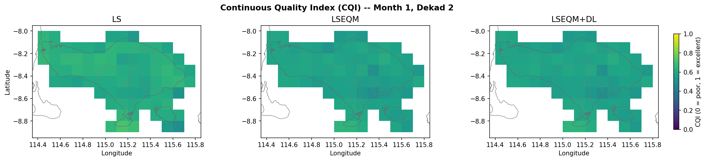
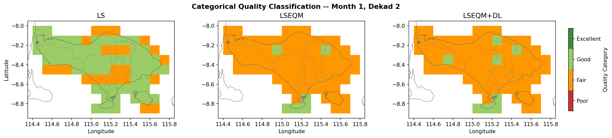
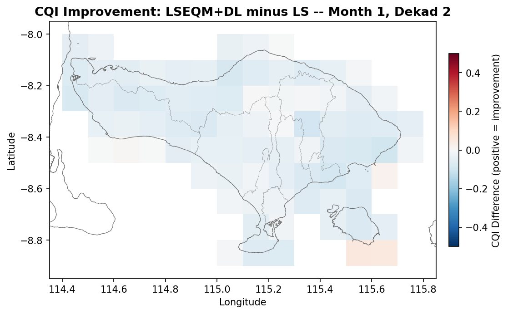
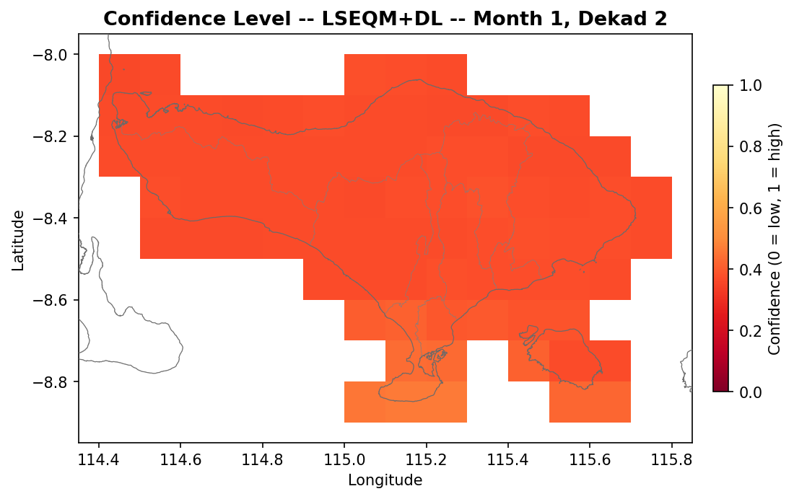
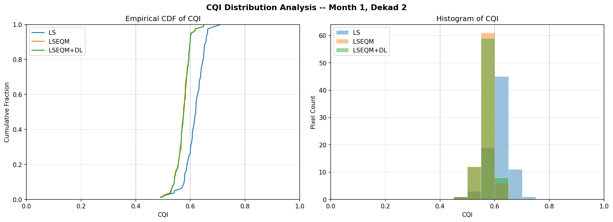
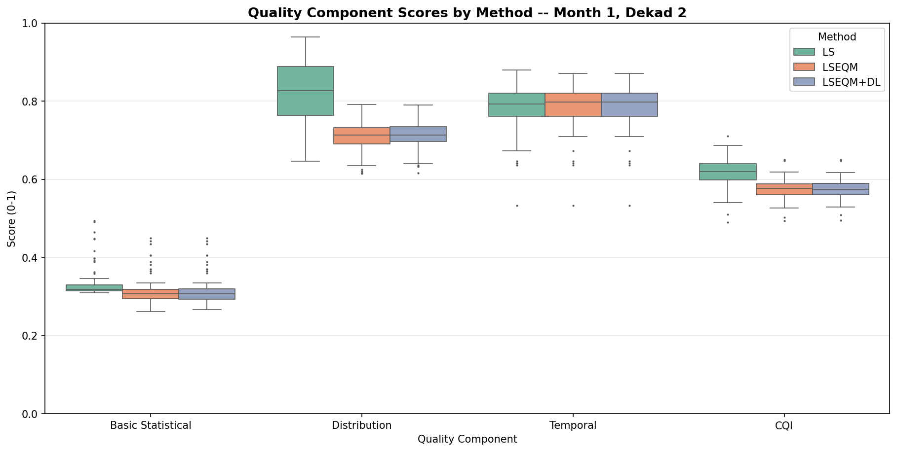

The Continuous Quality Index (CQI) is a single 0-1 score per pixel that summarises how well a corrected field reproduces the reference. It is the weighted sum of three component scores:

$$
\text{CQI} = w_b \cdot S_{\text{basic}} + w_d \cdot S_{\text{dist}} + w_t \cdot S_{\text{temporal}}
$$

with default weights $w_b = 0.4$, $w_d = 0.3$, $w_t = 0.3$.

## The components

| Component | What it measures | Underlying metrics |
|-----------|------------------|--------------------|
| **Basic** | Mean bias, correlation, error, efficiency | RMSE, MAE, Pearson r, NSE, Kling-Gupta efficiency |
| **Distribution** | Whether the shape of the distribution is corrected, not just the mean | Quantile-quantile error, std-dev ratio, percentile matching at 50/75/90/95/99 |
| **Temporal** | Whether the timing of wet and dry events is preserved | POD, FAR, CSI, wet-spell length match, dry-spell length match |

Each component is normalised to [0, 1] before weighting.

### Component scores side-by-side

Bali, January dekad 11-20, LSEQM+DL. Higher = better:

*Source: [nb06 Step 7 - Component Quality Maps](../example-bali/06_visualisation_hub_bali.html#step-7-component-quality-maps)*

## Categorical bands

| CQI range | Class | Reading |
|-----------|-------|---------|
| >= 0.80 | Excellent | Correction reproduces the reference closely |
| >= 0.60 | Good | Main features captured, minor discrepancies |
| >= 0.40 | Fair | Improves on raw satellite, significant biases remain |
| < 0.40 | Poor | Correction fails to improve or degrades the satellite estimate |

## Spatial CQI maps

For each dekad and each method, `04_qa_framework.ipynb` writes a `quality_{method}` NetCDF with the CQI and its three component fields. The visualisation hub (nb06) renders them as three-panel comparisons.

*Source: [nb06 Step 4 - CQI Spatial Maps](../example-bali/06_visualisation_hub_bali.html#step-4-cqi-spatial-maps)*

The categorical version uses the bands above:

*Source: [nb06 Step 5 - Categorical Quality Maps](../example-bali/06_visualisation_hub_bali.html#step-5-categorical-quality-maps)*

## What the DL stage actually moves

The improvement map (LSEQM+DL minus LS) shows where the deep-learning stage shifts the score:

*Source: [nb06 Step 6 - Method Improvement Map](../example-bali/06_visualisation_hub_bali.html#step-6-method-improvement-map)*

In gauge-dense areas, the DL stage usually adds a small but consistent improvement. In gauge-sparse areas, the station-density confidence mask returns the result to LSEQM, so the improvement is zero by construction. The confidence map shows where each pixel sits on that scale:

*Source: [nb06 Step 8 - Confidence Map](../example-bali/06_visualisation_hub_bali.html#step-8-confidence-map)*

## Distribution and box plots

CQI distribution shows the histogram and CDF of pixel scores per method:

*Source: [nb06 Step 9 - CQI Distribution Analysis](../example-bali/06_visualisation_hub_bali.html#step-9-cqi-distribution-analysis)*

Per-component box plots compare LS / LSEQM / LSEQM+DL on each component separately:

*Source: [nb06 Step 11 - Component Box Plots](../example-bali/06_visualisation_hub_bali.html#step-11-component-box-plots)*

## Interpreting changes between methods

The expected pattern, in tropical settings:

- LS improves the **mean** - basic score jumps from raw IMERG.
- LSEQM lifts the **distribution** component substantially - this is where the Gamma + GPD fit pays for itself.
- LSEQM+DL adds small gains in the **basic** component over densely gauged areas, and is neutral elsewhere by design (the confidence mask returns those cells to LSEQM).

If LSEQM+DL is worse than LSEQM in data-sparse cells, the confidence mask is probably misconfigured. Check `saturation_count` and inspect `confidence_mask_station_density.nc4` under `output/station_density/`.

For Bali specifically, all four BMKG stations sit in the southern half of the island, so the confidence mask is highest in southern Bali and near-zero over the northern coast.
