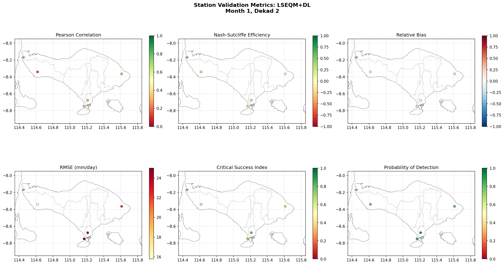
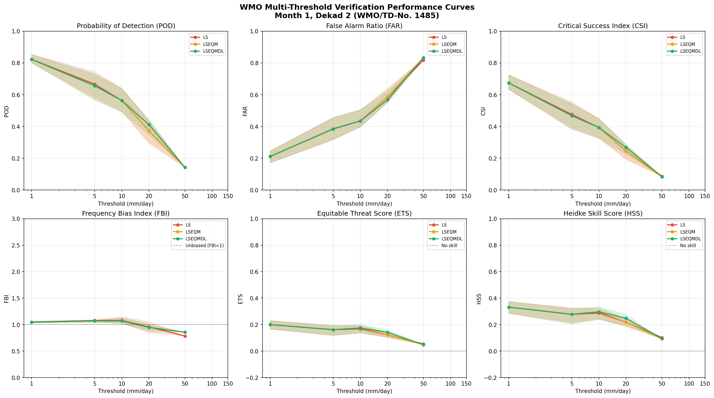
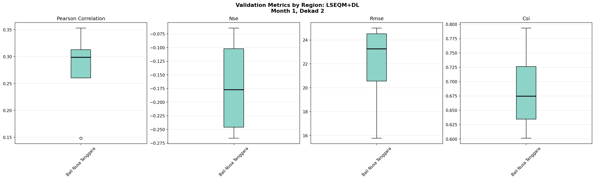
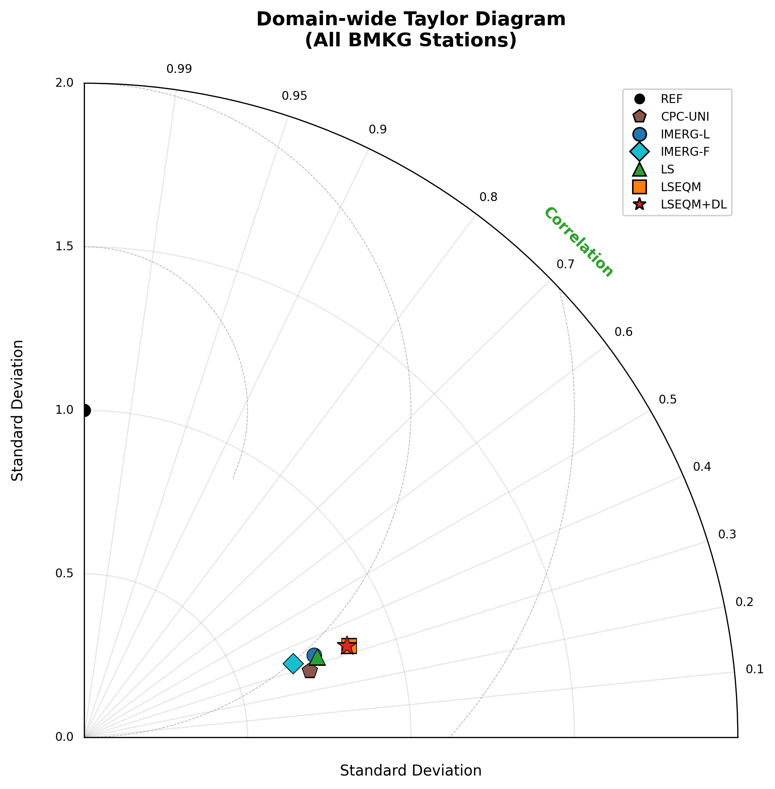
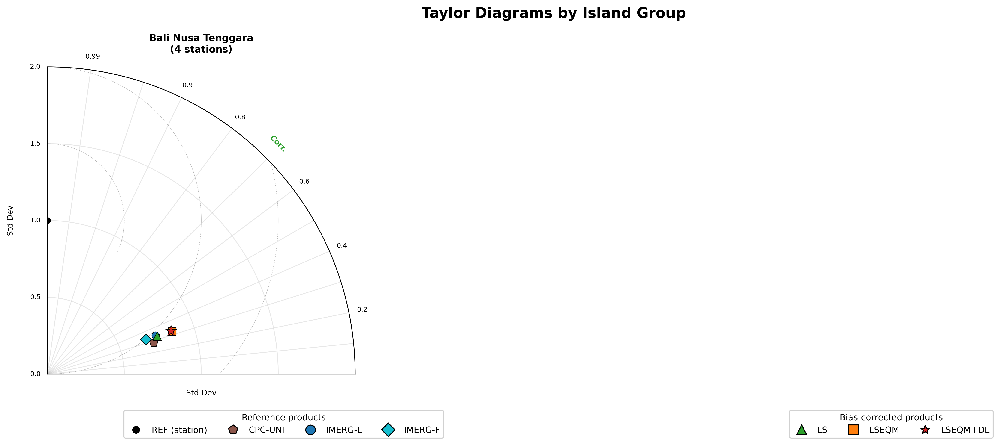
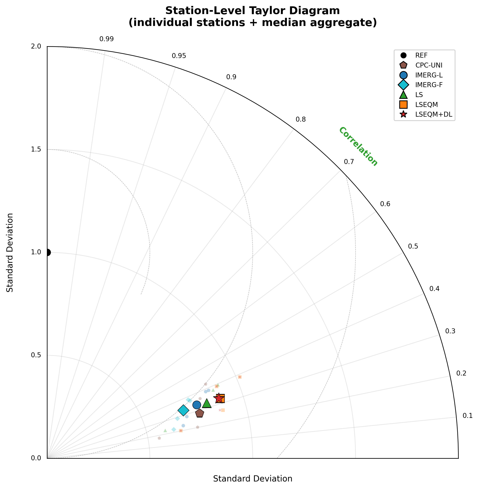

CPC-UNI is the training reference. The BMKG stations are not in the CPC pipeline (different national agency, different processing), so they provide an independent check on the bias correction.

For the Bali example bundle there are 4 BMKG stations:

| WMO ID | Name | Lat | Lon | Elev (m) |
|--------|------|-----|-----|----------|
| 97230 | I Gusti Ngurah Rai (airport) | -8.75 | 115.17 | 4 |
| 97232 | Geofisika Denpasar | -8.68 | 115.21 | 15 |
| 97234 | Kahang-Kahang | -8.37 | 115.61 | 155 |
| 97236 | Klimatologi Jembrana | -8.34 | 114.62 | 25 |

## What nb05 does

The batch cell (Step 12) iterates the 36 dekads. For each one:

1. Loads the per-dekad corrected NetCDFs (LS, LSEQM, LSEQM+DL).
2. Extracts the value at each station's nearest pixel.
3. Pairs against the BMKG daily observations, filtering missing values (sentinel `8888.0`).
4. Computes the 31 WMO-style metrics per station, plus the multi-threshold POD / FAR / CSI table.
5. Saves CSVs under `output/station_validation/`.

If you skip Step 2 (which loads `station_df` and `obs_df` interactively) and jump straight to the batch cell, it now **auto-loads** those variables - the batch is self-contained.

## What nb06 then plots

The nb06 station-validation batch reads the CSVs from nb05 and writes the figures discussed below.

### Per-station metric scatter maps

One 2 × 3 panel of key metrics across all stations, per method. Bali, January dekad 11-20, LSEQM+DL:

The dot colour at each station encodes the metric value; the dot position is the station location. Bigger dots, or warmer / cooler colours away from neutral, flag stations where the method does poorly.

### Multi-threshold WMO curves

POD / FAR / CSI computed at multiple wet-day thresholds (1, 5, 10, 20, 50 mm) for each method:

This is where the categorical impact of each correction stage is clearest: light-rain thresholds show LS already does most of the work; heavy-rain thresholds (20-50 mm) is where LSEQM+DL earns its keep.

### Regional box plots

Regional aggregation collapses the per-station metrics by `region_mapping` (Sumatra, Jawa, Kalimantan, Sulawesi, Bali Nusa Tenggara, Maluku, Papua). For Bali the only region is "Bali Nusa Tenggara":

For the full Indonesia run, this view becomes much more interesting - it surfaces where the framework performs well and where it does not.

## Taylor diagrams (from nb06)

nb06's Taylor pipeline (`compute_all_taylor_stats` + `generate_*_taylor`) pairs each product against each BMKG station's daily record across the entire 2001-2025 period, then plots the median.

Domain-wide Taylor (pooled across all stations):

By-island (only Bali Nusa Tenggara for the Bali example; this becomes a real multi-panel figure on Indonesia):

Per-station Taylor (one marker per station, with the cluster median as a larger marker):

The Taylor design follows the paper figure: bottom "Standard Deviation" axis label, "Correlation" label at 45 degrees close to the outer arc, denser correlation ticks at 0.95+ with 2-decimal formatting, and a split legend (reference products vs bias-corrected products) anchored at the bottom of the figure.

## Reading the diagrams

Each point encodes three things:

- **Angle from the y-axis** = Pearson correlation (closer to the vertical = higher correlation, ranging 0 to 1).
- **Radius** = standard deviation ratio (1.0 = matches the observed variability; <1 underestimates; >1 overestimates).
- **Distance from the reference point at (0, 1.0)** = centred RMSE (lower = better).

Movement *toward* the reference point as you go from IMERG-L → LS → LSEQM → LSEQM+DL is the desired pattern.

## Headline numbers

::: {.callout-note}
Quantitative headline numbers from the full-Indonesia run across all 180 BMKG stations will be filled in here when the companion paper is finalised. The Bali bundle's 4-station numbers are useful for sanity-checking the toolchain but are not statistically robust on their own.
:::
