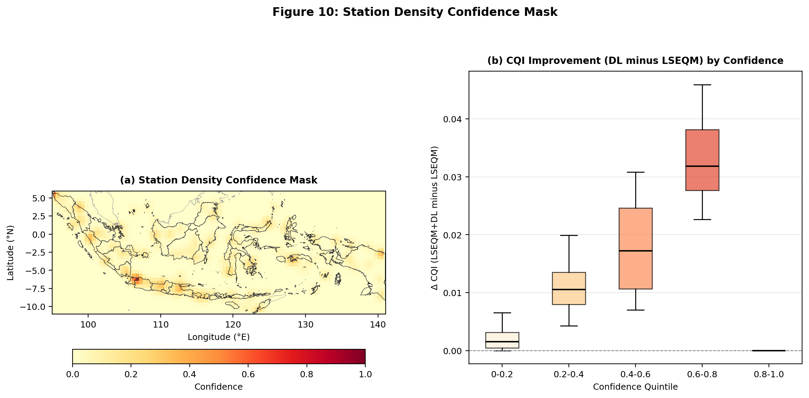

# A Scalable Framework for Enhancing Satellite-Derived Daily Precipitation: Adjusting Values, Aligning Distributions, and Preserving Extremes

**Benny Istanto**^{1,*}, **Rizaldi Boer**^{2,3}, **I Putu Santikayasa**^{2,4}

^{1} Applied Climatology Study Program, Department of Geophysics and Meteorology, Bogor Agricultural University, Bogor 16680, Indonesia  
^{2} Department of Geophysics and Meteorology, Bogor Agricultural University, Bogor 16680, Indonesia  
^{3} International Research Institute for Environment and Climate Change, Bogor Agricultural University, Bogor 16680, Indonesia  
^{4} Center for Climate Risk and Opportunity Management in South East Asia and Pacific, Bogor Agricultural University, Bogor 16680, Indonesia

\* Correspondence: bennyistanto@gmail.com

## Abstract

Accurate daily precipitation estimates are essential for hydrological modeling, climate risk assessment, and disaster preparedness. Satellite-based precipitation products such as the Integrated Multi-satellitE Retrievals for Global Precipitation Measurement (IMERG) provide global coverage but exhibit systematic biases in daily accumulations, particularly in representing extreme precipitation events. This study presents a hybrid bias correction framework (LSEQM+DL) for daily satellite precipitation that sequentially integrates Linear Scaling (LS) for mean bias removal, Empirical Quantile Mapping (EQM) with Generalized Pareto Distribution (GPD) tail adjustment for distributional alignment, and a Convolutional Neural Network (CNN) refinement that selectively targets extreme precipitation pixels. A station density confidence mask modulates the deep learning influence based on gauge network density, so that the CNN refinement is strongest where the reference dataset (CPC Unified Gauge-Based Analysis of Daily Precipitation, CPC-UNI) is best constrained by observations. Applied to daily IMERG Late Run precipitation over Indonesia (2001--2025) and evaluated against CPC-UNI and 171 independent station observations from Indonesia's Meteorological, Climatological, and Geophysical Agency (BMKG), the framework is assessed through three evaluation pillars aligned with its design objectives: adjusting values, aligning distributions, and preserving extremes. At independent BMKG station locations, the hybrid correction brings the standard deviation ratio from 0.71 (LS) to 1.00 (LSEQM+DL, toward unity), the relative bias from -11.4% to -0.6%, and the 99th-percentile ratio from 0.71 to 1.01, indicating convergence of the corrected distribution toward the observed precipitation statistics. The wet-day frequency ratio improves from 1.21 (LS) to 0.95 (LSEQM+DL), reducing a 21% overestimation of wet-day occurrence to within 5% of observed. These improvements come at a known cost: event detection (POD) decreases from 0.78 to 0.65, reflecting the trade-off inherent to distributional correction methods that adjust marginal statistics without modifying temporal sequencing. Pixel-level temporal accuracy metrics (correlation, root mean square error, Nash-Sutcliffe efficiency) remain largely unchanged, confirming that the framework improves statistical properties rather than day-to-day prediction skill. The World Meteorological Organization (WMO) multi-threshold verification at station locations shows maintained detection skill at rainfall thresholds up to 100 mm/day. Because the approach relies on globally available satellite and gauge-analysis datasets, it is applicable to other tropical and subtropical regions with sparse gauge networks, though recalibration of CNN hyperparameters and GPD thresholds may be required for different climate regimes.

**Keywords:** Bias Correction, Satellite Precipitation, IMERG, Daily Precipitation, Extreme Events, Deep Learning, Quantile Mapping, Generalized Pareto Distribution, Quality Assessment, Indonesia

# 1. Introduction

Accurate and timely precipitation estimates are critical for a wide range of scientific and societal applications, including flood forecasting, drought monitoring, hydrological modeling, and climate risk assessments. Satellite-derived precipitation products, such as those from the Global Precipitation Measurement (GPM) mission [ref1,ref2], have greatly expanded the global coverage of precipitation observations, especially over regions with sparse ground station networks. However, despite their transformative role, satellite-based estimates often suffer from systematic biases, spatial inconsistencies, and challenges in capturing the full spectrum of precipitation variability [ref3], particularly for extreme rainfall events. These limitations reduce the reliability of satellite data for operational and scientific applications that depend on an accurate depiction of both mean conditions and high-impact extremes.

A wide range of bias correction techniques has been developed to address these challenges. Traditional statistical methods, such as Linear Scaling (LS), effectively correct mean biases by adjusting the overall magnitude of satellite estimates to align with ground-based observations [ref4]. Empirical Quantile Mapping (EQM) extends this correction by aligning the entire distribution of satellite precipitation with the reference distribution, adjusting not only the mean but also higher-order statistical moments [ref5,ref6]. More recently, methods such as Generalized Pareto Distribution (GPD) fitting have been introduced to specifically address biases in the tails of precipitation distributions, aiming to better preserve extreme events [ref7]. In parallel, advances in machine learning (ML) and deep learning (DL) have opened new possibilities for bias correction, enabling more flexible and nonlinear mappings between satellite and reference data [ref8]. Convolutional Neural Networks (CNNs) provide powerful capabilities for modeling complex spatial patterns that traditional statistical methods may overlook [ref9,ref10].

Despite these advances, critical gaps remain. Traditional bias correction techniques often underperform in preserving the frequency and magnitude of extreme precipitation events [ref8,ref11], while many machine learning approaches lack integration with physically interpretable statistical corrections, risking overfitting or reduced transparency [ref12]. There remains a need for a hybrid approach that simultaneously addresses mean biases, distributional alignment, and extreme event preservation in a scalable and reproducible manner.

In this study, we propose a hybrid bias correction framework that sequentially integrates Linear Scaling, Empirical Quantile Mapping with gamma-based distribution fitting and GPD tail adjustment, and a Deep Learning refinement step using Convolutional Neural Networks. The framework is designed to improve daily satellite precipitation estimates by systematically adjusting mean values, aligning distributions, and preserving extremes. Using globally available datasets – the Integrated Multi-satellitE Retrievals for GPM (IMERG) Late Run (IMERG-L) satellite precipitation [ref2] and the CPC Global Unified Gauge-Based Analysis of Daily Precipitation (CPC-UNI) gridded station observations [ref13] – the methodology is demonstrated over the Indonesian archipelago, selected for its vulnerability to extreme rainfall and complex topographic and climatic conditions. Correction quality is evaluated through 31 verification metrics organized into a composite Continuous Quality Index (CQI), providing a structured assessment across basic statistical, distributional, and temporal dimensions [ref14,ref15].

To address the spatial heterogeneity inherent in gauge-based reference datasets, the framework incorporates a station density confidence mask that modulates the influence of the deep learning component based on gauge network density. In regions where the CPC-UNI reference is supported by dense station coverage, the CNN refinement is applied with greater confidence. In station-sparse regions, where the reference dataset relies on interpolation and may not accurately capture local precipitation characteristics, the framework reverts toward purely statistical corrections. This design provides a systematic approach for managing reference dataset uncertainty in operational bias correction over regions with heterogeneous observational networks.

# 2. Methods

The hybrid framework sequentially integrates four processing stages, each targeting a distinct source of satellite precipitation bias (Figure 1). Linear Scaling (LS) corrects the mean [ref4,ref16]. Empirical Quantile Mapping (EQM) aligns the full distribution [ref5,ref6], but may underrepresent upper extremes [ref8]. Generalized Pareto Distribution (GPD) fitting addresses this by modeling the upper tail explicitly [ref7]. A Convolutional Neural Network (CNN) provides spatially aware refinement of residual extreme-pixel errors [ref9,ref10,ref17]. Because the CPC-UNI reference quality varies spatially with gauge density [ref13,ref18], a station density confidence mask modulates the CNN influence, providing an explicit mechanism for managing training target uncertainty.

## 2.1 Study Region

Indonesia, the world's largest archipelagic country, presents a complex and challenging environment for precipitation estimation. Located between the Indian and Pacific Oceans and straddling the equator, Indonesia experiences a tropical climate characterized by high spatial and temporal variability in rainfall [ref19,ref20]. Topographical diversity, ranging from lowland plains to mountainous regions exceeding 4,000 meters in elevation, further complicates precipitation patterns. The country is highly vulnerable to extreme rainfall events that frequently trigger flooding, landslides, and other hydrometeorological disasters.

This study adopts Indonesia as the area of interest (AOI) due to its critical need for improved precipitation monitoring and its representative challenges for satellite-based hydrometeorological applications. While the Indonesia's Meteorological, Climatological, and Geophysical Agency (BMKG) station data used for validation are specific to Indonesia, the primary datasets utilized for bias correction, IMERG and CPC-UNI, are globally available. Moreover, the hybrid bias correction methodology developed here is designed to be scalable and replicable across other regions worldwide, supporting broader applications in climate research, disaster risk reduction, and hydrological modeling beyond Indonesia.

## 2.2 Data and Preprocessing

Three precipitation datasets are used in this study [ref22]. The IMERG Late Run (IMERG-L; 0.1°, ~14-hour latency) [ref2,ref21] serves as the satellite product to be corrected; because IMERG-L relies purely on satellite observations without gauge assimilation, it provides an uncontaminated baseline for evaluating bias correction. The IMERG Final Run (IMERG-F; 0.1°) [ref2], which incorporates gauge data during post-processing, is included as an independent evaluation benchmark but is not used in the correction procedure. The CPC Unified Gauge-Based Analysis of Global Daily Precipitation (CPC-UNI; 0.5°) [ref13,ref18] serves as the reference for bias correction. CPC-UNI is the highest-resolution global daily gauge-analysis product, though its interpolated values may not capture local extremes in regions with sparse station networks. All satellite data were obtained from the NASA GES DISC; CPC-UNI from the NOAA Physical Sciences Laboratory.

Independent validation uses daily observations from 171 stations operated by Indonesia's Meteorological, Climatological, and Geophysical Agency (BMKG). These station data are not used in the bias correction procedure and provide an external ground-truth assessment uncontaminated by the CPC-UNI training reference.

Prior to correction, datasets were harmonized through spatial regridding (CPC-UNI to the IMERG grid via nearest-neighbor interpolation), temporal alignment, land-sea masking, and latitude reindexing. Following the Bias Correction Spatial Disaggregation (BCSD) principle [ref23], distribution parameters are estimated at the native 0.5° CPC-UNI resolution and bilinearly interpolated to 0.1° before quantile mapping. A wet-day threshold of 1.0 mm/day is applied throughout, consistent with WMO recommendations for tropical regions [ref24]. Full preprocessing details are provided in Supplementary S1.

## 2.3 Hybrid Bias Correction Methodology

The operational implementation follows a sequential four-stage structure. Each processing stage targets a specific source of bias in satellite-derived daily precipitation estimates. All bias correction steps are performed separately for each dekadal period (three subdivisions per month: days 1–10, 11–20, and 21 to end of month). Within each dekad, daily precipitation values are pooled across all available years (2001–2025), yielding approximately 250 samples per dekad. This multi-year pooling strategy enhances the statistical robustness of distribution fitting and extreme value estimation, while preserving the seasonal characteristics of each dekadal window.

The overall hybrid bias correction workflow is illustrated in Figure 2.

### 2.3.1 Stage 1: Linear Scaling

Linear Scaling corrects the systematic mean bias by applying a multiplicative factor derived from the ratio of reference to satellite mean precipitation. For each dekad, the scaling factor $C_{LS}$ is computed as:

$$C_{LS} = \frac{\bar{P}_{ref}}{\bar{P}_{sat}}$$

where $\bar{P}_{ref}$ and $\bar{P}_{sat}$ are the mean daily precipitation of the CPC-UNI reference and IMERG-L satellite datasets, respectively, pooled over the same dekadal period across all years. The corrected precipitation is:

$$P_{LS} = P_{sat} \cdot C_{LS}$$

Grid cells where the satellite mean is zero are left unchanged. Following the BCSD strategy (Section 2.2), $\bar{P}_{ref}$ is computed at the native $0.5^{\circ}$ CPC-UNI grid and bilinearly interpolated to $0.1^{\circ}$, producing a spatially smooth scaling field.

### 2.3.2 Stage 2: Empirical Quantile Mapping with Gamma Distribution Fitting (EQM)

Empirical Quantile Mapping aligns the full cumulative distribution function (CDF) of the LS-corrected satellite precipitation to that of the reference observations. To improve the stability and smoothness of the CDFs, particularly in regions with limited sample sizes, gamma distributions are fitted to the precipitation data prior to mapping. Gamma parameters (shape $k$ and scale $\theta$) are estimated using maximum likelihood estimation (MLE) with the location parameter fixed at zero to ensure physical validity of non-negative precipitation values [ref15]. The quantile correction for each satellite precipitation value $P_{LS}$ is performed by:

$$P_{EQM} = F_{ref}^{-1}\left( F_{sat}\left( P_{LS} \right) \right)$$

where $F_{sat}$ and $F_{ref}$ denote the fitted gamma CDFs of the satellite and reference datasets, respectively, and $F_{ref}^{-1}$ is the inverse CDF (quantile function) of the reference distribution.

The satellite-side gamma CDF is fitted independently at each $0.1^{\circ}$ pixel, while the reference gamma CDF is fitted at the native $0.5^{\circ}$ CPC-UNI resolution and the parameters bilinearly interpolated to $0.1^{\circ}$, consistent with the BCSD strategy [ref23].

**Dry-day handling.** Because daily tropical precipitation is a mixed discrete-continuous variable with a large atom at zero, the gamma distribution is fitted only on wet days ($P \geq 1$ mm/day) rather than on the full sample. Fitting a gamma to the mixed sample would bias the shape parameter toward zero and distort the mapped quantiles. The dry-day fraction is handled explicitly at the mapping stage following the unconditional-CDF construction of Cannon et al.~[ref11]. Let $p_{dry}^{sat}$ and $p_{dry}^{ref}$ denote the satellite and reference dry-day probabilities estimated at each pixel from the empirical sample. For a satellite wet-day value $P_{LS} \geq 1$ mm/day, the unconditional quantile position is $$y = p_{dry}^{sat} + (1 - p_{dry}^{sat}) \cdot F_{sat}^{wet}(P_{LS}),$$ where $F_{sat}^{wet}$ is the gamma CDF fitted on wet values only. The reference quantile is then obtained from the analogous reference unconditional CDF, with values falling below $p_{dry}^{ref}$ mapped to zero. This construction preserves the reference dry-day frequency by design and prevents satellite drizzle from being mapped to spurious low-intensity wet-day values.

### 2.3.3 Stage 3: Generalized Pareto Distribution (GPD) Tail Adjustment

Extreme precipitation values are modeled separately to preserve the frequency and magnitude of high-impact events that gamma-based EQM may underrepresent. Precipitation exceedances above the 80th percentile of the wet-day sample are fitted using the Generalized Pareto Distribution, with separate thresholds $u_{sat}$ and $u_{ref}$ estimated from the satellite and reference wet-value distributions, respectively. The 80th percentile threshold was selected to balance two competing requirements: a sufficiently large number of exceedances for stable GPD parameter estimation, and a threshold high enough to isolate genuinely extreme behavior from the bulk distribution [ref7]. This threshold is consistent with recommendations for tropical regions with frequent heavy rainfall, where lower thresholds risk contaminating GPD fits with moderate rainfall, while higher thresholds yield too few exceedances for reliable estimation [ref25].

For precipitation values exceeding threshold $u$, the exceedances $y = P - u$ are modeled using the GPD probability density function:

$$f(y) = \frac{1}{\sigma} \left( 1 + \xi \frac{y}{\sigma} \right)^{-(1 + 1/\xi)}$$

where $\xi$ is the shape parameter and $\sigma$ is the scale parameter. The location parameter is fixed at zero because exceedances are non-negative by construction; leaving the location free would bias the fitted tail [ref7]. To improve robustness against data sparsity, GPD parameters are estimated using $K$-fold cross-validation ($K = 5$) with shuffled folds, and the final parameters are averaged across all folds to reduce sensitivity to individual outliers [ref25]. Conditional probability mapping is then applied to correct extreme quantiles. For an LS-corrected value $P_{LS} > u_{sat}$, the conditional exceedance probability is computed on the satellite side using its own threshold,

$$p_c = \frac{F_{sat}(P_{LS}) - F_{sat}(u_{sat})}{1 - F_{sat}(u_{sat})},$$

and the GPD-corrected value is obtained from the reference GPD as

$$P_{LSEQM} = u_{ref} + G_{ref}^{-1}(p_c),$$

where $G_{ref}^{-1}$ is the inverse GPD fitted to the reference exceedances and $u_{ref}$ is the reference wet-value 80th percentile. Computing $p_c$ on the satellite side ensures that the tail-substitution probability chain is internally consistent with the unconditional gamma CDF used in the body of the distribution, and maintains continuity at the gamma-GPD boundary.

As with the gamma parameters, GPD parameters are fitted at the native $0.5^{\circ}$ resolution and interpolated to $0.1^{\circ}$. Corrected values are capped at the interpolated 99.9th percentile of the reference distribution to prevent physically unrealistic extremes from GPD extrapolation.

### 2.3.4 Stage 4: Deep Learning Refinement (CNN)

Although the preceding statistical corrections substantially reduce biases in mean, distribution, and extremes, residual errors in extreme precipitation pixels often persist due to complex local topographic and atmospheric processes. To address these remaining biases, a Convolutional Neural Network (CNN) is employed to refine the corrected precipitation fields, with its corrections selectively applied to extreme pixels through alpha-blending.

The CNN is trained separately for each dekadal period, using the LSEQM-corrected fields as input and CPC-UNI observations as the training target. This two-stage design means the CNN receives input from the same statistical domain at both training and inference time, avoiding the domain shift problem that arises when training directly on raw satellite data [ref9].

Each daily precipitation field is independently normalized to $[0, 1]$ by dividing by its spatial maximum. The CNN comprises two convolutional blocks ($3 \times 3$ filters, 32/64 channels) with max pooling and dropout, followed by a Flatten-Dense bottleneck (128 units) and a linear output layer (Figure 3). The model is trained by minimizing mean squared error using the Adam optimizer [ref26] with early stopping (patience = 5 epochs) and an 80/20 training-validation split.

#### Alpha-Blending Integration

The CNN predictions are not applied uniformly across all grid cells. Instead, an alpha-blending strategy selectively integrates the DL refinement with the statistical corrections. For each grid cell and time step, the final corrected precipitation is:

$$P_{final} = \alpha_{eff} \cdot P_{LSEQM} + (1 - \alpha_{eff}) \cdot P_{DL}$$

where $\alpha_{eff}$ is the effective blending weight. This blending is applied only to pixels identified as extreme, defined as those where $P_{LSEQM}$ exceeds the 80th percentile of the pixel's dekadal distribution.

Non-extreme pixels retain their LSEQM values without modification, and pixels with zero precipitation are preserved as zero. The base blending weight $\alpha = 0.70$ assigns 70% weight to the physical-statistical correction and 30% to the DL refinement.

#### Station Density Confidence Weighting

The reliability of the CPC-UNI reference varies spatially depending on the density of contributing gauge stations. To account for this heterogeneity, a station density confidence mask modulates the blending parameter. Gauge station counts per CPC-UNI native grid cell ($0.5^{\circ}$) are computed from the BMKG station network, Gaussian-smoothed ($\sigma = 1.0$ grid cells) to prevent sharp boundaries, then normalized to $[0, 1]$ by dividing by a saturation count of 3 stations per cell. The confidence mask $C(x, y)$ modulates the blending parameter as:

$$\alpha_{eff}(x, y) = 1.0 - C(x, y) \cdot (1.0 - \alpha)$$

This formulation provides a smooth spatial transition: station-dense areas receive the full DL contribution ($\alpha_{eff} = 0.70$), while station-sparse areas revert toward pure LSEQM ($\alpha_{eff} \rightarrow 1.0$). This approach reduces the risk of the DL model introducing artifacts in regions where the training target itself is uncertain [ref27].

## 2.4 Model Evaluation and Quality Assessment

Evaluating bias correction of daily precipitation requires a multi-metric framework that captures statistical accuracy, distributional consistency, temporal pattern preservation, and the representation of extreme events. Daily precipitation exhibits high temporal variability, frequent dry periods, and intermittent extreme events, making it more difficult to evaluate than monthly-aggregated precipitation. A single performance metric cannot capture correction quality across all relevant dimensions including event timing, intensity distribution, dry spell behavior, and extremes, and this study therefore employs a structured suite of statistical, categorical, temporal, and distributional metrics combined with integrated quality indices, consistent with recommended practice for satellite precipitation verification [ref14,ref15].

### 2.4.1 Nine-Combination Evaluation Design

The evaluation follows a systematic 3 x 3 factorial design (Table 1). Three reference datasets are used: (1) CPC-UNI, the gauge-based product used as the training reference for bias correction; (2) IMERG-L, the uncorrected satellite product; and (3) IMERG-F, the gauge-adjusted IMERG Final Run product, which serves as an independent benchmark. Each reference is compared against three correction stages: LS (mean correction only), LSEQM (mean + distributional correction), and LSEQM+DL (full hybrid correction). This yields nine reference-test combinations, enabling three complementary perspectives:

- **CPC-UNI vs.~corrected products:** Measures absolute correction
  quality against the training reference, assessing how well each stage
  reproduces the gauge-based observations.
- **IMERG-L vs.~corrected products:** Quantifies improvement
  relative to the uncorrected satellite baseline, isolating the added
  value of bias correction.
- **IMERG-F vs.~corrected products:** Evaluates performance against
  an independent, gauge-adjusted satellite product that was not used in
  the correction procedure, providing a less circular validation.

**Table 1.** Evaluation matrix: nine reference-test combinations.

|  | **LS** | **LSEQM** | **LSEQM+DL** |
|---|---|---|---|
| **CPC-UNI** | CPC-UNI vs LS | CPC-UNI vs LSEQM | CPC-UNI vs |
| **IMERG-L** | IMERG-L vs LS | IMERG-L vs LSEQM | IMERG-L vs |
| **IMERG-F** | IMERG-F vs LS | IMERG-F vs LSEQM | IMERG-F vs |

### 2.4.2 Evaluation Metrics

Correction performance is evaluated using 31 verification metrics organized into four categories (Table 2): continuous statistical measures (Relative Bias, Pearson Correlation, RMSE, MAE, NSE, Standard Deviation Ratio, KS test), categorical event detection (POD, FAR, CSI, ETS), temporal pattern fidelity (Frequency of Precipitation Days, Mean Wet-Day Precipitation, Maximum Dry Spell Length), and distributional consistency (six percentiles from $Q_{25}$ to $Q_{99}$). All metrics are computed at the pixel level for each dekadal period, following established definitions [ref14,ref15,ref28,ref29]. Mathematical formulas for all metrics are provided in Supplementary S2.

**Table 2.** Summary of verification metrics.

| Category | Metric | Abbreviation | Unit | Perfect Score |
| --- | --- | --- | --- | --- |
| Continuous | Relative Bias | RB | ratio | 0 |
|  | Pearson Correlation | CORR | – | 1 |
|  | Root Mean Square Error | RMSE | mm/day | 0 |
|  | Mean Absolute Error | MAE | mm/day | 0 |
|  | Nash-Sutcliffe Efficiency | NSE | – | 1 |
|  | Standard Deviation (ref, test) | STDEV | mm/day | equal |
|  | Standard Deviation Ratio | SDR | ratio | 1 |
|  | KS Test Statistic / $p$-value | KS | – | 0 / 1 |
| Categorical | Probability of Detection | POD | – | 1 |
|  | False Alarm Ratio | FAR | – | 0 |
|  | Critical Success Index | CSI | – | 1 |
|  | Equitable Threat Score | ETS | – | 1 |
| Temporal | Frequency of Precipitation Days | FPD | % | equal |
|  | Mean Wet-Day Precipitation | MDWP | mm/day | equal |
|  | Maximum Dry Spell Length | DSL | days | equal |
| Distributional | Percentiles ($Q_{25}$ – $Q_{99}$) | $Q_{xx}$ | mm/day | equal |

### 2.4.3 Composite Quality Assessment Framework

To evaluate overall correction quality across multiple dimensions simultaneously, the Continuous Quality Index (CQI) aggregates individual metrics into three principal component scores [ref30]:

$$\text{BSQS} = 0.30 \cdot S_{RB} + 0.30 \cdot S_{RMSE} + 0.40 \cdot S_{NSE}$$

$$\text{DQS} = 0.45 \cdot S_{extreme} + 0.25 \cdot S_{general} + 0.15 \cdot S_{var} + 0.15 \cdot S_{KS}$$

$$\text{TQS} = 0.40 \cdot S_{CSI} + 0.30 \cdot S_{event} + 0.30 \cdot S_{spell}$$

where BSQS captures basic statistical accuracy (bias, error magnitude, prediction efficiency), DQS evaluates distributional preservation with emphasis on extreme percentiles (weight 0.45), and TQS assesses temporal pattern fidelity including event detection and dry spell persistence. The overall CQI synthesizes these components:

$$\text{CQI} = 0.35 \cdot \text{BSQS} + 0.35 \cdot \text{DQS} + 0.30 \cdot \text{TQS}$$

CQI values are classified as Excellent ($\geq 0.8$), Good ($0.6\text{–}0.8$), Fair ($0.4\text{–}0.6$), or Poor ($< 0.4$). Because the majority of pixels fall within the Fair range, Figure 6b employs a finer six-tier subdivision to reveal spatial structure. Sub-score formulas and the full classification table are provided in Supplementary S2.

A pixel-level confidence score, based on metric consistency and distributional agreement, flags regions where the evaluation may be less reliable due to data limitations. The confidence formulation is detailed in Supplementary S3.

# 3. Results and Discussion

Before examining correction performance, it is important to characterize the starting conditions. The uncorrected IMERG Late Run over Indonesia exhibits a systematic wet bias against the CPC-UNI reference, with domain-median relative bias of approximately +15% during the wet season (October–March). This bias has a conditional structure: IMERG overestimates precipitation on days that CPC-UNI classifies as light rain while simultaneously underestimating moderate-to-heavy events (Section 3.1), a pattern consistent with published IMERG-L evaluations over the Maritime Continent [ref31,ref32,ref33]. The CPC-UNI reference itself carries important limitations: at $0.5^{\circ}$ resolution with 180 contributing stations across Indonesia, gauge density is heavily concentrated in Java and southern Sumatra (Section 3.6, Figure 10a), leaving eastern Indonesia (Papua, Maluku, Nusa Tenggara) dependent on interpolation that may not capture local extremes. The independent BMKG station network used for validation (171 stations with $\geq$ 30 valid days) shares a similar spatial distribution, with station density highest in Java. This geographic concentration means that domain-median validation statistics are more representative of conditions in station-dense western Indonesia than in the data-sparse east, a caveat that should be borne in mind when interpreting the results below.

## 3.1 Progressive Improvement Across Correction Stages

The hybrid framework targets three complementary aspects of satellite precipitation bias: adjusting values (mean and magnitude), aligning distributions (statistical shape), and preserving extremes (tail accuracy). To evaluate whether each correction stage delivers on its intended objective, domain-wide verification metrics were computed for the uncorrected IMERG Late Run and the three correction products (LS, LSEQM, and LSEQM+DL) against the CPC-UNI gauge-based reference. Table 3 organizes the evaluation around these three design objectives, supplemented by categorical event detection metrics. All values represent the spatial median across Indonesian land pixels, averaged over 36 dekadal periods (12 months $\times$ 3 dekads per month). Ratio metrics express the corrected product relative to the reference (target = 1.0).

**Table 3.** Domain-wide evaluation by correction stage against CPC-UNI, organized by the three design objectives of the hybrid framework. Values represent the spatial median across all land pixels, averaged over all 36 dekadal periods. Ratio metrics express test/reference. Bold indicates the value closest to the target.

| Evaluation Objective | Metric | LS | LSEQM | LSEQM+DL | Target |
|---|---|---|---|---|---|
| **Value Adjustment** | Relative Bias | 0.0000 | 0.0697 | 0.0652 | 0 |
|  | Std. Dev. Ratio | 0.9707 | 1.1587 | 1.1475 | 1.0 |
| **Distribution Alignment** | KS $p$-value (%) | 6.56 | 0.00 | 0.00 | 100 |
|  | Wet-Day Freq. Ratio | 1.0397 | 0.9466 | 0.9462 | 1.0 |
|  | Mean Wet-Day Precip Ratio | 0.9611 | 1.1569 | 1.1519 | 1.0 |
| **Extreme Preservation** | $Q_{95}$ Ratio | 0.9459 | 1.1711 | 1.1626 | 1.0 |
|  | $Q_{99}$ Ratio | 0.9669 | 1.2117 | 1.1964 | 1.0 |
| **Event Detection** | POD | 0.7669 | 0.7069 | 0.7069 | 1.0 |
|  | CSI | 0.5890 | 0.5723 | 0.5724 | 1.0 |
|  | FAR | 0.2705 | 0.2476 | 0.2475 | 0 |
| **Temporal Skill** (acknowledged limitation) | Pearson Corr | 0.3430 | 0.3451 | 0.3476 | 1.0 |  |  |
|  | RMSE (mm/day) | 13.1051 | 14.1797 | 14.0717 | 0 |
|  | NSE | $-$0.2728 | $-$0.5479 | $-$0.5241 | 1.0 |

The results reveal a pattern consistent with the design intent of each correction stage. Linear Scaling drives the domain-wide relative bias against CPC-UNI to zero by construction, since $C_{LS}$ is defined exactly as the ratio of reference to satellite dekadal means; the standard deviation ratio of $\approx 0.97$ indicates that a uniform multiplicative rescaling leaves the distributional shape essentially unchanged. The addition of EQM with GPD tail adjustment (LSEQM) then modifies the shape of the distribution: the wet-day-mean ratio moves from 0.96 (LS) to 1.16 and the $Q_{95}$/$Q_{99}$ ratios move from below unity to above unity (Table 3). These shifts are intentional rather than deficient: LS by construction under-represents wet-day intensity because it also rescales drizzle days upward, and EQM with a wet-day-only gamma fit plus explicit dry-day handling (Section 2.3) lifts the conditional wet-day distribution back toward the reference. The apparent ``overshoot'' at the upper percentiles against CPC-UNI is analyzed further in Sections 3.5 and 3.8, where independent BMKG station validation shows that the LSEQM+DL $Q_{99}$ ratio lands at 1.01 against gauge observations, compared with 0.71 for LS, the opposite direction from the CPC-UNI-based assessment.

The CNN refinement (LSEQM+DL) provides targeted adjustment at the extreme end: the standard deviation ratio moves slightly closer to unity and $Q_{95}$/$Q_{99}$ move modestly toward the reference. The CNN effect is intentionally small, reflecting the conservative alpha-blending design ($\alpha = 0.70$ applied only to extreme pixels), which limits the DL contribution to at most 30% of the correction signal and only where the station density confidence mask permits.

Event detection shows a trade-off inherent to distributional correction: POD and CSI shift marginally across correction stages (Table 3), reflecting the fact that quantile mapping adjusts wet-day precipitation magnitudes and can move marginal events above or below the 1 mm/day detection threshold. FAR remains essentially unchanged, indicating that the redistribution of values does not systematically inflate false alarms.

An important characteristic of distributional bias correction methods is that they adjust marginal distributions without modifying the temporal sequencing of satellite estimates [ref34,ref11]. Accordingly, pixel-level temporal accuracy metrics show limited change across correction stages: Pearson correlation remains at approximately 0.35, RMSE at approximately 13 mm/day, and NSE remains negative (approximately $-0.3$) for all methods. These values reflect the inherent difficulty of reproducing gauge-interpolated daily precipitation fields at 0.1$^{\circ}$ resolution rather than a deficiency of the correction framework. The method is designed to produce climatologically unbiased rainfall fields with correct distributional properties (adjusting values, aligning distributions, and preserving extremes) rather than to improve day-to-day prediction skill at the pixel level.

To provide a compact visual summary of these multi-dimensional performance characteristics, Figure 4 presents Taylor diagrams [ref35] comparing all evaluated products against independent BMKG station observations, stratified by monsoon regime. The diagram simultaneously displays three complementary statistics: Pearson correlation (angular position), normalized standard deviation (radial distance), and centered RMSE (gray dashed contours). A product that perfectly reproduces the observed variability would coincide with the reference point at correlation = 1.0 and normalized standard deviation = 1.0.

The seasonal stratification reveals that the method ordering is stable across both monsoon regimes. In both wet (October–March) and dry (April–September) seasons, LS underestimates the observed variability (median standard deviation ratio of 0.71 and 0.74, respectively), while LSEQM and LSEQM+DL bring the ratio toward unity (1.03/1.00 in the wet season, 1.04/1.02 in the dry season). Correlation remains largely unchanged across correction stages ($\approx$ 0.22–0.25), confirming that distributional correction does not modify temporal prediction skill, consistent with the theoretical expectation discussed in Section 3.8. CPC-UNI, despite serving as the correction target, does not coincide with the station reference point (standard deviation ratio $\approx$ 0.85), reflecting the interpolation uncertainty inherent to the gauge analysis at $0.5^{\circ}$ resolution, a characteristic that motivates the independent station validation. IMERG-F, included as an independent benchmark, sits between the uncorrected IMERG-L and the CPC-UNI reference, consistent with its gauge-adjusted nature.

![Taylor diagrams comparing daily precipitation performance against independent BMKG station observations, stratified by (a) wet season (October–March) and (b) dry season (April–September). Products shown: CPC-UNI (brown pentagon), IMERG-L (blue circle), IMERG-F (cyan diamond, included as an independent benchmark), LS (green triangle), LSEQM (orange square), and LSEQM+DL (red star). Large markers indicate the median of per-station normalized statistics; small translucent markers show individual stations. The black circle at correlation = 1.0 and normalized standard deviation = 1.0 represents the station reference. Angular position indicates Pearson correlation, radial distance indicates normalized standard deviation, and gray dashed arcs indicate centered RMSE [ref35](images/fig04_taylor_by_station.png)

The domain-wide averages in Table 3 aggregate regions where the CPC-UNI reference is well constrained by gauge observations alongside station-sparse areas where CPC-UNI itself carries substantial interpolation uncertainty. To disentangle this effect, the analysis was stratified using the station density confidence mask (Section 3.6). In station-covered regions (confidence $C \geq 0.5$, representing 59 of approximately 78,800 land pixels), the CNN refinement effect is clearly visible: the standard deviation ratio improves from 1.16 (LSEQM) to 1.05 (LSEQM+DL), and RMSE decreases from 9.0 to 8.3 mm/day. The relative bias drops from 0.050 (LSEQM) to 0.003 (LSEQM+DL), confirming that the CNN is most effective where the CPC-UNI reference is well constrained. In station-sparse regions ($C < 0.5$), the LSEQM-to-LSEQM+DL transition is minimal, reflecting the confidence mask design that reverts toward purely statistical corrections where few gauges constrain the analysis. This spatial dependence is explored further in Section 3.6.

A per-pixel quantile decomposition of the residual bias (Supplementary S4) reveals that IMERG is systematically too wet on CPC-UNI light-rain days and too dry on moderate-to-heavy days, a conditional mismatch that univariate quantile mapping cannot remove by construction \cite{ref34,ref11]. This structure explains the persistence of residual bias after LSEQM correction and is discussed further in the context of residual bias attribution (Section 3.8).

## 3.2 Spatial Distribution of Correction Quality

While domain-averaged statistics provide a useful summary, they mask important spatial heterogeneity in correction performance. Figure 5 presents the Continuous Quality Index (CQI) spatial maps for all three correction stages, computed as the mean CQI across all 36 dekadal periods to provide a climatological summary of correction quality.

The CQI maps reveal a clear west-to-east gradient in correction quality. Java, southern Sumatra, and Bali, regions characterized by dense gauge networks and relatively homogeneous terrain at the CPC-UNI resolution, consistently achieve CQI values in the Fair to Good range (0.5–0.65) across all three methods. Eastern Indonesia, including Papua and Maluku, shows lower CQI values, reflecting both the sparser station coverage of the CPC-UNI reference and the greater topographic complexity of these regions. The CQI ranges are {[}0.337, 0.657{]} for LS, {[}0.283, 0.602{]} for LSEQM, and {[}0.285, 0.608{]} for LSEQM+DL.

The domain-median CQI decreases from 0.541 (LS) to 0.505 (LSEQM) and recovers slightly to 0.508 (LSEQM+DL). This decrease may appear to contradict the distributional improvements documented in Section 3.1, but it reflects the composite nature of CQI: the Temporal Quality Score (TQS), which includes POD and CSI, decreases from 0.666 to 0.648 because the dry-day frequency matching [ref11] reclassifies some IMERG wet days as dry (reducing POD from 0.77 to 0.71), while the Basic Statistical Quality Score (BSQS) decreases from 0.326 to 0.297 (LSEQM) and 0.299 (LSEQM+DL) due to the increase in RMSE that accompanies the wider corrected distribution. These losses outweigh the gains in Distribution Quality Score (DQS: 0.686 to 0.656 for LSEQM, recovering to 0.661 for LSEQM+DL). The CNN refinement partially recovers performance (LSEQM+DL CQI 0.508 vs LSEQM 0.505), consistent with the targeted spatial adjustment in station-covered regions.

Figure 6a presents a smoothed CQI difference map (LSEQM+DL minus LS), showing a spatially heterogeneous pattern: regions with higher station density (Java, Bali, southern Sumatra) tend to show modest CQI gains from the CNN refinement, while the domain majority shows small decreases driven by the POD/RMSE trade-off discussed above. Figure 6b presents a six-tier quality classification for LSEQM+DL that subdivides the dominant Fair range (0.4–0.6) to reveal spatial structure: the majority of land pixels fall in the Fair-High (0.5–0.6) and Fair-Low (0.4–0.5) categories, with a clear west-to-east gradient from Fair-High in station-dense regions to Fair-Low and Marginal (0.3–0.4) in station-sparse eastern Indonesia. Only 2 pixels reach Good ($\geq$ 0.6); no pixels achieve Excellent ($\geq$ 0.7).

The spatial pattern of the CQI difference correlates with station density, a relationship explored further in Section 3.6. The CNN refinement shows its largest positive contribution in station-dense regions, indicating that the alpha-blending strategy and station density confidence mask effectively target the DL contribution where the reference is well constrained. This CQI result highlights an important methodological point: composite quality indices that weight event detection equally with distributional accuracy may undervalue corrections that deliberately trade wet-day frequency for distributional fidelity. The independent station validation (Section 3.5) provides the clearest assessment of the framework's net benefit.

## 3.3 Distributional Quality and Extreme Event Representation

A central motivation for the hybrid framework is the preservation of extreme precipitation events [ref46], which are often attenuated by standard bias correction methods. Table 4 presents the domain-median percentile values for the CPC-UNI reference and each correction stage, spanning from the median (Q50) to the 99th percentile (Q99). Percentiles are computed from the single-dekad aggregated mode, which pools approximately 250 daily values per pixel (25 years $\times$ 10 days per dekad), providing adequate sample sizes for stable quantile estimation.

**Table 4.** Domain-median precipitation percentiles (mm/day) for the CPC-UNI reference and each correction stage, averaged over all 36 dekadal periods. Values in parentheses indicate the relative error against the reference.

| Percentile | CPC-UNI | LS, % Err | LSEQM, % Err | LSEQM+DL, % Err |
|---|---|---|---|---|
| $Q_{25}$ | 0.27 | 0.44 (+62.6%) | 0.00 ($-$100%) | 0.00 ($-$100%) |
| $Q_{50}$ | 2.22 | 2.62 (+18.0%) | 1.71 ($-$23.1%) | 1.71 ($-$23.1%) |
| $Q_{75}$ | 8.64 | 8.84 (+2.4%) | 8.76 (+1.4%) | 8.76 (+1.4%) |
| $Q_{90}$ | 20.22 | 19.47 ($-$3.7%) | 22.67 (+12.1%) | 22.61 (+11.8%) |
| $Q_{95}$ | 29.80 | 28.47 ($-$4.5%) | 35.53 (+19.2%) | 35.27 (+18.4%) |
| $Q_{99}$ | 51.31 | 50.59 ($-$1.4%) | 63.19 (+23.2%) | 62.46 (+21.7%) |

LS preserves the relative percentile structure through uniform multiplicative rescaling; the small apparent errors at $Q_{90}$ and above against CPC-UNI are a statistical coincidence arising from cancellation of wet-day intensity under-prediction and frequency over-prediction. The LSEQM stage shifts the upper percentiles upward through gamma-based quantile mapping and explicit dry-day handling. Crucially, at independent BMKG stations (Section 3.5), the $Q_{99}$ ratio moves from 0.71 (LS) to 1.01 (LSEQM+DL): the shift away from CPC-UNI is a shift *toward* gauge ground truth.

Figure 7 presents the distribution of CQI component scores across all land pixels, comparing the three correction stages. The box plots reveal that all three CQI components decrease from LS to LSEQM, with partial recovery under LSEQM+DL. The BSQS (median: LS 0.326, LSEQM 0.297, LSEQM+DL 0.299) decreases because the wider corrected distribution increases RMSE. The DQS (median: LS 0.686, LSEQM 0.656, LSEQM+DL 0.661) decreases because the CPC-UNI-referenced KS statistic penalizes the intentional distributional shift toward gauge ground truth. The TQS (median: LS 0.666, LSEQM 0.648, LSEQM+DL 0.648) decreases because POD and CSI drop as the dry-day handling [ref11] reclassifies some IMERG wet days. These component-level patterns explain the overall CQI decrease discussed in Section 3.2 and underscore the tension between CPC-UNI-referenced composite indices and the independent station validation (Section 3.5), which confirms that the distributional corrections represent genuine improvements.

The KS $p$-value against CPC-UNI decreases from 6.56% (LS) to 0.00% (LSEQM), but at independent BMKG stations it improves from 0.01% to 19.07%, confirming that the intentional distributional shift represents genuine improvement against uncontaminated ground truth.

## 3.4 Cross-Reference Evaluation

Evaluating bias-corrected products solely against the training reference (CPC-UNI) risks overly optimistic performance estimates. The evaluation framework includes cross-reference validation against both the IMERG Final Run (IMERG-F), a gauge-adjusted satellite product not used in the correction procedure (Section 2.4.1), and the uncorrected IMERG Late Run (IMERG-L) as a baseline. This implements the 3 $\times$ 3 factorial design described in Table 1, enabling three complementary evaluation perspectives. IMERG-F is also included in the station-level Taylor diagram (Figure 4) as an independent benchmark.

Table 5 presents the full evaluation matrix using metrics aligned with the three-pillar framework. Metrics are summarized as domain-wide medians averaged over all 36 dekadal periods.

**Table 5.** Cross-reference evaluation matrix organized by the three-pillar framework. RB = Relative Bias (value adjustment), SDR = Std. Dev. Ratio, KS $p$ = Kolmogorov-Smirnov $p$-value (distribution alignment), $Q_{99}$R = 99th-percentile ratio (extreme preservation), CSI = Critical Success Index (event detection). Bold indicates the value closest to target per reference group.

| Reference | Test | RB | SDR | KS $p$ (%) | $Q_{99}$ Ratio | CSI |
|---|---|---|---|---|---|---|
| CPC-UNI | LS | **0.0000** | **0.9707** | **6.56** | **0.9669** | **0.5890** |
|  | LSEQM | 0.0697 | 1.1587 | 0.00 | 1.2117 | 0.5723 |
|  | LSEQM+DL | 0.0652 | 1.1475 | 0.00 | 1.1964 | 0.5724 |
| IMERG-F | LS | $-$0.0819 | 0.9549 | **51.25** | 0.9527 | **0.9016** |
|  | LSEQM | **$-$0.0093** | 1.1384 | 0.00 | 1.2053 | 0.8574 |
|  | LSEQM+DL | $-$0.0140 | **1.1274** | 0.00 | **1.1902** | 0.8574 |
| IMERG-L | LS | $-$0.1010 | 0.8990 | **62.26** | 0.8990 | **0.9643** |
|  | LSEQM | **$-$0.0279** | 1.0783 | 0.00 | 1.1425 | 0.9117 |
|  | LSEQM+DL | $-$0.0326 | **1.0678** | 0.00 | **1.1280** | 0.9116 |

Against CPC-UNI, LS appears closest to target for most metrics because it preserves the satellite's distributional shape. The IMERG-F rows provide an independent perspective: relative bias decreases from $-$0.082 (LS) to $-$0.009 (LSEQM), indicating that distributional correction brings the product closer to the gauge-adjusted satellite estimate. The standard deviation ratio against IMERG-F moves from 0.95 (LS) toward 1.13 (LSEQM+DL), overshooting IMERG-F variability and consistent with the interpretation that LSEQM pushes the distribution toward independent gauge ground truth (Section 3.5). Across all three reference groups, the KS $p$-value drops to zero after EQM, reflecting the intentional distributional shift confirmed as beneficial by station validation.

## 3.5 Station-Level Ground Truth Validation

The gridded evaluation in Sections 3.1–3.4 assesses correction performance against the CPC-UNI reference used during training. The most rigorous test of the framework employs entirely independent ground truth. The corrected products were compared against daily precipitation observations from 171 BMKG (Indonesian Meteorological, Climatological, and Geophysical Agency) weather stations, which were not used in any stage of the bias correction procedure. A minimum of 30 valid overlapping days per station follows WMO guidance for precipitation verification sample sizes; results are robust to increasing this threshold to 60 days (up to 169 stations retained per dekad).

Figure 8 presents the spatial distribution of BMKG stations alongside the per-station standard deviation ratio for the LSEQM+DL product, which measures how well the corrected product reproduces the observed precipitation variability at each gauge location.

Table 6 presents the station-level validation results organized by the same three-pillar framework used for the domain-wide evaluation. The station-level results provide the clearest evidence of the framework's effectiveness, as the BMKG observations represent direct ground truth uncontaminated by the interpolation uncertainties present in the gridded CPC-UNI reference.

**Table 6.** Independent station validation organized by the three design objectives of the hybrid framework. Values represent the median across 171 BMKG stations and all 36 dekadal periods. Ratio metrics express test/observed (target = 1.0). Bold indicates the value closest to the target.

| Evaluation Objective | Metric | LS | LSEQM | LSEQM+DL | Target |
|---|---|---|---|---|---|
| **Value Adjustment** | Relative Bias | $-$0.114 | **0.009** | $-$0.006 | 0 |
|  | Std. Dev. Ratio | 0.71 | 1.03 | **1.00** | 1.0 |
| **Distribution Alignment** | KS $p$-value (%) | 0.01 | **19.07** | **19.07** | 100 |
|  | Wet-Day Freq. Ratio | 1.21 | **0.96** | **0.95** | 1.0 |
|  | Mean Wet-Day Precip Ratio | 0.71 | **1.06** | **1.05** | 1.0 |
| **Extreme Preservation** | $Q_{95}$ Ratio | 0.74 | **1.07** | **1.05** | 1.0 |
|  | $Q_{99}$ Ratio | 0.71 | 1.05 | **1.01** | 1.0 |
| **Event Detection** | POD | **0.78** | 0.65 | 0.65 | 1.0 |
|  | CSI | **0.53** | 0.49 | 0.49 | 1.0 |
|  | FAR | 0.36 | **0.32** | **0.32** | 0 |

The station-level results provide strong evidence for the framework's effectiveness at independent ground truth locations. The most striking changes occur in the LS-to-LSEQM transition. For value adjustment, the standard deviation ratio improves from 0.71 to 1.03, meaning that LS underestimates the observed precipitation variability by 29%, while LSEQM matches it within 3%. The LSEQM+DL standard deviation ratio reaches 1.00 (exact match to observed variability). For distribution alignment, the wet-day frequency ratio moves from 1.21 to 0.96, correcting a 21% overestimation of wet-day occurrence to within 5% of observed. For extreme preservation, the $Q_{99}$ ratio improves from 0.71 to 1.05, recovering the large extreme rainfall underestimation present in the LS product; the full LSEQM+DL reaches $Q_{99}$ = 1.01 (near perfect). The mean wet-day precipitation ratio improves from 0.71 to 1.06, indicating that the EQM adjustment corrects a systematic 29% underestimation of rainfall intensity on wet days to within 6% of observed values.

These improvements come at a measurable cost in event detection: POD decreases from 0.78 (LS) to 0.65 (LSEQM), while FAR improves from 0.36 to 0.32. This trade-off is inherent to the dry-day frequency matching [ref11] (Section 2.3), which adjusts the marginal wet-day fraction to match the CPC-UNI reference: some IMERG wet days that correspond to genuine station-observed rainfall are reclassified as dry. However, the net effect is that detected events are more reliable (lower FAR), and the distributional properties of the corrected product are substantially more accurate.

The LSEQM-to-LSEQM+DL transition shows targeted refinement at the station level: the $Q_{99}$ ratio moves from 1.05 to 1.01, and the standard deviation ratio from 1.03 to 1.00, both approaching unity. This confirms that the CNN refinement, while conservative by design, provides measurable additional value for extreme event representation.

As with the gridded evaluation, temporal accuracy metrics at stations show no improvement: Pearson correlation remains at approximately 0.24, and RMSE increases from 15.9 (LS) to 18.2 mm/day (LSEQM+DL). This confirms that the framework's value lies in statistical property correction rather than temporal prediction skill, consistent with Section 3.1.

To evaluate extreme event detection skill across a range of precipitation intensities, the WMO-standard multi-threshold verification [ref24] was applied. Figure 9 presents the Probability of Detection, Critical Success Index, and Equitable Threat Score as functions of precipitation threshold (1, 5, 10, 20, 50, 100, and 150 mm/day).

All three methods show the expected decline in detection skill with increasing threshold, as extreme events become rarer and more difficult to reproduce. The LSEQM and LSEQM+DL curves are nearly indistinguishable across all thresholds, reflecting the fact that the CNN refinement adjusts precipitation magnitudes for extreme pixels but does not alter wet/dry classification: the contingency tables underlying POD, CSI, and ETS are therefore essentially identical for both methods. At the 1 mm threshold, LS achieves the highest POD (0.77) and CSI (0.53), while LSEQM+DL shows lower POD (0.65) but also lower FAR, reflecting the dry-day frequency matching [ref11] described in Section 2.3. However, at thresholds above 20 mm/day, this pattern reverses: LSEQM and LSEQM+DL maintain higher skill than LS. At the 50 mm threshold, the median CSI for LSEQM+DL is 0.097, compared to 0.062 for LS, representing an improvement of 56%. At 100 mm (very heavy rainfall), the LSEQM+DL product achieves a median POD of 0.065 and CSI of 0.042, compared to LS values of 0.015 and 0.011 respectively, demonstrating that the GPD tail adjustment substantially improves the detection of high-impact events. The Equitable Threat Score, which accounts for random hits, shows a similar pattern: at 50 mm, the ETS for LSEQM+DL (0.058) exceeds that of LS (0.038), confirming that the improved extreme detection is not attributable to increased frequency bias.

These station-level results provide the strongest validation evidence in this study, as BMKG observations are entirely independent of the correction procedure and represent direct ground truth measurements.

## 3.6 Role of the Station Density Confidence Mask

The station density confidence mask was introduced to manage the spatial heterogeneity of CPC-UNI reference quality by modulating the CNN contribution based on gauge network density. To evaluate the effectiveness of this mechanism, Figure 10a presents the confidence mask itself, derived from BMKG station counts per CPC-UNI grid cell, and Figure 10b examines the relationship between station density and CQI improvement.

Java, Bali, and parts of Sumatra have high confidence ($C > 0.7$), while Papua, Maluku, and oceanic boundary regions have near-zero confidence (25.8% of pixels have $C = 0$). The median $\Delta$CQI (LSEQM+DL minus LSEQM) increases monotonically with confidence, from +0.002 at $C < 0.2$ to +0.032 at $C \in [0.6, 0.8)$, confirming that the mask concentrates CNN refinement where the reference is well constrained and reverts to purely statistical corrections elsewhere. The mask also serves as a spatially explicit quality flag for operational agencies.

## 3.7 Temporal Stability of Corrections

An important practical consideration for operational deployment is whether the correction quality remains stable across the annual cycle or varies systematically between wet and dry seasons. Figure 11 presents monthly domain-median values of four key metrics (standard deviation ratio, RMSE, KS $p$-value, and CSI) for all three correction stages.

The relative ordering of correction methods is stable across all months: LSEQM and LSEQM+DL maintain consistently higher variability than LS (SDR 1.10–1.18 vs. 0.94–0.97), and the LS-to-LSEQM gap in CSI ($\approx$ 0.02–0.03) is consistent across months. RMSE follows the expected seasonal pattern, peaking during the wet season. These results confirm that the distributional correction does not introduce seasonal artifacts and that the POD trade-off is not seasonally concentrated.

## 3.8 Discussion

#### Synthesis

The sequential design offers advantages over both purely statistical and purely DL approaches. Single-method statistical corrections can align distributions but may not capture complex spatial patterns [ref8,ref44]. Standalone DL approaches risk introducing physically implausible values if inadequately constrained [ref9,ref12]. By positioning the CNN as a refinement step after statistical correction, the DL component operates on partially corrected input from the same statistical domain used during training, avoiding the domain shift problem. The alpha-blending weight of 0.70 assigns dominant influence to the statistical correction, with CNN providing targeted refinement for extreme pixels only.

An important finding is that distributional bias correction does not improve, and is not designed to improve, temporal prediction skill at the pixel level [ref34]. Applications requiring temporally accurate fields should use the corrected product in combination with temporal downscaling or ensemble methods. Additionally, IMERG-L is known to over-detect light precipitation over the Maritime Continent [ref31,ref32]; the conditional bias decomposition (Supplementary S4) confirms that this signature persists after LSEQM because univariate quantile mapping cannot reassign values to different days.

The station density confidence mask addresses a challenge common to all bias correction methods relying on gridded gauge products: spatial heterogeneity of reference quality. The mask adapts automatically to any station network without manual tuning, permitting greater DL influence in dense-network regions (e.g., India, Japan) while reverting to statistical corrections in sparse regions (e.g., Central Africa, Amazon basin).

### 3.8.1 Limitations

Several limitations should be acknowledged. The dekadal pooling strategy preserves seasonal characteristics but does not model temporal autocorrelation or inter-annual trends. The CPC-UNI reference at $0.5^{\circ}$ is considerably coarser than the $0.1^{\circ}$ IMERG grid; the BCSD strategy produces spatially smooth correction fields but does not introduce sub-grid variability in complex terrain. The CNN Flatten-Dense architecture was deliberately chosen as a lightweight refinement step; fully convolutional architectures (e.g., U-Net) could improve spatial fidelity [ref40,ref41].

The framework is demonstrated over a single domain (Indonesia, 2001–2025). While the methodology uses globally available datasets, the GPD threshold, CNN hyperparameters, and alpha-blending weight may require recalibration for different climate regimes [ref44,ref45]. The evaluation uses the same temporal period for correction and assessment; a strict hold-out would strengthen generalization claims, though at the cost of reduced training samples. Independent BMKG station validation partially mitigates this concern.

The alpha-blending weight ($\alpha = 0.70$) and GPD threshold percentile (80th) were selected based on domain expertise rather than formal optimization. A sensitivity analysis could identify performance trade-offs and inform region-specific calibration. The CQI component weights represent a subjective but informed partitioning; the relative ranking of methods is expected to be robust to reasonable weight perturbations.

#### Residual Bias Attribution

After LSEQM correction, a residual positive bias of approximately $+8%$ against CPC-UNI persists during peak monsoon, reduced from $+15.5%$ for the raw product. This residual is structural rather than methodological, arising from two factors: CPC-UNI systematically undercatches convective precipitation over sparsely gauged terrain [ref36,ref37], and the $0.5^{\circ}$ gauge analysis cannot resolve sub-grid heterogeneity present in the $0.1^{\circ}$ satellite retrieval. The $+8%$ residual falls at the lower end of published IMERG-L wet-season biases over the Maritime Continent ($+10%$ to $+25%$) [ref31,ref32,ref33,ref38,ref39,ref47].

The conditional bias decomposition (Supplementary S4) confirms that this residual reflects a mismatch in *which days are heavy where* between IMERG and the gauge analysis, a conditional error that cannot be removed by univariate quantile mapping by construction [ref34,ref11]. Station-level validation (Section 3.5) shows that LSEQM moves the standard deviation ratio, wet-day frequency, and $Q_{99}$ toward gauge observations even where it moves away from CPC-UNI, supporting interpretation of the post-LSEQM residual as reference-side uncertainty rather than correction deficiency.

### 3.8.2 Future Directions

Several extensions merit investigation: (1) replacing the Dense reconstruction with a fully convolutional architecture (e.g., U-Net) and incorporating auxiliary features (elevation, land cover) as CNN input channels; (2) extending to other satellite products (CHIRPS, GSMaP, MSWEP [ref42]) and other tropical regions (Sub-Saharan Africa, Amazon basin) to test transferability; (3) refining the temporal scale from dekadal to pentad or daily corrections with adaptive window sizing; and (4) conducting formal sensitivity analysis of the alpha-blending weight and GPD threshold using cross-validated grid search [ref43], alongside a strict temporal hold-out experiment.

# 4. Conclusions

This study developed and evaluated a hybrid bias correction framework (LSEQM+DL) for daily satellite precipitation that sequentially applies Linear Scaling, Empirical Quantile Mapping with Generalized Pareto Distribution (GPD) tail adjustment, and Convolutional Neural Network (CNN) refinement. Applied to IMERG Late Run daily precipitation over Indonesia (2001–2025) and evaluated against CPC-UNI and 171 independent BMKG station observations, the framework yields four principal findings, organized around its three design objectives: adjusting values, aligning distributions, and preserving extremes.

First, the sequential design delivers measurable improvements across all three objectives. At independent BMKG station locations, the standard deviation ratio improves from 0.71 (LS) to 1.03 (LSEQM) and 1.00 (LSEQM+DL), the wet-day frequency bias decreases from 21% to 5%, and the $Q_{99}$ ratio improves from 0.71 to 1.05 (LSEQM) and 1.01 (LSEQM+DL), recovering the extreme rainfall underestimation present in the LS product. These improvements come at a measurable cost in event detection (POD decreases from 0.78 to 0.65), a trade-off inherent to the dry-day frequency matching [ref11] that is partially offset by improved FAR (0.36 to 0.32). Each correction stage targets a distinct bias dimension: LS adjusts the mean, EQM aligns the distribution, and GPD preserves the extremes.

Second, the framework honestly operates within the known limitations of distributional bias correction: pixel-level temporal accuracy (correlation, RMSE, NSE) remains largely unchanged across correction stages, consistent with the theoretical understanding that quantile mapping adjusts marginal distributions without modifying temporal sequencing [ref34]. This distinction is important for users: the corrected product has improved statistical properties (bias, variability, distribution shape, extreme magnitudes) but not improved day-to-day prediction accuracy.

Third, independent validation against 171 BMKG stations strengthens confidence that the improvements reflect genuine enhancement of the precipitation signal rather than overfitting to the CPC-UNI training reference. The domain-wide CQI decreases from 0.541 (LS) to 0.508 (LSEQM+DL), driven by the POD trade-off in the composite index; however, the station-level validation confirms that the distributional corrections move the product toward independent ground truth. The WMO multi-threshold verification further demonstrates that at thresholds above 20 mm/day, LSEQM+DL maintains higher detection skill than LS, with the CSI at 50 mm improving by 56%.

Fourth, the station density confidence mask provides a practical mechanism for managing reference dataset uncertainty. By modulating the CNN influence based on gauge network density, the mask prevents DL artifacts in station-sparse regions while allowing CNN refinement where the reference is well constrained. The mask also serves as a spatially explicit quality flag for end users.

Several limitations warrant consideration, including the absence of a strict temporal hold-out, the use of a relatively simple CNN architecture, and the reliance on fixed values for the blending weight and GPD threshold that were not formally optimized. These choices were guided by practical constraints of limited training samples per dekad ($\sim$230 daily values) and the design priority of maintaining physical plausibility over maximizing statistical fit. Future work should address these limitations through sensitivity analysis, alternative architectures such as U-Net, and application to additional tropical regions to test transferability.

The framework relies on globally available datasets (IMERG and CPC-UNI) and employs transferable statistical-distributional methods, making it applicable to other regions with sparse gauge networks. The modular implementation supports integration into operational precipitation monitoring workflows where climatologically unbiased daily estimates are needed for hydrological modeling, agricultural planning, and climate risk assessment.

%%%%%%%%%%%%%%%%%%%%%%%%%%%%%%%%%%%%%%%%%%

# References

[1] Hou, A.Y., Kakar, R.K., Neeck, S., Azarbarzin, A.A., Kummerow, C.D., Kojima, M., Oki, R., Nakamura, K. and Iguchi, T. (2014). The Global Precipitation Measurement Mission. *Bull. Amer. Meteor. Soc.*, 95(5), 701-722. DOI: 10.1175/BAMS-D-13-00164.1

[2] Huffman, G.J., Bolvin, D.T., Braithwaite, D., Hsu, K.-L., Joyce, R.J., Kidd, C., Nelkin, E.J., Sorooshian, S., Stocker, E.F., Tan, J., Wolff, D.B. and Xie, P. (2020). Integrated Multi-satellitE Retrievals for the Global Precipitation Measurement (GPM) Mission (IMERG). *Satellite Precipitation Measurement*, Adv. Global Change Res., 67, 343-353. DOI: 10.1007/978-3-030-24568-9\_19

[3] Maggioni, V., Meyers, P.C. and Robinson, M.D.~(2016). A Review of Merged High-Resolution Satellite Precipitation Product Accuracy during the Tropical Rainfall Measuring Mission (TRMM) Era. *J. Hydrometeor.*, 17(4), 1101-1117. DOI: 10.1175/JHM-D-15-0190.1

[4] Teutschbein, C. and Seibert, J. (2012). Bias correction of regional climate model simulations for hydrological climate-change impact studies: Review and evaluation of different methods. *J. Hydrol.*, 456-457, 12-29. DOI: 10.1016/j.jhydrol.2012.05.052

[5] Gudmundsson, L., Bremnes, J.B., Haugen, J.E. and Engen-Skaugen, T. (2012). Technical Note: Downscaling RCM precipitation to the station scale using statistical transformations – a comparison of methods. *Hydrol. Earth Syst. Sci.*, 16, 3383-3390. DOI: 10.5194/hess-16-3383-2012

[6] Themesssl, M.J., Gobiet, A. and Heinrich, G. (2012). Empirical-statistical downscaling and error correction of regional climate models and its impact on the climate change signal. *Climatic Change*, 112, 449-468. DOI: 10.1007/s10584-011-0224-4

[7] Coles, S. (2001). *An Introduction to Statistical Modeling of Extreme Values*. Springer Series in Statistics. DOI: 10.1007/978-1-4471-3675-0

[8] Maraun, D. (2016). Bias Correcting Climate Change Simulations – a Critical Review. *Curr. Clim. Change Rep.*, 2, 211-220. DOI: 10.1007/s40641-016-0050-x

[9] Bano-Medina, J., Manzanas, R. and Gutierrez, J.M. (2020). Configuration and intercomparison of deep learning neural models for statistical downscaling. *Geosci. Model Dev.*, 13, 2109-2124. DOI: 10.5194/gmd-13-2109-2020

[10] Pan, B., Hsu, K., AghaKouchak, A. and Sorooshian, S. (2019). Improving Precipitation Estimation Using Convolutional Neural Network. *Water Resour. Res.*, 55(3), 2301-2321. DOI: 10.1029/2018WR024090

[11] Cannon, A.J., Sobie, S.R. and Murdock, T.Q. (2015). Bias Correction of GCM Precipitation by Quantile Mapping: How Well Do Methods Preserve Changes in Quantiles and Extremes? *J. Climate*, 28(17), 6938-6959. DOI: 10.1175/JCLI-D-14-00754.1

[12] Ehret, U., Zehe, E., Wulfmeyer, V., Warrach-Sagi, K. and Liebert, J. (2012). HESS Opinions: Should we apply bias correction to global and regional climate model data? *Hydrol. Earth Syst. Sci.*, 16, 3391-3404. DOI: 10.5194/hess-16-3391-2012

[13] Chen, M., Shi, W., Xie, P., Silva, V.B.S., Kousky, V.E., Wayne Higgins, R. and Janowiak, J.E. (2008). Assessing objective techniques for gauge-based analyses of global daily precipitation. *J. Geophys. Res.*, 113, D04110. DOI: 10.1029/2007JD009132

[14] Ebert, E.E. (2007). Methods for Verifying Satellite Precipitation Estimates. *Measuring Precipitation from Space*, Adv. Global Change Res., 28, 345-356. DOI: 10.1007/978-1-4020-5835-6\_27

[15] Wilks, D.S. (2011). *Statistical Methods in the Atmospheric Sciences*. 3rd ed.~Academic Press, International Geophysics Series, Vol. 100. DOI: 10.1016/B978-0-12-385022-5.00001-4

[16] Piani, C., Haerter, J.O. and Coppola, E. (2010). Statistical bias correction for daily precipitation in regional climate models over Europe. *Theor. Appl. Climatol.*, 99, 187-192. DOI: 10.1007/s00704-009-0134-9

[17] LeCun, Y., Bengio, Y. and Hinton, G. (2015). Deep learning. *Nature*, 521, 436-444. DOI: 10.1038/nature14539

[18] Xie, P., Chen, M., Yang, S., Yatagai, A., Hayasaka, T., Fukushima, Y. and Liu, C. (2007). A Gauge-Based Analysis of Daily Precipitation over East Asia. *J. Hydrometeor.*, 8(3), 607-626. DOI: 10.1175/JHM583.1

[19] Aldrian, E. and Susanto, R.D. (2003). Identification of three dominant rainfall regions within Indonesia and their relationship to sea surface temperature. *Int. J. Climatol.*, 23(12), 1435-1452. DOI: 10.1002/joc.950

[20] As-syakur, A.R., Tanaka, T., Osawa, T. and Mahendra, M.S. (2013). Indonesian rainfall variability observation using TRMM multi-satellite data. *Int. J. Remote Sens.*, 34(21), 7723-7738. DOI: 10.1080/01431161.2013.826837

[21] Pradhan, R.K., Markonis, Y., Varber, M.R., Franch, M., Papalexiou, S.M., Vidal, J.-P., Pappas, C., Hanel, M. and Hao, Z. (2022). Review of GPM IMERG performance: A global perspective. *Remote Sens. Environ.*, 268, 112754. DOI: 10.1016/j.rse.2021.112754

[22] Sun, Q., Miao, C., Duan, Q., Ashouri, H., Sorooshian, S. and Hsu, K.-L. (2018). A Review of Global Precipitation Data Sets: Data Sources, Estimation, and Intercomparisons. *Rev.~Geophys.*, 56(1), 79-107. DOI: 10.1002/2017RG000574

[23] Wood, A.W., Leung, L.R., Sridhar, V. and Lettenmaier, D.P. (2004). Hydrologic implications of dynamical and statistical approaches to downscaling climate model outputs. *Climatic Change*, 62, 189-216. DOI: 10.1023/B:CLIM.0000013685.99609.9e

[24] WMO (2008). *Guide to Meteorological Instruments and Methods of Observation*. WMO-No.~8, World Meteorological Organization, Geneva.

[25] Hosking, J.R.M. and Wallis, J.R. (1997). *Regional Frequency Analysis: An Approach Based on L-Moments*. Cambridge University Press. DOI: 10.1017/CBO9780511529443

[26] Kingma, D.P. and Ba, J. (2015). Adam: A Method for Stochastic Optimization. *Proc. 3rd Int. Conf. Learning Representations (ICLR 2015)*, San Diego. DOI: 10.48550/arXiv.1412.6980

[27] Mega, T., Ushio, T., Matsuda, T., Kubota, T., Kachi, M. and Oki, R. (2019). Gauge-Adjusted Global Satellite Mapping of Precipitation. *IEEE Trans. Geosci. Remote Sens.*, 57(4), 1928-1935. DOI: 10.1109/TGRS.2018.2870199

[28] Nash, J.E. and Sutcliffe, J.V. (1970). River flow forecasting through conceptual models part I – A discussion of principles. *J. Hydrol.*, 10(3), 282-290. DOI: 10.1016/0022-1694(70)90255-6

[29] Moriasi, D.N., Arnold, J.G., Van Liew, M.W., Bingner, R.L., Harmel, R.D. and Veith, T.L. (2007). Model evaluation guidelines for systematic quantification of accuracy in watershed simulations. *Trans. ASABE*, 50(3), 885-900. DOI: 10.13031/2013.23153

[30] Gupta, H.V., Kling, H., Yilmaz, K.K. and Martinez, G.F. (2009). Decomposition of the mean squared error and NSE performance criteria: Implications for improving hydrological modelling. *J. Hydrol.*, 377(1-2), 80-91. DOI: 10.1016/j.jhydrol.2009.08.003

[31] Tan, J., Petersen, W.A. and Tokay, A. (2016). A Novel Approach to Identify Sources of Errors in IMERG for GPM Ground Validation. *J. Hydrometeor.*, 17(9), 2477-2491. DOI: 10.1175/JHM-D-16-0079.1

[32] Ramadhan, R., Yusnaini, H., Marzuki, M., Muharsyah, R., Suryanto, W., Sholihun, S., Vonnisa, M., Harmadi, H., Ningsih, A.P., Battaglia, A., Hashiguchi, H. and Tokay, A. (2022). Evaluation of GPM IMERG Performance Using Gauge Data over Indonesian Maritime Continent at Different Time Scales. *Remote Sensing*, 14(5), 1172. DOI: 10.3390/rs14051172

[33] Tang, G., Clark, M.P., Papalexiou, S.M., Ma, Z. and Hong, Y. (2020). Have satellite precipitation products improved over last two decades? A comprehensive comparison of GPM IMERG with nine satellite and reanalysis datasets. *Remote Sens. Environ.*, 240, 111697. DOI: 10.1016/j.rse.2020.111697

[34] Maraun, D. (2013). Bias correction, quantile mapping, and downscaling: Revisiting the inflation issue. *J. Climate*, 26(6), 2137-2143. DOI: 10.1175/JCLI-D-12-00821.1

[35] Taylor, K.E. (2001). Summarizing multiple aspects of model performance in a single diagram. *J. Geophys. Res.*, 106(D7), 7183-7192. DOI: 10.1029/2000JD900719

[36] Adam, J.C. and Lettenmaier, D.P. (2003). Adjustment of global gridded precipitation for systematic bias. *J. Geophys. Res.*, 108(D9), 4257. DOI: 10.1029/2002JD002499

[37] Behrangi, A., Khakbaz, B., Jaw, T.C., AghaKouchak, A., Hsu, K. and Sorooshian, S. (2011). Hydrologic evaluation of satellite precipitation products over a mid-size basin. *J. Hydrol.*, 397(3-4), 225-237. DOI: 10.1016/j.jhydrol.2010.11.043

[38] Rahmawati, N. and Lubczynski, M.W. (2018). Validation of satellite daily rainfall estimates in complex terrain of Bali Island, Indonesia. *Theor. Appl. Climatol.*, 134(1–2), 513–532. DOI: 10.1007/s00704-017-2290-7

[39] Wang, Z., Zhong, R., Lai, C. and Chen, J. (2017). Evaluation of the GPM IMERG satellite-based precipitation products and the hydrological utility. *Atmos. Res.*, 196, 151-163. DOI: 10.1016/j.atmosres.2017.06.020

[40] Sha, Y., Gagne II, D.J., West, G. and Stull, R. (2020). Deep-learning-based gridded downscaling of surface meteorological variables in complex terrain. Part I: Daily maximum and minimum 2-m temperature. *J. Appl. Meteor. Climatol.*, 59(12), 2057-2073. DOI: 10.1175/JAMC-D-20-0057.1

[41] Vandal, T., Kodra, E., Ganguly, S., Michaelis, A., Nemani, R. and Ganguly, A.R. (2017). DeepSD: Generating high fidelity daily climate surfaces with generative adversarial networks. *Proc. 23rd ACM SIGKDD Int. Conf. on Knowledge Discovery and Data Mining*, 1375-1383. DOI: 10.1145/3097983.3098004

[42] Beck, H.E., Wood, E.F., Pan, M., Fisher, C.K., Miralles, D.G., van Dijk, A.I.J.M., McVicar, T.R. and Adler, R.F. (2019). MSWEP V2 Global 3-Hourly 0.1 degrees Precipitation: Methodology and Quantitative Assessment. *Bull. Amer. Meteor. Soc.*, 100(3), 473-500. DOI: 10.1175/BAMS-D-17-0138.1

[43] Lange, S. (2019). Trend-preserving bias adjustment and statistical downscaling with ISIMIP3BASD (v1.0). *Geosci. Model Dev.*, 12, 3055-3070. DOI: 10.5194/gmd-12-3055-2019

[44] Hempel, S., Frieler, K., Warszawski, L., Schewe, J. and Piontek, F. (2013). A trend-preserving bias correction – the ISI-MIP approach. *Earth Syst. Dynam.*, 4, 219-236. DOI: 10.5194/esd-4-219-2013

[45] Baez-Villanueva, O.M., Zambrano-Bigiarini, M., Beck, H.E., McNamara, I., Ribbe, L., Nauditt, A., Birkel, C., Verbist, K., Giraldo-Osorio, J.D. and Thinh, N.X. (2020). RF-MEP: A novel Random Forest method for merging gridded precipitation products and ground-based measurements. *Remote Sens. Environ.*, 239, 111606. DOI: 10.1016/j.rse.2019.111606

[46] Sillmann, J., Kharin, V.V., Zhang, X., Zwiers, F.W. and Bronaugh, D. (2013). Climate extremes indices in the CMIP5 multimodel ensemble: Part 1. Model evaluation in the present climate. *J. Geophys. Res. Atmos.*, 118, 1716-1733. DOI: 10.1002/jgrd.50203

[47] Wu, P., Yamanaka, M.D. and Matsumoto, J. (2008). The Formation of Nocturnal Rainfall Offshore from Convection over Western Kalimantan (Borneo) Island. *J. Meteor. Soc. Japan*, 86A, 187-203. DOI: 10.2151/jmsj.86A.187
